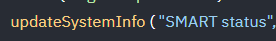
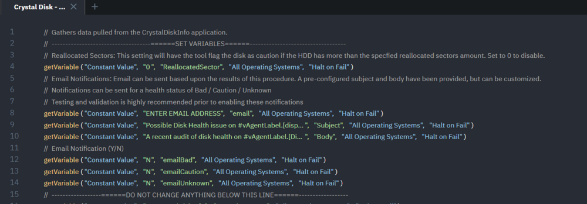

# Overview
This document gathers data pulled from the CrystalDiskInfo application.

# Requirements
- PowerShell V.5
- Custom Field "SMART status"

# VSA Implementation
1. Create a custom field "SMART status" as a string prior to running the agent procedure.

   

2. Import the procedure and set the variables within the agent procedure. There are comments describing the purpose and usage of these lines within the agent procedure. A screenshot of the relevant portion of the procedure has been provided below.

   

3. Run the agent procedure and verify that you see the drive information in the agent procedure log, as well as the custom field updated.

# Process
1. Downloads CrystalDiskInfo.
2. Runs the executable silently.
3. Parses the created .txt file.
4. Generates objects based on the output.
5. Returns the objects.
6. The objects are stored in the log, written to the agent procedure, and stored in a custom field.

# Payload Usage
Executes the CrystalDiskInfo application and stores the basic information for all disks into a custom object.

```
$GetDiskInfo = ./Get-CrystalDiskInfo.ps1
```

Run the CrystalDiskInfo application with a threshold of 50 reallocated sectors. This way, the tool will only flag the disk as `caution` if the HDD has more than 50 reallocated sectors. Additionally, store the basic information for all disks in a custom object.

```
$GetDiskInfo = ./Get-CrystalDiskInfo.ps1 -ReallocatedSector 50
```

# Parameters

| Parameter          | Alias | Required | Default | Type | Description                                                                                      |
|--------------------|-------|----------|---------|------|--------------------------------------------------------------------------------------------------|
| `ReallocatedSector` | `r`   | False    | 0       | int  | Set the threshold for the number of reallocated sectors to mark an HDD as `caution` (not applicable to SSDs). |

# Output
Location of output for log, result, and error files.

```
$env:ProgramData/_automation/AgentProcedure/GetCrystalDiskInfo/Get-CriticalDiskInfo-log.txt
$env:ProgramData/_automation/AgentProcedure/GetCrystalDiskInfo/Get-CriticalDiskInfo-error.txt
```

