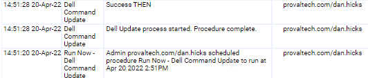

## Summary

Downloads and runs DellCMDUpdate from ProVal App Repo

## Sample Run

## Dependencies

Dell manufactured endpoint

## Variables

none

## Process

Run Procedure

## Output

workingdir/System/DellCMDUpdate-log.txt

