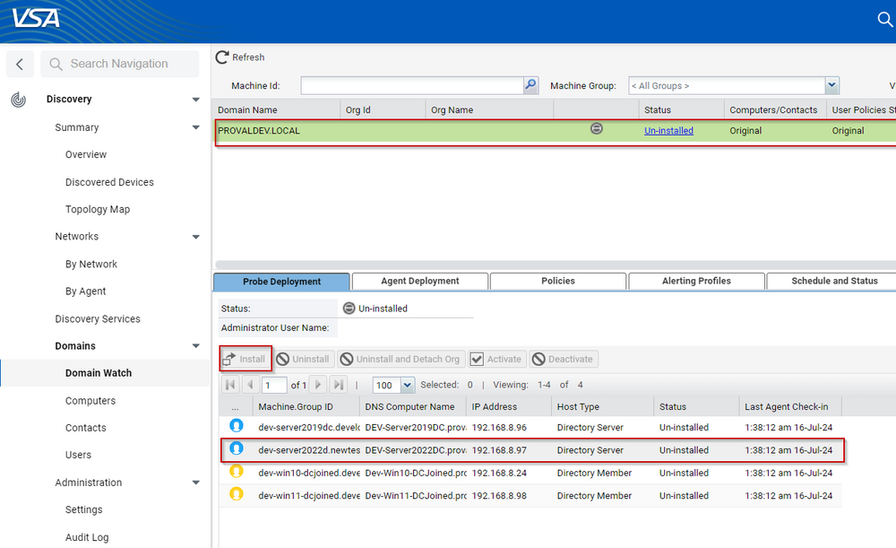
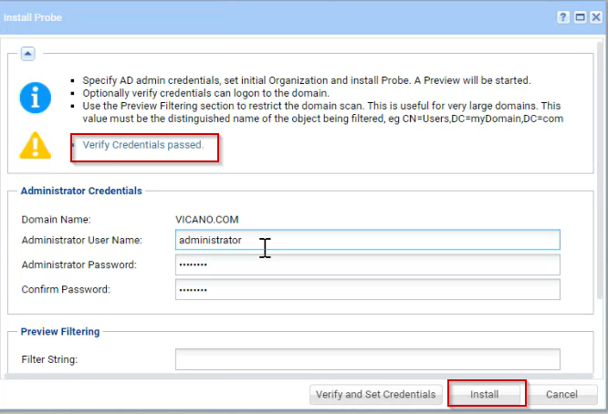
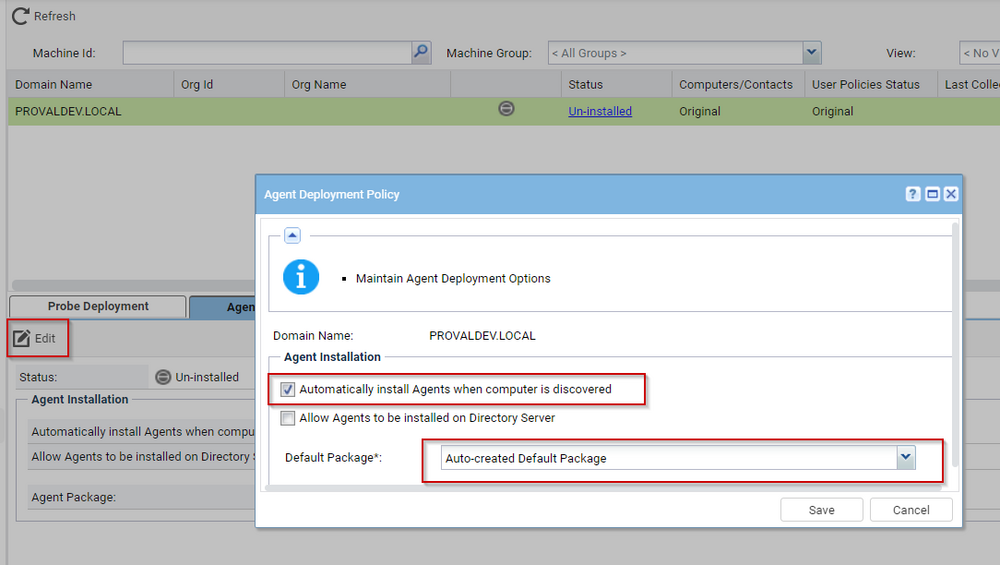
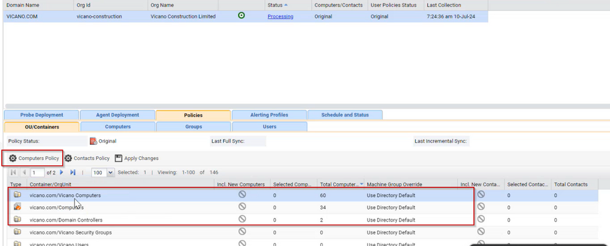
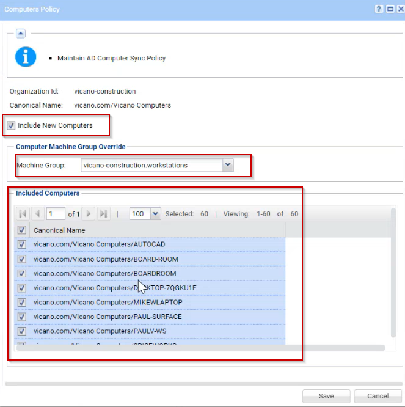
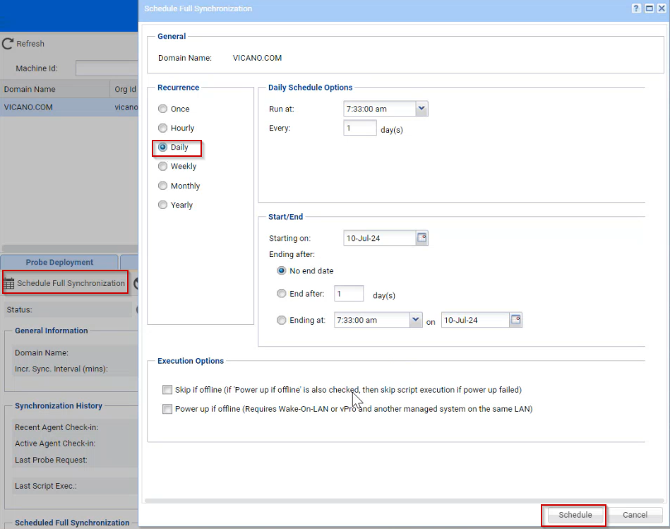
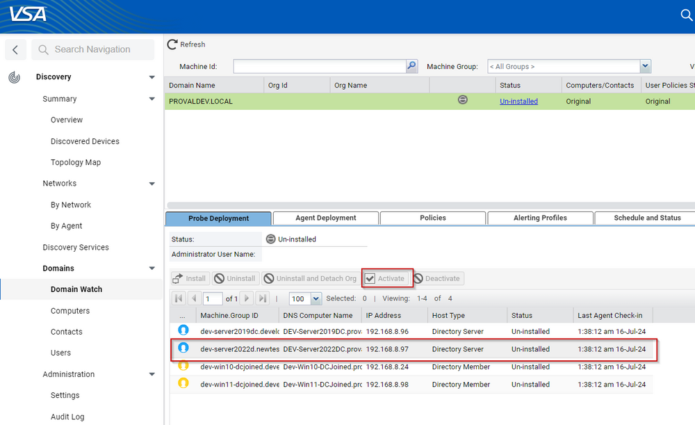
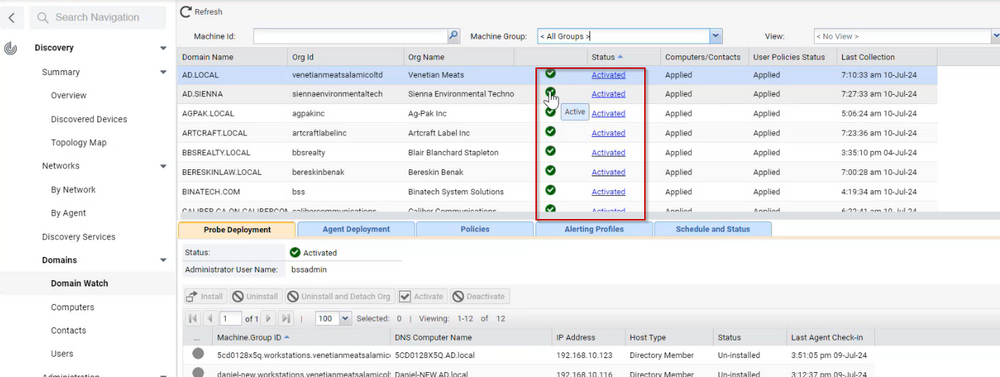
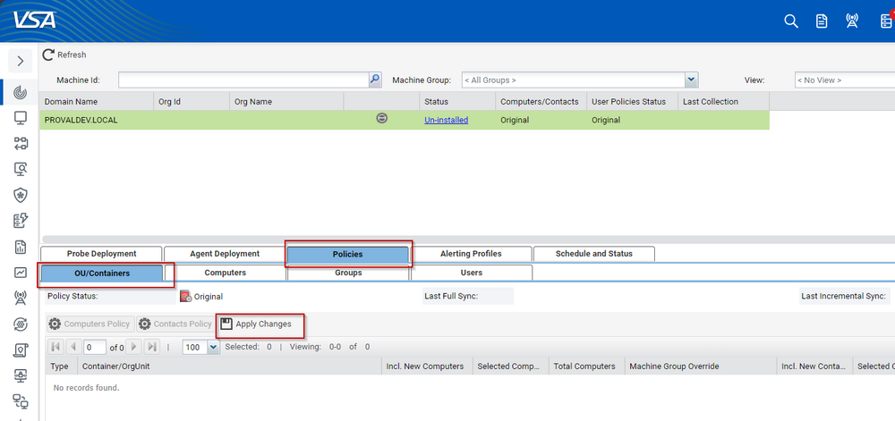

## Purpose

This document provides step-by-step instructions for configuring Domain Watch Discovery in VSA 9.5, ensuring consistent and accurate setup across the organization.

## Prerequisites

Before configuring Domain Watch Discovery, ensure the following prerequisites are met:

1. **User Credentials**: Ensure you have the necessary Domain administrative credentials to configure settings within VSA.
2. **Domain Information**: Gather relevant information regarding the DC Server or any machine which will be acting as a probe.
3. **Schedule**: Gather information about the recurring schedule of the Discovery Scan.
4. **Agent Package**: Agent package should be created beforehand for the organization that Domain Discovery is being configured for.

## Procedure

### Step 1: Access Domain Watch Discovery

1. In the VSA dashboard, navigate to **Discovery**.
2. Select **Domain Watch** from the Discovery menu.

### Step 2: Configure Domain Settings

1. From the list, select the organization for which Domain Watch is to be configured.
2. From the probe deployment, select the machine which will act as a probe (prefer DCs).
3. Click on Install, enter the Domain Admin username and credentials.
   
4. Click on Verify and set credentials.
5. After the credentials verification has been done, proceed with the Install button.
   
6. Wait for the discovery to complete; meanwhile, we will proceed to configure Agent Deployment.
7. Go to the Agent deployment section and click on Edit.
8. Select the option "Automatically install Agents when computer is discovered" and change Default package to the Agent package for that specific organization.
   
9. If the discovery has been done, there will be some policies created in the Policies section, so we will head over to the OU/Containers section under Policies.
10. Select the policies one by one if there are machines present in multiple policies and click on "Computers Policy" button.
    
11. Check whether the policy is for workstations or servers.
12. Select "Include New Computer" option.
13. Change the Machine Group with the Workstation or Server subgroup respectively (or as per the requirement from the client's end).
14. Select all the machines (or select few if specified) and click on save.
    
15. Repeat Steps 11-14 for all the policies as per the requirement.
16. Move over to the Schedule and Status option.
17. Schedule Full Synchronization to run daily or as per the requirement.
    
18. Go to Probe Deployment and select the machine on which we had installed the probe earlier.
19. Click on Activate.
    
20. Check the status of the Domain Discovery; it should show as Active and Green.
    
21. If the status is not green or active, review the configuration and click on Apply Changes under Policies > OU/Containers.
    

### Step 3: Verify Configuration

1. Return to the **Domain Watch** main page.
2. Verify that the domain is listed and the schedule is active.
3. Run a manual discovery to test the configuration:
   - Select the domain.
   - Click **Run Discovery Now**.
4. Check the logs and notifications to ensure the discovery process runs smoothly.

## Conclusion

By following these steps, you will configure Domain Watch Discovery in VSA 9.5 successfully. Regular monitoring and adjustment of settings based on discovery results will ensure optimal performance and coverage of your domain environment.

