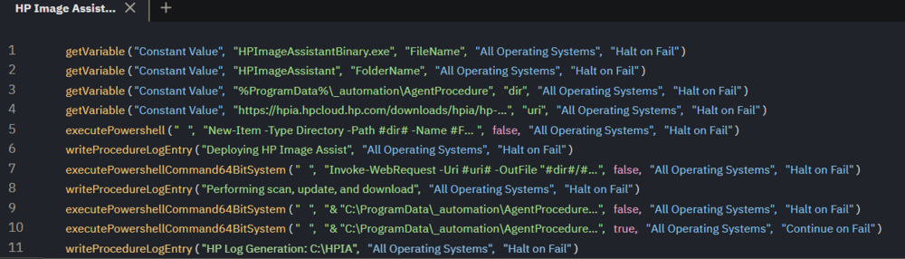

## Summary

This procedure deploys HP Image Assistant to the endpoint. The procedure downloads the software, extracts it, and then installs it.

## Example Agent Procedure Log

| Time                     | Action                                                                                                                                            | Status                     | User   |
|--------------------------|---------------------------------------------------------------------------------------------------------------------------------------------------|----------------------------|--------|
| 6:11:18 pm 4-Oct-23     | HP Image Assistant - Deploy                                                                                                                      | Success THEN               | pronoc |
| 6:11:18 pm 4-Oct-23     | HP Image Assistant - Deploy                                                                                                                      | HP Log Generation: C:/HPIA | pronoc |
| 6:11:18 pm 4-Oct-23     | Execute Powershell Command (64-bit, Run As System)                                                                                              | Success THEN               | pronoc |
| 6:11:18 pm 4-Oct-23     | Execute Powershell Command (64-bit, Run As System)-0016                                                                                         | Powershell command complete. Results returned to global variable #global:psresult# and saved in Agent's Documents tab of server. | pronoc |
| 6:11:18 pm 4-Oct-23     | Execute Powershell Command (64-bit, Run As System)-0016                                                                                         | Informational: GetFile command overwrote the server file C:/Kaseya/UserProfiles/411153734350743/GetFiles/../docs/psoutput.txt with the new contents from c:/ktemp/psoutput.txt in THEN step 3. | pronoc |
| 6:11:16 pm 4-Oct-23     | Execute Powershell Command (64-bit, Run As System)-0011                                                                                         | Executing 64-bit Powershell command as System: \"\" -command \"& & \"C:/ProgramData/_automation/AgentProcedure/HPImageAssistant/HPImageAssistant.exe\" /Operation:Analyze /Category:All /selection:All /action:download /silent /AutoCleanup /reportFolder:c:/HPIA/Report /softpaqdownloadfolder:\"C:/Windows/temp\" \" >\"c:/ktemp/psoutputtmp.txt\" | pronoc |
| 6:11:16 pm 4-Oct-23     | Execute Powershell Command (64-bit, Run As System)-0013                                                                                         | Sending output to global variable. | pronoc |
| 6:11:16 pm 4-Oct-23     | Execute Powershell Command (64-bit, Run As System)-0008                                                                                         | Custom commands detected as & & \"C:/ProgramData/_automation/AgentProcedure/HPImageAssistant/HPImageAssistant.exe\" /Operation:Analyze /Category:All /selection:All /action:download /silent /AutoCleanup /reportFolder:c:/HPIA/Report /softpaqdownloadfolder:\"C:/Windows/temp\" | pronoc |
| 6:11:16 pm 4-Oct-23     | Execute Powershell Command (64-bit, Run As System)-0003                                                                                         | No powershell file variable detected. | pronoc |
| 6:11:15 pm 4-Oct-23     | Execute Powershell Command (64-bit, Run As System)-0002                                                                                         | Powershell is present.     | pronoc |
| 6:11:14 pm 4-Oct-23     | Execute Powershell Command (64-bit, Run As System)                                                                                              | Success THEN               | pronoc |
| 6:11:14 pm 4-Oct-23     | Execute Powershell Command (64-bit, Run As System)-0014                                                                                         | Powershell command completed! | pronoc |
| 6:11:13 pm 4-Oct-23     | Execute Powershell Command (64-bit, Run As System)-0011                                                                                         | Executing 64-bit Powershell command as System: \"\" -command \"& & \"C:/ProgramData/_automation/AgentProcedure/HPImageAssistant/HPImageAssistantBinary.exe\" /s /e /f \"C:/ProgramData/_automation/AgentProcedure/HPImageAssistant\"\" \"\" | pronoc |
| 6:11:13 pm 4-Oct-23     | Execute Powershell Command (64-bit, Run As System)-0013                                                                                         | Not sending output to variable. | pronoc |
| 6:11:13 pm 4-Oct-23     | Execute Powershell Command (64-bit, Run As System)-0008                                                                                         | Custom commands detected as & & \"C:/ProgramData/_automation/AgentProcedure/HPImageAssistant/HPImageAssistantBinary.exe\" /s /e /f \"C:/ProgramData/_automation/AgentProcedure/HPImageAssistant\" | pronoc |
| 6:11:13 pm 4-Oct-23     | Execute Powershell Command (64-bit, Run As System)-0003                                                                                         | No powershell file variable detected. | pronoc |
| 6:11:12 pm 4-Oct-23     | Execute Powershell Command (64-bit, Run As System)-0002                                                                                         | Powershell is present.     | pronoc |
| 6:11:11 pm 4-Oct-23     | HP Image Assistant - Deploy                                                                                                                      | Performing scan, update, and download | pronoc |
| 6:11:11 pm 4-Oct-23     | Execute Powershell Command (64-bit, Run As System)                                                                                              | Success THEN               | pronoc |
| 6:11:11 pm 4-Oct-23     | Execute Powershell Command (64-bit, Run As System)-0014                                                                                         | Powershell command completed! | pronoc |
| 6:11:06 pm 4-Oct-23     | Execute Powershell Command (64-bit, Run As System)-0011                                                                                         | Executing 64-bit Powershell command as System: \"\" -command \"Invoke-WebRequest -Uri [https://hpia.hpcloud.hp.com/downloads/hpia/hp-hpia-5.1.11.exe](https://hpia.hpcloud.hp.com/downloads/hpia/hp-hpia-5.1.11.exe) -OutFile \"%ProgramData%/_automation/AgentProcedure/HPImageAssistant/HPImageAssistantBinary.exe\" -UseBasicParsing -Headers @\\\{'User-Agent'='Mozilla/5.0 (Windows NT 10.0; Win64; x64) AppleWebKit/537.36 (KHTML, like Gecko) Chrome/91.0.4472.124 Safari/537.36'}; Start-Process -FilePath \"%ProgramData%/_automation/AgentProcedure/HPImageAssistant/HPImageAssistantBinary.exe\" -ArgumentList \"-s\"\" \"\" | pronoc |
| 6:11:06 pm 4-Oct-23     | Execute Powershell Command (64-bit, Run As System)-0013                                                                                         | Not sending output to variable. | pronoc |
| 6:11:05 pm 4-Oct-23     | Execute Powershell Command (64-bit, Run As System)-0008                                                                                         | Custom commands detected as Invoke-WebRequest -Uri [https://hpia.hpcloud.hp.com/downloads/hpia/hp-hpia-5.1.11.exe](https://hpia.hpcloud.hp.com/downloads/hpia/hp-hpia-5.1.11.exe) -OutFile \"%ProgramData%/_automation/AgentProcedure/HPImageAssistant/HPImageAssistantBinary.exe\" -UseBasicParsing -Headers @\\\{'User-Agent'='Mozilla/5.0 (Windows NT 10.0; Win64; x64) AppleWebKit/537.36 (KHTML, like Gecko) Chrome/91.0.4472.124 Safari/537.36'}; Start-Process -FilePath \"%ProgramData%/_automation/AgentProcedure/HPImageAssistant/HPImageAssistantBinary.exe\" -ArgumentList \"-s\" | pronoc |
| 6:11:05 pm 4-Oct-23     | Execute Powershell Command (64-bit, Run As System)-0003                                                                                         | No powershell file variable detected. | pronoc |
| 6:11:04 pm 4-Oct-23     | Execute Powershell Command (64-bit, Run As System)-0002                                                                                         | Powershell is present.     | pronoc |
| 6:11:04 pm 4-Oct-23     | HP Image Assistant - Deploy                                                                                                                      | Deploying HP Image Assistant   | pronoc |
| 6:11:04 pm 4-Oct-23     | Execute Powershell Command                                                                                                                       | Success THEN               | pronoc |
| 6:11:04 pm 4-Oct-23     | Execute Powershell Command-0011                                                                                                                  | Powershell command completed!  | pronoc |
| 6:11:01 pm 4-Oct-23     | Execute Powershell Command-0011                                                                                                                  | Executing powershell \"\" -Command \"New-Item -Type Directory -Path %ProgramData%/_automation/AgentProcedure -Name HPImageAssistant\" \"\" | pronoc |
| 6:11:01 pm 4-Oct-23     | Execute Powershell Command-0010                                                                                                                  | Not sending output to variable. | pronoc |
| 6:11:01 pm 4-Oct-23     | Execute Powershell Command-0008                                                                                                                  | New command variable is: -Command \"New-Item -Type Directory -Path %ProgramData%/_automation/AgentProcedure -Name HPImageAssistant\" | pronoc |
| 6:11:01 pm 4-Oct-23     | Execute Powershell Command-0008                                                                                                                  | Custom commands detected as New-Item -Type Directory -Path %ProgramData%/_automation/AgentProcedure -Name HPImageAssistant | pronoc |
| 6:10:59 pm 4-Oct-23     | Execute Powershell Command-0002                                                                                                                  | Powershell is present.      | pronoc |
| 6:10:52 pm 4-Oct-23     | Run Now - HP Image Assistant - Deploy                                                                                                            | Admin pronoc scheduled procedure Run Now - HP Image Assistant - Deploy to run at Oct 4 2023 7:10 PM | pronoc |

## Output

Agent Procedure Log  
C:/HPIA  

  

Line 10 is where the HP commands are customized.  
Available Commands (Starting at page 20): [HPIA User Guide](https://ftp.hp.com/pub/caps-softpaq/cmit/whitepapers/HPIAUserGuide.pdf)  
The procedure is set to a default of: /Operation:Analyze /Category:All /selection:All /action:download /silent /AutoCleanup /reportFolder:c:/HPIA/Report /softpaqdownloadfolder:"C:/Windows/temp"  

