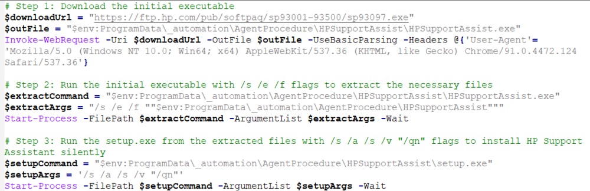

## Summary

This procedure deploys HP Support Assist to the endpoint. The procedure downloads the software, extracts it, and then installs it.

## Example Agent Procedure Log

| Timestamp              | Action                                                                                                      | Status                                                                                                     | User           |
|-----------------------|-------------------------------------------------------------------------------------------------------------|------------------------------------------------------------------------------------------------------------|----------------|
| 3:20:37 pm 4-Oct-23   | HP Support Assist - Deploy                                                                                 | Success THEN                                                                                               | derek.joniak   |
| 3:20:37 pm 4-Oct-23   | Execute Powershell Command (64-bit, Run As System)                                                        | Success THEN                                                                                               | derek.joniak   |
| 3:20:37 pm 4-Oct-23   | Execute Powershell Command (64-bit, Run As System)-0001                                                  | Success THEN                                                                                               | derek.joniak   |
| 3:20:37 pm 4-Oct-23   | Execute Powershell Command (64-bit, Run As System)-0002                                                  | Success THEN                                                                                               | derek.joniak   |
| 3:20:37 pm 4-Oct-23   | Execute Powershell Command (64-bit, Run As System)-0011                                                  | Success THEN                                                                                               | derek.joniak   |
| 3:20:37 pm 4-Oct-23   | Execute Powershell Command (64-bit, Run As System)-0014                                                  | Success THEN                                                                                               | derek.joniak   |
| 3:20:37 pm 4-Oct-23   | Execute Powershell Command (64-bit, Run As System)-0015                                                  | Success THEN                                                                                               | derek.joniak   |
| 3:20:37 pm 4-Oct-23   | Execute Powershell Command (64-bit, Run As System)-0016                                                  | Success THEN                                                                                               | derek.joniak   |
| 3:20:37 pm 4-Oct-23   | Execute Powershell Command (64-bit, Run As System)-0016                                                  | Powershell command complete. Results returned to global variable #global:psresult# and saved in Agent's Documents tab of server. | derek.joniak   |
| 3:20:37 pm 4-Oct-23   | Execute Powershell Command (64-bit, Run As System)-0016                                                  | Informational: GetFile command overwrote the server file C:/Kaseya/UserProfiles/570617411282368/GetFiles/../docs/psoutput.txt with the new contents from c:/kworking/psoutput.txt in THEN step 3. | derek.joniak   |
| 3:17:47 pm 4-Oct-23   | Execute Powershell Command (64-bit, Run As System)-0011                                                  | Executing 64-bit Powershell command as System: "" -command "Set-ExecutionPolicy -ExecutionPolicy Bypass -Scope Process -Force; & "$env:ProgramData/_automation/AgentProcedure/HPSupportAssist/HPSupportAssist.ps1"" >"c:/kworking/psoutputtmp.txt" | derek.joniak   |
| 3:17:47 pm 4-Oct-23   | Execute Powershell Command (64-bit, Run As System)-0012                                                  | Success THEN                                                                                               | derek.joniak   |
| 3:17:47 pm 4-Oct-23   | Execute Powershell Command (64-bit, Run As System)-0013                                                  | Success THEN                                                                                               | derek.joniak   |
| 3:17:47 pm 4-Oct-23   | Execute Powershell Command (64-bit, Run As System)-0013                                                  | Sending output to global variable.                                                                         | derek.joniak   |
| 3:17:47 pm 4-Oct-23   | Execute Powershell Command (64-bit, Run As System)-0003                                                  | Success ELSE                                                                                               | derek.joniak   |
| 3:17:47 pm 4-Oct-23   | Execute Powershell Command (64-bit, Run As System)-0008                                                  | Success THEN                                                                                               | derek.joniak   |
| 3:17:47 pm 4-Oct-23   | Execute Powershell Command (64-bit, Run As System)-0009                                                  | Success ELSE                                                                                               | derek.joniak   |
| 3:17:47 pm 4-Oct-23   | Execute Powershell Command (64-bit, Run As System)-0010                                                  | Success ELSE                                                                                               | derek.joniak   |
| 3:17:47 pm 4-Oct-23   | Execute Powershell Command (64-bit, Run As System)-0008                                                  | Custom commands detected as Set-ExecutionPolicy -ExecutionPolicy Bypass -Scope Process -Force; & "$env:ProgramData/_automation/AgentProcedure/HPSupportAssist/HPSupportAssist.ps1" | derek.joniak   |
| 3:17:47 pm 4-Oct-23   | Execute Powershell Command (64-bit, Run As System)-0003                                                  | No powershell file variable detected.                                                                       | derek.joniak   |
| 3:17:46 pm 4-Oct-23   | Execute Powershell Command (64-bit, Run As System)-0002                                                  | Powershell is present.                                                                                     | derek.joniak   |
| 3:17:45 pm 4-Oct-23   | HP Support Assist - Deploy                                                                                 | Deploying HP Support Assist                                                                                 | derek.joniak   |

## Dependencies

Procedure requires the shared file "HPSupportAssist.ps1" to run.  

## Output

Agent Procedure Log

