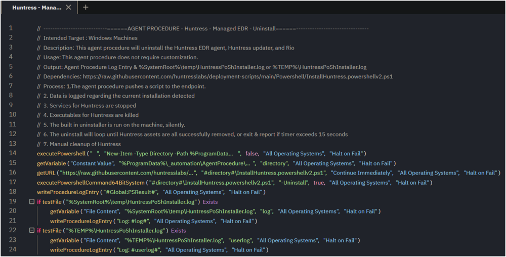

## Summary

This agent procedure will uninstall the Huntress EDR agent, Huntress updater, and Rio.

## Implementation

This agent procedure is designed as a template and meant to be exported.  
**Name:** Huntress - Managed EDR - Uninstall  

  

The agent procedure requires no customization.  

  

## Dependencies

[Vendor Provided Uninstall Script](https://raw.githubusercontent.com/huntresslabs/deployment-scripts/main/Powershell/InstallHuntress.powershellv2.ps1)

## Process

1. The agent procedure pushes a script to the endpoint.
2. Data is logged regarding the current installation detected.
3. Services for Huntress are stopped.
4. Executables for Huntress are terminated.
5. The built-in uninstaller is run on the machine, silently.
6. The uninstall will loop until all Huntress assets are successfully removed, or it will exit and report if the timer exceeds 15 seconds.
7. Manual cleanup of the Huntress folder after the uninstall completes.
8. Manual cleanup of Huntress registry keys after the uninstall completes.

## Output

`%SystemRoot%/temp/HuntressPoShInstaller.log`  
`%TEMP%/HuntressPoShInstaller.log`  
Agent Procedure Log

