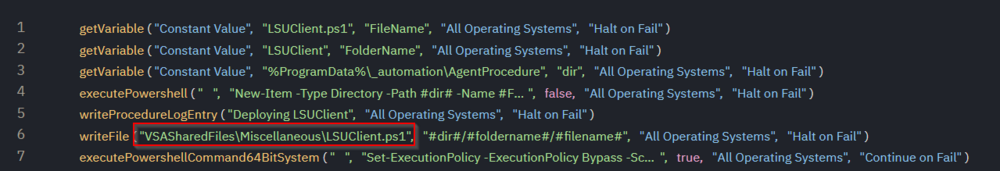
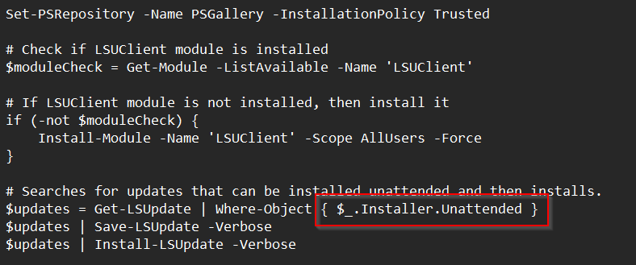

## Summary

This script uses the PowerShell module `LSUClient` to install available BIOS updates for Lenovo machines. The `-All` parameter can be used to install all available vendor updates, including BIOS, Firmware, and Drivers.

## Warning

It is generally not recommended to automate `driver` and `firmware` updates on machines since they can cause unexpected results. In some rare cases, they may cause machines to not function afterwards.

Also, please note that the computer can be restarted even without setting the `Reboot` parameter while installing all available updates. Therefore, the `-All` parameter should be used with caution.

## Dependencies

PowerShell 5.0+

## Output

Agent Procedure Log  
`%ProgramData%//_automation//AgentProcedure`

## Parameters

Shared file line 6 is where the .PS1 is deployed  

  

The red box is where the update options are configured.  
  

The script is set to a default of **Installer.Unattended** which will only install updates that can be completed without a user prompt.

Setting this to the option below will install all updates but review the warning above.

```
$updates = Get-LSUpdate -All
```

Github: [https://jantari.github.io/LSUClient-docs/](https://jantari.github.io/LSUClient-docs/)  
[https://github.com/jantari/LSUClient](https://github.com/jantari/LSUClient)


