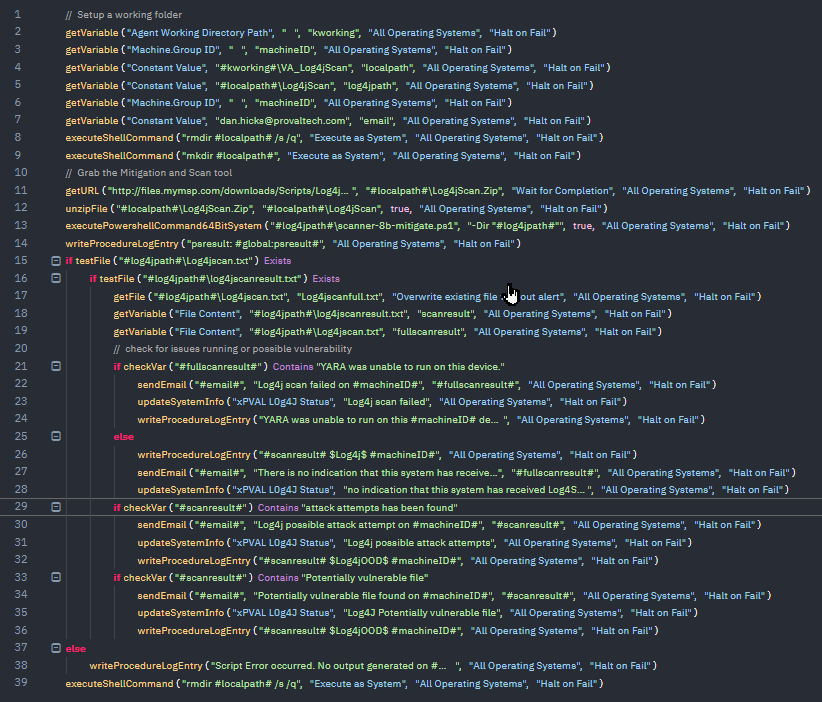

## Uses revised Datto Scrip

Uses revised Datto Scrip (revision credit Stephen Nix) to scan endpoint for attacks and possible vulnerabilities. 

Email must be specified on script line 7.

Email will be sent in the case that vulnerabilities or attack traces are found. No notification if no threat exists.

