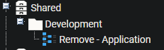
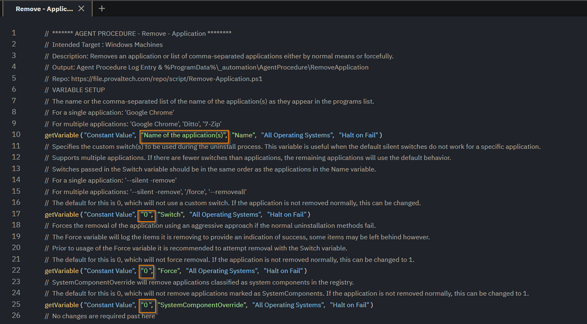

## Summary

Removes an application or list of comma-separated applications either by normal means or forcefully.

## Implementation

This agent procedure is designed as a template and meant to be exported.  
**Name:** Remove - Application  
  
The agent procedure can be customized to fit the needs of various uninstalls. There are four variables within this agent procedure. See the usage for these below.  

## Variables

| Variable Name                | Example                                   | Required | Description                                                                                               |
|------------------------------|-------------------------------------------|----------|-----------------------------------------------------------------------------------------------------------|
| `Name`                       | `'Google Chrome'`                         | True     | The name or the comma-separated list of the name of the application(s) as they appear in the programs list. |
| `Switch`                     | `'--remove -silent'`                     | False    | Specifies the custom switch(s) to be used during the uninstall process. This variable is useful when the default silent switches do not work for a specific application. Default value of 0. |
| `Force`                      | `1`                                       | False    | Forces the removal of the application using an aggressive approach if the normal uninstallation methods fail. Default value of 0. |
| `SystemComponentOverride`    | `1`                                       | False    | SystemComponentOverride will remove applications classified as system components in the registry. Default value of 0. |

Both `#Name#` and `#Switch#` accept multiple applications.

For a single application removal surround it in single quotes.

> `'Google Chrome'`

For multiple application removals, surround each application in single quotes and separate with a comma.

> `'Google Chrome', 'Cisco Secure Client - AnyConnect VPN'`

For using custom switches for a single application surround it in single quotes.

> `'--uninstall --multi-install --chrome --system-level --force-uninstall'`

For using custom switches for multiple application removals surround the switches for each application in single quotes and separate with a comma.

> `'--uninstall --multi-install --chrome --system-level --force-uninstall','-remove -silent'`

## Dependencies

- [SWM - Software Uninstall - Agnostic - Remove-Application](https://proval.itglue.com/5078775/docs/10677467)
- [EPM - Endpoint Management - Agent Procedure - Safe Mode Reboot](https://proval.itglue.com/DOC-5078775-11260329)
- [EPM - Endpoint Management - Agent Procedure - Leave Safe Mode](https://proval.itglue.com/DOC-5078775-11260331)

## Process

1. Search for the object
   1. Check for the application; log an error and exit if not found.
   2. If there are more than 1 results for the search for `$Name`, then notify that there are multiple results and to refine the search.
2. Determine the type of uninstallation object that `$Name` references (AppX, MSI, EXE).
   1. AppX
      1. Remove the appx object.
      2. Check for the item after removal to confirm.
      3. Exit.
   2. MSI
      1. Attempt to remove the MSI package using the uninstall string.
      2. Log the success or failure of the uninstallation.
   3. EXE
      1. Check if a custom switch is provided. If so, attempt to uninstall using the provided switch.
      2. If the custom switch fails or is not provided, attempt to uninstall using the QuietUninstallString if available.
      3. If the QuietUninstallString fails or is not available, attempt to uninstall using targeted silent switches.
      4. If targeted silent switches fail, attempt to uninstall using the UninstallString without modifications.
      5. Log the success or failure of each uninstallation attempt.
3. Check if the application is still installed
   1. If the application is not installed, log the successful removal and exit.
   2. If the application is still installed and the -Force parameter is specified, proceed with forced removal.
4. Forced Removal (if -Force parameter is specified)
   1. Terminate any processes related to the application.
   2. Remove the application's files and directories.
   3. Remove the application's shortcuts.
   4. Remove the application's registry keys.
   5. Log the success or failure of the forced removal.

## Output

`%ProgramData%/_automation/AgentProcedure/RemoveApplication/Remove-Application-error.txt`  
`%ProgramData%/_automation/AgentProcedure/RemoveApplication/Remove-Application-log.txt`  
Agent Procedure Log  

Due to the way the VSA pulls in logs, the Agent Procedure log will typically not show much for `Remove-Application-log` as the VSA pulls the first lines of a file. This log is not cleared upon subsequent runs, and is too verbose to be captured in its entirety. `Remove-Application-error` is cleared upon every run and should contain relevant error messages. For the most detailed log refer to the `Remove-Application-log.txt` above.

