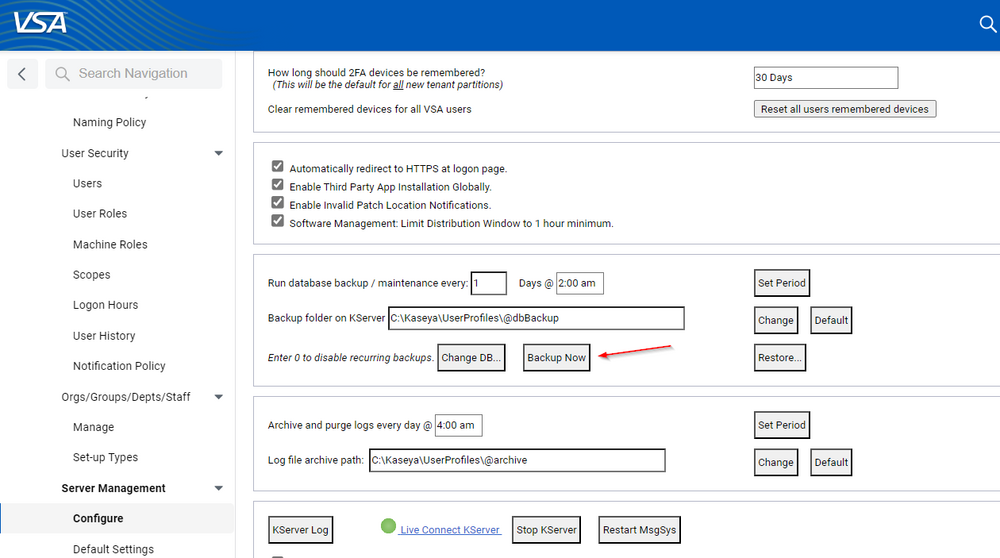
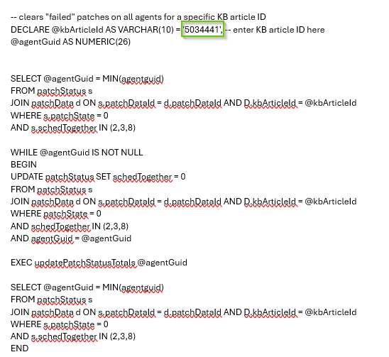
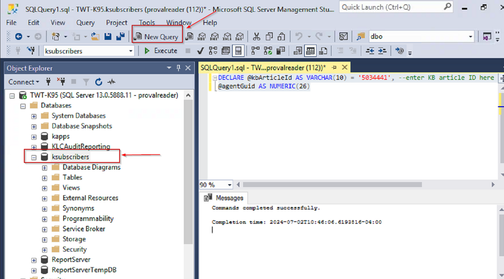

## Purpose

Allows to clear a patch from Failed Patches with help of SQL.

## Associated Content

| **Content**                     | **Type**      | **Function**                                             |
|----------------------------------|---------------|----------------------------------------------------------|
| SQL - clearFailedPatchesByKB     | SQL Query     | Removes Specific Patch from failed patches.              |

## Implementation

1. Take Backup of VSA DataBase.  
   

2. Update the Kb Number in the SQL Query Below.  
     
   ```sql
   -- clears "failed" patches on all agents for a specific KB article ID
   DECLARE @kbArticleId AS VARCHAR(10) = '5034441', -- enter KB article ID here
   @agentGuid AS NUMERIC(26)

   SELECT @agentGuid = MIN(agentguid)
   FROM patchStatus s
   JOIN patchData d ON s.patchDataId = d.patchDataId AND D.kbArticleId = @kbArticleId
   WHERE s.patchState = 0
   AND s.schedTogether IN (2,3,8)

   WHILE @agentGuid IS NOT NULL
   BEGIN
       UPDATE patchStatus SET schedTogether = 0
       FROM patchStatus s
       JOIN patchData d ON s.patchDataId = d.patchDataId AND D.kbArticleId = @kbArticleId
       WHERE patchState = 0
       AND schedTogether IN (2,3,8)
       AND agentGuid = @agentGuid

       EXEC updatePatchStatusTotals @agentGuid

       SELECT @agentGuid = MIN(agentguid)
       FROM patchStatus s
       JOIN patchData d ON s.patchDataId = d.patchDataId AND D.kbArticleId = @kbArticleId
       WHERE s.patchState = 0
       AND s.schedTogether IN (2,3,8)
   END
   ```

3. Run this Query on KSubscribers on SQL Server.  
   


