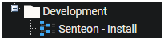
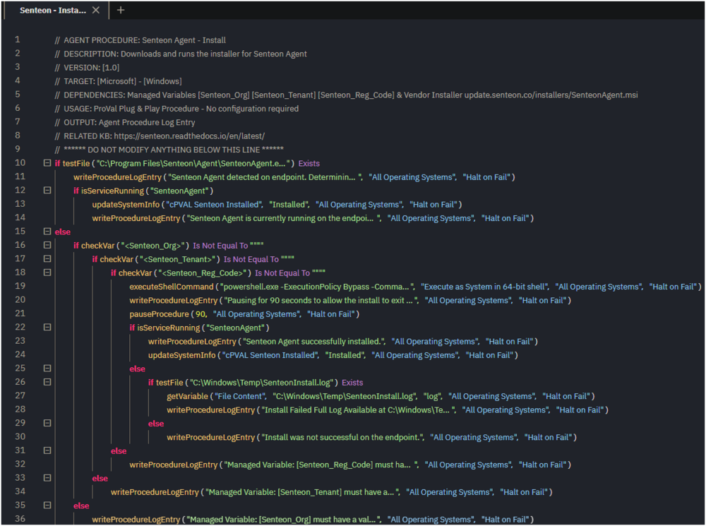
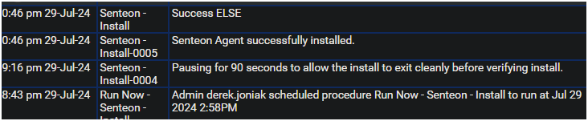
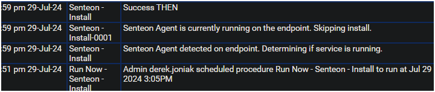

## Summary

Downloads and runs the installer for Senteon Agent on the endpoint. Updates the custom field if install is successful. 

## Dependencies

| Content | Type | Function |
|---------|------|----------|
| [cPVAL Senteon Installed](<../../unsorted/SWM - Software Management - Custom Field - cPVAL Senteon Installed.md>) | Custom Field | This custom field is used to determine if the Senteon Agent is installed on the endpoint or not. |
| [Senteon_Org](<../variables/Senteon_Org.md>) | Managed Variable | This managed variable is used to store the Senteon ID/Name of the partner's Organization. |
| [Senteon_Tenant](<../variables/Senteon_Tenant.md>) | Managed Variable | This managed variable is used to store the Senteon ID/Name of the Tenant the partner wishes to register the agent/endpoint to. |
| [Senteon_Reg_Code](<../variables/Senteon_Reg_Code.md>) | Managed Variable | This managed variable is used to store the Senteon registration code of the Tenant the partner wishes to register the agent/endpoint to. |

## Associated Content

[SWM - Software Management - Solution - Senteon Agent](<../../solutions/Senteon Agent.md>)

## Implementation

Export the agent procedure from the ProVal VSA, and import into the partner VSA.  
Name: Senteon - Install  
  
  

ProVal Plug & Play: No agent procedure configuration is required. Ensure dependencies exist prior to usage.  

## Output

Agent Procedure Log Entry  

Successful Install  
  

Existing Install  
  

