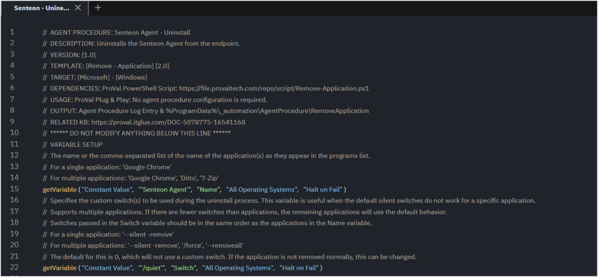
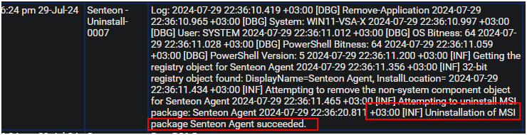

## Summary

This document outlines the steps to uninstall the Senteon Agent from the endpoint.  
This agent procedure utilizes the [Remove - Application](https://proval.itglue.com/5078775/docs/11259375) agent procedure template to perform the uninstall.

## Associated Content

[SWM - Software Management - Solution - Senteon Agent](<../../solutions/Senteon Agent.md>)

## Implementation

Export the agent procedure from the ProVal VSA and import it into the partner VSA.  
**Name:** Senteon - Uninstall  
  
  

Proval Plug & Play Procedure: The agent procedure requires no configuration.

## Output

Agent Procedure Log Entry  
**Success**  
  
