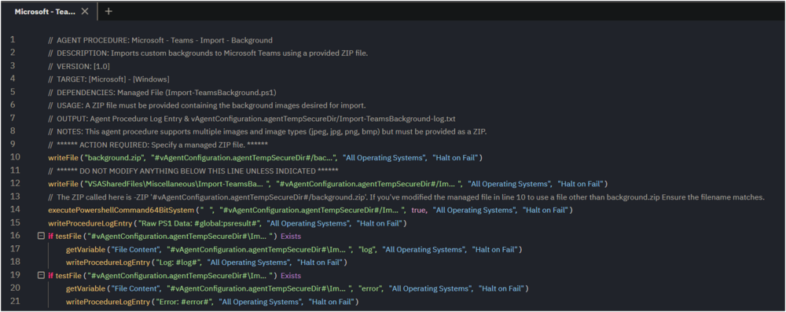

## Summary

This document outlines the installation process for the SentinelOne application on Windows endpoints.

## Implementation

Export the agent procedure.  
**Name:** SentinelOne - Install - (Windows)

The agent procedure requires a ZIP file containing the backgrounds.  
The ZIP can contain multiple images.  
The following image formats are supported: ('jpeg', 'jpg', 'png', 'bmp')

If the selected file is "[background.zip](http://background.zip)", no further changes are required.  
If a different file has been specified, update the filename in the PowerShell execution.  
Modify **[background.zip](http://background.zip)** to the name of the ZIP file you selected in the previous step.

## Dependencies

- Managed File (Import-TeamsBackground.PS1)
- Managed File (background.zip)

## Process

1. Deploy the ZIP file and Import-TeamsBackground.ps1 to the endpoint.
2. Check if Teams is installed and retrieve the list of active users' info.
   - Get the user profile path from the user's SID for each active user.
     - Create the Backgrounds and Uploads folders for each active user.
       - Extract images from the ZIP file.
         - Remove the temporary directories if they exist.
         - Create the temporary directories.
           - Extract images from the ZIP file to the temporary directory.
             - Rename JPEG, JPG, PNG, BMP files with Teams GUID.
             - Create a _thumb copy of each image.
               - Copy renamed images to active users' Teams Backgrounds directories.

## Output

Agent Procedure Log Entry & vAgentConfiguration.agentTempSecureDir/Import-TeamsBackground-log.txt
