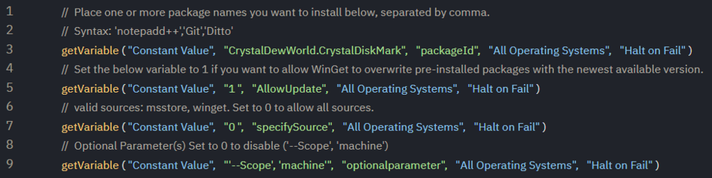
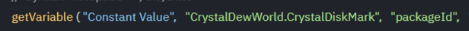
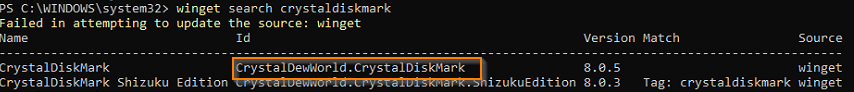
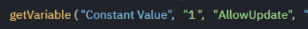
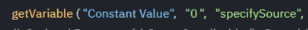
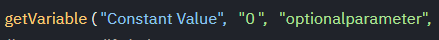
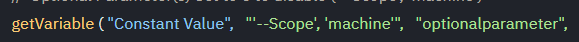

## Summary

A suite of 5 agent procedures to manage WinGet packages on an endpoint using ProVal Agnostic Script [SWM - Software Management - Powershell - Invoke-WingetProcessor](<../../powershell/Invoke-WingetProcessor.md>):

- WinGet Package Install
- WinGet Package Uninstall
- WinGet UpdateAll
- WinGet Export
- WinGet Import Install

## Usage

The series of scripts have several parameters that can be set.



`#packageID#` - Ensure this matches capitalization.



If you are unsure, use `winget search` to find the proper name.



`#AllowUpdate#` - Leave this as `1`, unless there's a need to disable updates.



`#specifysource#` - Leave this as `0`, unless there's a specific need for a particular package.



`#optionalparameter#` - This is set to `0` by default, but a common option that may be needed is machine-wide installation packages.



If we want to install a package machine-wide, we use this `optionalparameter` to specify so.



The parameter must be passed as an array, so ensure it matches as seen in the screenshot or copy it as shown below:

> '--Scope', 'machine'

## Example Agent Procedure Log

```
12:23:19 pm 6-Jan-23   WinGet Package Install   Success THEN   provaltech.com/dan.hicks  
12:23:19 pm 6-Jan-23   Execute Powershell Command (64-bit, Run As System)   Success THEN   provaltech.com/dan.hicks  
12:23:18 pm 6-Jan-23   Execute Powershell Command (64-bit, Run As System)-0016   Powershell command complete. Results returned to global variable #global:psresult# and saved in Agent's Documents tab of server.   provaltech.com/dan.hicks  
12:23:16 pm 6-Jan-23   Execute Powershell Command (64-bit, Run As System)-0011   Executing 64-bit Powershell command as System: "\"\" -command \"%ProgramData%/_automation/AgentProcedure/WingetProcessor/Invoke-WingetProcessor.ps1 -install -AllowUpdate -PackageId notepad++.notepad++ -InformationAction Continue\" >\"c:/provaltech/psoutputtmp.txt\""   provaltech.com/dan.hicks  
12:23:16 pm 6-Jan-23   Execute Powershell Command (64-bit, Run As System)-0013   Sending output to global variable.   provaltech.com/dan.hicks  
12:23:16 pm 6-Jan-23   Execute Powershell Command (64-bit, Run As System)-0008   Custom commands detected as %ProgramData%/_automation/AgentProcedure/WingetProcessor/Invoke-WingetProcessor.ps1 -install -AllowUpdate -PackageId notepad++.notepad++ -InformationAction Continue   provaltech.com/dan.hicks  
12:23:16 pm 6-Jan-23   Execute Powershell Command (64-bit, Run As System)-0003   No powershell file variable detected.   provaltech.com/dan.hicks  
12:23:15 pm 6-Jan-23   Execute Powershell Command (64-bit, Run As System)-0002   Powershell is present.   provaltech.com/dan.hicks  
12:23:14 pm 6-Jan-23   Execute Powershell Command   Success THEN   provaltech.com/dan.hicks  
12:23:13 pm 6-Jan-23   Execute Powershell Command-0011   Powershell command completed!   provaltech.com/dan.hicks  
12:23:11 pm 6-Jan-23   Execute Powershell Command-0011   Executing powershell "\"\" -Command \"New-Item -Type Directory -Path $env:ProgramData/_automation/AgentProcedure -name WingetProcessor\" \"\""   provaltech.com/dan.hicks  
12:23:11 pm 6-Jan-23   Execute Powershell Command-0010   Not sending output to variable.   provaltech.com/dan.hicks  
12:23:11 pm 6-Jan-23   Execute Powershell Command-0008   New command variable is: -Command \"New-Item -Type Directory -Path $env:ProgramData/_automation/AgentProcedure -name WingetProcessor\"   provaltech.com/dan.hicks  
12:23:11 pm 6-Jan-23   Execute Powershell Command-0008   Custom commands detected as New-Item -Type Directory -Path $env:ProgramData/_automation/AgentProcedure -name WingetProcessor   provaltech.com/dan.hicks  
12:23:09 pm 6-Jan-23   Execute Powershell Command-0002   Powershell is present.   provaltech.com/dan.hicks  
12:23:01 pm 6-Jan-23   Run Now - WinGet Package Install   Admin provaltech.com/dan.hicks scheduled procedure Run Now - WinGet Package Install to run at Jan 6 2023 12:23 PM
```

## Dependencies

**WinGet Import** requires a WinGet Export JSON file to be uploaded to Managed Files in the environment.

## Process

Utilizes Agnostic Content [SWM - Software Management - Powershell - Invoke-WingetProcessor](<../../powershell/Invoke-WingetProcessor.md>) to run WinGet as a system user on an endpoint and manage application packages.

## Output

- Agent Procedure Log
- Log Files Exported to GetFiles
- Export JSON Exported to GetFiles and present on endpoint in `%ProgramData%/_automation/AgentProcedure/wingetprocessor`


