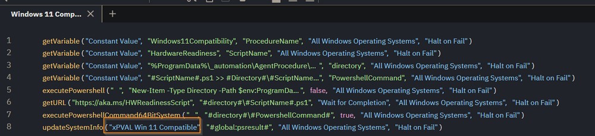

# Overview
- Determines if an endpoint is compatible with Windows 11 per Microsoft's Hardware Readiness script.

# Requirements
- Windows 10
- Administrator rights are required for accessing the TPM (Trusted Platform Module) details, checking for Secure Boot state, and interacting with WMI (Windows Management Instrumentation) to get processor, memory, and disk information.

# VSA Implementation
There is no configuration required within the Agent Procedure, but a custom field is required to display the compatibility.

**Custom Field**: xPVAL Win 11 Compatible



# Process
The `HardwareReadiness.ps1` script is a PowerShell script designed to assess a Windows 10 machine's hardware compatibility with Windows 11. It verifies several system components, including storage, memory, TPM (Trusted Platform Module), processor details, and Secure Boot status. The script utilizes both PowerShell cmdlets and .NET interop to gather system information and evaluate compatibility based on predefined minimum requirements.

- **Initialization**: Sets up variables with minimum system requirements and initializes an output object to store the results, logging information, and return codes.
- **Storage Check**: Validates the OS disk size using WMI queries. It checks if the disk size is at least 64 GB.
- **Memory Check**: Assesses the system memory, ensuring there's at least 4 GB available.
- **TPM Check**: Evaluates the presence and version of TPM. Windows 11 requires TPM version 2.0.
- **Processor Details Check**: Utilizes custom .NET code to verify the processor's architecture, family, and other specifics. It requires the processor to meet specific criteria, including clock speed, logical cores, and compatibility based on manufacturer and architecture.
- **Secure Boot Check**: Determines if Secure Boot is enabled, a requirement for Windows 11.

# Payload Usage
```
#ScriptName#.ps1 >> #Directory#/#ScriptName#-log.txt; $result = Get-Content -Path #Directory#/#ScriptName#-log.txt -Raw | ConvertFrom-Json; $simplifiedResult = switch ($result.returnCode) {0 {"'Yes'"} 1 {"'No'"} -1 {"'Hardware Check Failed'"} -2 {"'Script Error'"} default {"'UnknownReturnCode'"}}; Write-Host $simplifiedResult
```
Runs the HardwareReadiness.ps1 script, outputting the results to a log file within the Agent Procedure folder. The returnCode is read and modified to produce a value for the **xPVAL Win 11 Compatible** custom field.

| returnCode | Definition                                                                                                       | **xPVAL Win 11 Compatible** Value    |
|------------|------------------------------------------------------------------------------------------------------------------|--------------------------------------|
| 0          | CAPABLE – the device meets all assessed Windows 11 hardware requirements                                        | Yes                                  |
| 1          | NOT CAPABLE – the device does not meet one or more of the assessed Windows 11 hardware requirements              | No                                   |
| -1         | UNDETERMINED – one or more of the hardware requirement checks failed to execute properly                         | Hardware Check Failed                |
| -2         | FAILED TO RUN – the script encountered an error                                                                 | Script Error                         |
| default    | UNKNOWN RETURN CODE - This is designed as a failsafe to prevent the procedure from failing due to an unknown return code. | UnknownReturnCode                    |

# Log Example
```
{"returnCode":1,"returnReason":"Processor, ","logging":"Storage: OSDiskSize=79GB. PASS; Memory: System_Memory=4GB. PASS; TPM: TPMVersion=2.0, 0, 1.16. PASS; Processor: {AddressWidth=64; MaxClockSpeed=2000; NumberOfLogicalCores=2; Manufacturer=AuthenticAMD; Caption=AMD64 Family 23 Model 1 Stepping 2; }. FAIL; SecureBoot: Capable. PASS; ","returnResult":"NOT CAPABLE"}
```
The log indicates that while the system meets the necessary criteria for storage, memory, TPM version, and Secure Boot capability for upgrading to Windows 11, it fails to comply with processor requirements. Despite having the required address width, clock speed, and number of logical cores, the processor (AMD64 Family 23 Model 1 Stepping 2) does not match the compatibility standards set for Windows 11, leading to an overall "NOT CAPABLE" assessment for the upgrade.

# Output
```
$env:ProgramData/_automation/AgentProcedure/Windows11Compatibility/HardwareReadiness-log.txt
```


