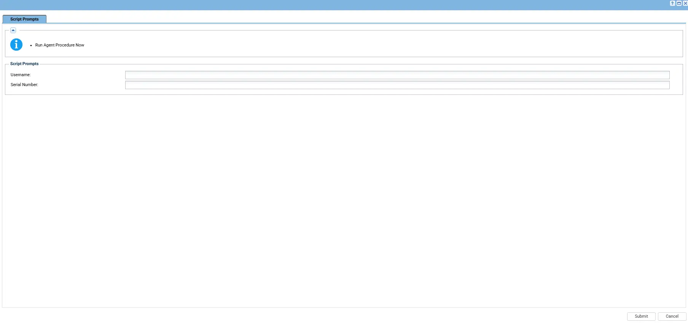
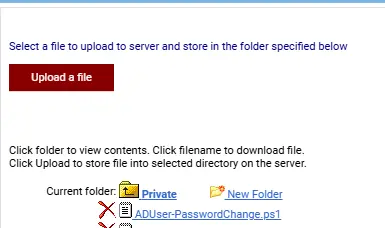

## Summary

This script generates a secure, randomized temporary password for a target Active Directory user account, resets the password via AD cmdlet, and formats the execution summary into an internal note block using email connector tags. It also enforces administrative privileges via self-elevation.

## Sample Run

## Implementation

1. Export the agent procedure from ProVal's VSA RMM instance.   
   **Name:** `Password Change - AD User` 

   The export will download the necessary XML file.   
   
2. Import this XML file into the partner's VSA RMM instance.   

3. Export the `ADUser-PasswordChange.ps1` from the ProVal's Internal VSA. This is also placed under the below path:  
`Manage Files` > `Shared Files` > `PVAL` > `ADUser-PasswordChange.ps1`  

  

4. Map the `ADUser-PasswordChange.ps1` into the `13th` step of the script in the client's environment.

5. Change the Email ID on step number `16th`.
   
## Output

- Script logs

## Changelog

### 2026-08-26

- Initial version of the document