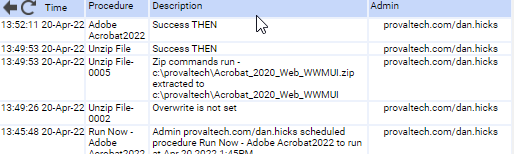

## Summary

Installs Adobe Acrobat 2022

## Sample Run

## Dependencies

None

## Variables

None  

**Process**  
Downloads the installer from the vendor, performs a quiet no-restart installation of MSI, and cleans up afterwards.

## Output

None

