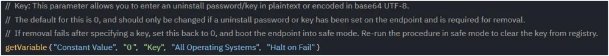

## Summary

This document completely removes BitDefender Endpoint Security Tools from an endpoint.  
Implementation of agnostic content [SWM - Software Uninstall - Agnostic - Remove-BitdefenderEndpointSecurity](/docs/3037688b-782b-468e-956a-292b3ef33534).

## Dependencies

[SWM - Software Uninstall - Agnostic - Remove-BitdefenderEndpointSecurity](/docs/3037688b-782b-468e-956a-292b3ef33534).

## Implementation

1. Export the procedure from the ProVal VSA.  
   **Procedure Name:** Bitdefender Endpoint Security Tools - Uninstall  
   

2. Import the procedure from step 1 into the client's VSA.  
   

3. There are no managed files or managed variables required for this procedure.

4. There are two optional variables within the procedure:  
   - **Key:** This parameter allows you to enter an uninstall password/key in plaintext or encoded in base64 UTF-8.  
       
   - **Destructive:** This variable allows the Bitdefender tool to remove the application in certain circumstances where it cannot be detected by the Bitdefender tool.  
     

## Process

1. The agent procedure creates a folder for the script and any necessary files.
2. The agent procedure downloads the script from the ProVal file repository and executes it.
3. The script first checks if Bitdefender Endpoint Security is present on the endpoint by looking for related services, directories, and registry keys.
4. If the machine is booted into safe mode, the agent procedure attempts to clear the Bitdefender Key and UninstallLink from the registry and then restarts the endpoint back to normal.
5. If a white-labeled Bitdefender installation (Managed Antivirus) is detected, the script attempts to uninstall it using the uninstaller in this folder. If successful, the script removes any leftover directories and exits.
6. If the white-labeled uninstaller is not found or fails to remove Bitdefender, the script proceeds to download the BEST (Bitdefender Endpoint Security Tools) Uninstall Tool from the specified URL.
7. The script checks for the presence of a Bitdefender uninstall key in the registry. If found, it logs relevant information and compares it with the provided key (if any). If the keys don't match, a warning is logged.
8. The script constructs the command-line arguments for the vendor removal tool based on the provided parameters (-Key and -Destructive) and executes the tool.
9. If Bitdefender is still detected after running the vendor removal tool, the script gathers relevant trace information from the tool's log file and logs it for further analysis.
10. The script logs the overall result of the removal process, indicating whether Bitdefender was successfully removed or if further action is required.

## Output

Agent Procedure Log Entry & %ProgramData%/_automation/AgentProcedure/RemoveBitdefender