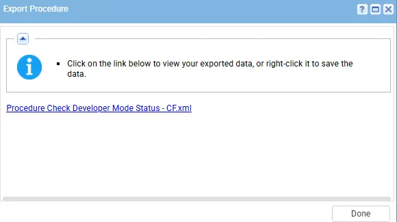
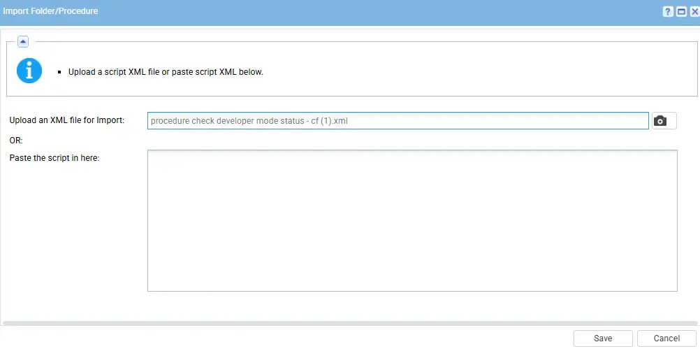
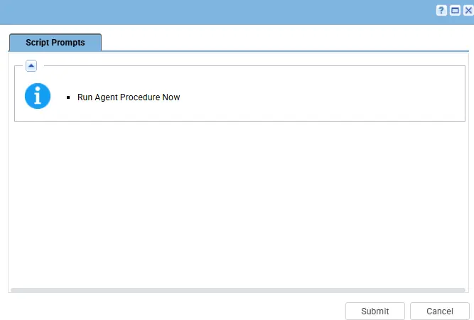

## Summary

This script used to check the status of developer mode on the windows machine and update the result into the custom field [cPVAL_Developer_Mode_Status](/docs/7eca9a7b-d09d-416d-8c04-3dab7776ba1b).

## Dependencies

- PowerShell 5.0+
- [Custom Field: cPVAL_Developer_Mode_Status](/docs/7eca9a7b-d09d-416d-8c04-3dab7776ba1b)
- [Solution: Enable/Disable Developer Mode](/docs/b4452b00-9dfd-4ad8-b4fd-3ba7769ff674)

## Variable

`Developer Mode`: description  
Accepted Values: 
  - Enable: description
  - Disable: Descripton

## Implementation

1. Export the agent procedure from ProVal's VSA RMM instance.  
   **Name:** `Check Developer Mode Status - CF`   
     
   The export will download the necessary XML file.

2. Import this XML file into the partner's VSA RMM instance.

## Sample Run

Now, You can execute the script on the machine in which you need to check status of the developer mode and it will update the result into the custom filed.

## Output

- Agent Procedure log
- Custom Field: `cPVAL_Developer_Mode_Status`

## Changelog

### 2026-05-01

  - Initial version of the document
