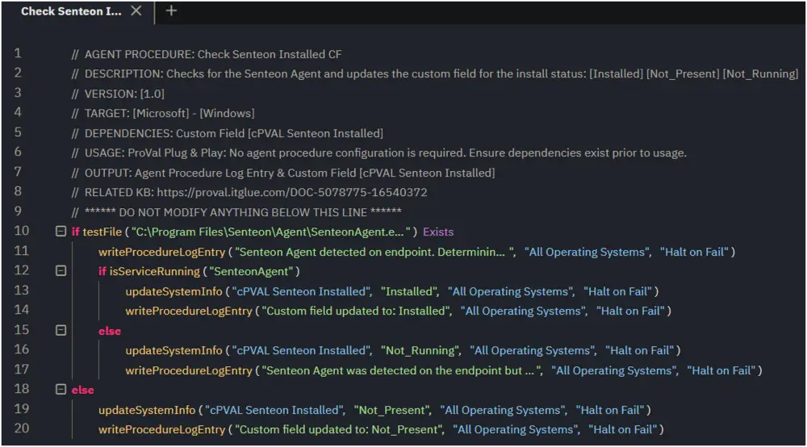
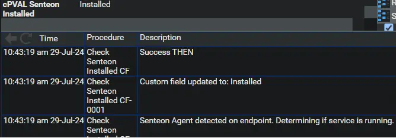
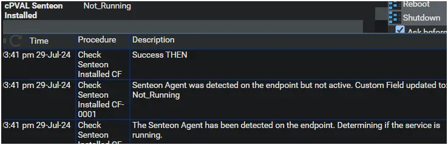
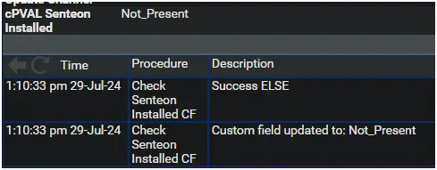

## Summary

This agent procedure is used to check for the presence of the Senteon Agent on the endpoint and updates a custom field **cPVAL Senteon Installed** with the status.

## Dependencies

Custom Field: [cPVAL Senteon Installed](/docs/bc1c7f2d-8eb4-41a3-bb12-8150cdeb0241)

## Associated Content

[SWM - Software Management - Solution - Senteon Agent](/docs/5cc5165d-4314-499b-9357-299f3b04f402)

## Implementation

Ensure all dependencies exist prior to implementation.  
Export the agent procedure from the ProVal VSA and import it into the partner VSA.  
Name: Check Senteon Installed CF  

  
  

## Output

Agent Procedure Log Entry  

Script Summary of Success is expected  
  

Agent Procedure Log Entry & Custom Field - **Installed**  
  

Agent Procedure Log Entry & Custom Field - **Not Running**  
  

Agent Procedure Log Entry & Custom Field - **Not Present**  
  