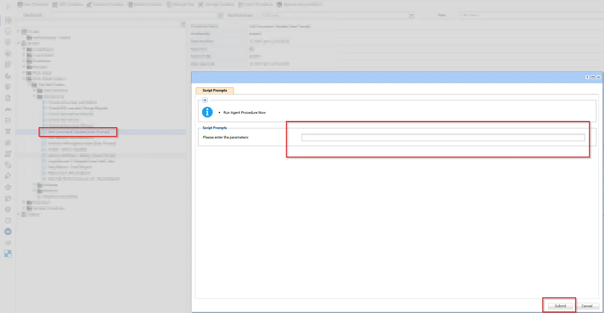
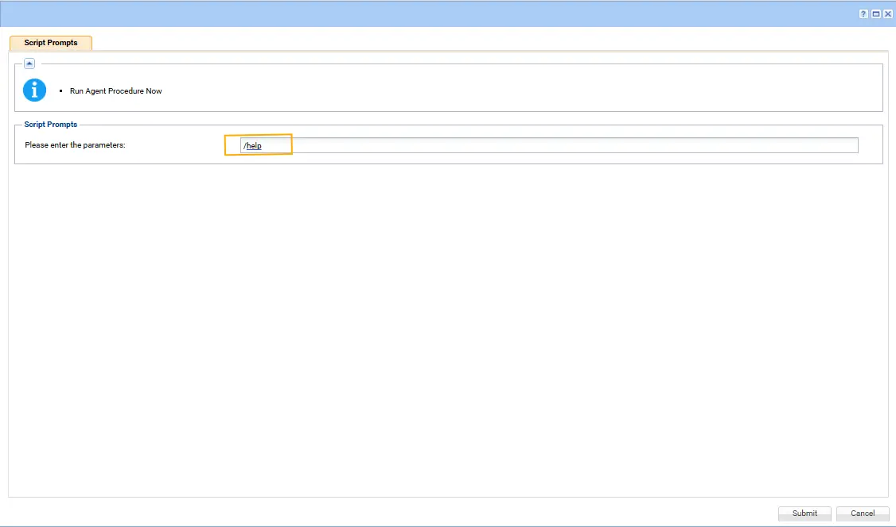

## Summary

This procedure deploys all updates including BIOS, firmware, and drivers to the endpoint. The script prompts for variables during runtime where we can pass arguments to install all, or only firmware, only Dell updates, only drivers, or any specific driver as needed.

For complete documentation on supported arguments, refer to: See [Dell Documentation](https://www.dell.com/support/manuals/en-us/command-update/dcu_rg/dell-command-%7C-update-cli-commands?guid=guid-92619086-5f7c-4a05-bce2-0d560c15e8ed&lang=en-us) for supported parameters.

## Sample Run

## Note: `If an argument contains double quotes ("), they must be escaped by using them twice (""silent""). Otherwise, the command will not execute correctly.`

## Dependenies

   [Initialize-DellCommandUpdate](/docs/aa963f3d-f149-4bfa-8fdc-30f12c21ce7f)

## Parameters

| Parameter  | Required | Example                                                                                          | Type   | Details                                                                                                                                                                                                                                           | Description                                                |
| ---------- | -------- | ------------------------------------------------------------------------------------------------ | ------ | ------------------------------------------------------------------------------------------------------------------------------------------------------------------------------------------------------------------------------------------------- | ---------------------------------------------------------- |
| `Argument` | False    |                   --                                                                                       | String | DCU-CLI arguments to execute. See [Dell Documentation](https://www.dell.com/support/manuals/en-us/command-update/dcu_rg/dell-command-%7C-update-cli-commands?guid=guid-92619086-5f7c-4a05-bce2-0d560c15e8ed&lang=en-us) for supported parameters. | Leave this field blank to perform scan only                |
| `Argument` | False    | `/applyUpdates -updateType=driver,application,bios,firmware -silent -reboot -forceupdate=enable` | String | DCU-CLI arguments to execute. See [Dell Documentation](https://www.dell.com/support/manuals/en-us/command-update/dcu_rg/dell-command-%7C-update-cli-commands?guid=guid-92619086-5f7c-4a05-bce2-0d560c15e8ed&lang=en-us) for supported parameters. | Installs drivers, applications, BIOS, and firmware updates |
| `Argument` | False    | `/applyUpdates -updateType=driver -silent -reboot=disable -forceupdate=enable`                   | String | DCU-CLI arguments to execute. See [Dell Documentation](https://www.dell.com/support/manuals/en-us/command-update/dcu_rg/dell-command-%7C-update-cli-commands?guid=guid-92619086-5f7c-4a05-bce2-0d560c15e8ed&lang=en-us) for supported parameters. | Installs driver updates only without reboot                |
| `Argument` | False    | `/help`                                                                                          | String | DCU-CLI arguments to execute. See [Dell Documentation](https://www.dell.com/support/manuals/en-us/command-update/dcu_rg/dell-command-%7C-update-cli-commands?guid=guid-92619086-5f7c-4a05-bce2-0d560c15e8ed&lang=en-us) for supported parameters. | Displays Dell Command Update CLI help                      |

### Examples

1. **Default scan operation**: If executing the script without any arguments it will only scan.

   

2. **Apply driver updates silently**:

   `/applyUpdates -updateType=driver -silent -reboot=disable -forceupdate=enable`
  
   

3. **Display DCU help**:

   `/help`

    

4. **Apply driver, application, bios, firmware updates silently and reboot**:

   `/applyUpdates -updateType=driver,application,bios,firmware -silent -reboot -forceupdate=enable`

    

## Output

- Script Logs

- `C:\ProgramData\_automation\AgentProcedure\DellCommandUpdate\Initialize-DellCommandUpdate-log.txt`

- `C:\ProgramData\_automation\AgentProcedure\DellCommandUpdate\Initialize-DellCommandUpdate-error.txt`
