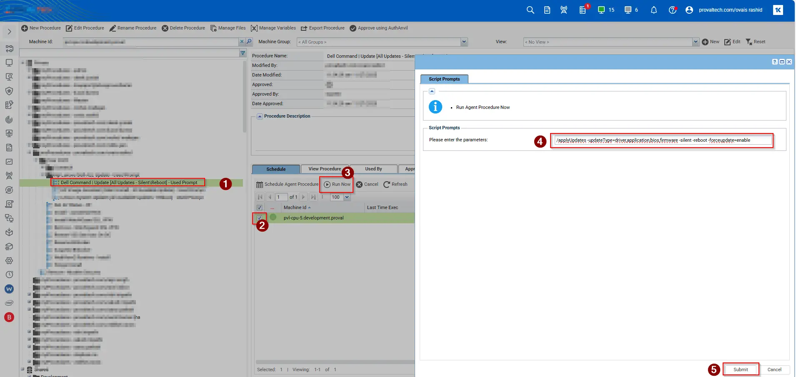

## Summary

This procedure deploys all updates including BIOS, firmware, and drivers to the endpoint. The script prompts for variables during runtime, and we can also pass arguments to install only firmware, only Dell updates, only drivers, or any specific driver as needed.

For complete documentation on supported arguments, refer to: See [Dell Documentation](https://www.dell.com/support/manuals/en-us/command-update/dcu_rg/dell-command-%7C-update-cli-commands?guid=guid-92619086-5f7c-4a05-bce2-0d560c15e8ed&lang=en-us) for supported parameters.

## Sample Run

## Parameters

| Parameter         | Required  | Default              | Type      | Description                                                                 |
|-------------------|-----------|----------------------|-----------|-----------------------------------------------------------------------------|
| `Argument`        | True    | `/applyUpdates -updateType=driver,application,bios,firmware -silent -reboot -forceupdate=enable`    | String    | DCU-CLI arguments to execute. See [Dell Documentation](https://www.dell.com/support/manuals/en-us/command-update/dcu_rg/dell-command-%7C-update-cli-commands?guid=guid-92619086-5f7c-4a05-bce2-0d560c15e8ed&lang=en-us) for supported parameters. |

## Dependenies

PowerShell 5.0+

## Output

Script Logs