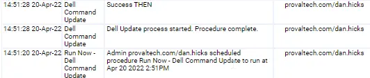

## Summary

This document describes how to download and run DellCMDUpdate from the ProVal App Repository.

## Sample Run

## Dependencies

- Dell manufactured endpoint

## Variables

- None

## Process

- Run the procedure as outlined.

## Output

- The log file can be found at: `workingdir/System/DellCMDUpdate-log.txt`