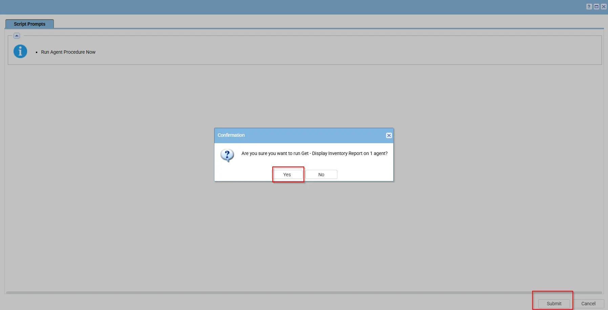
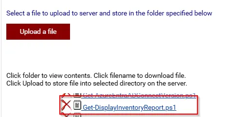

## Summary

This script collects and displays detailed information about the system’s video controllers (GPUs), including their names, driver versions, resolution, refresh rate, and status. It also detects connected monitors and identifies their manufacturer, model, serial number, active port, and instance name. Additionally, it reports Windows desktop monitor status and detects connected docks or display adapters such as Thunderbolt, DisplayLink, and USB-C, with all collected information displayed in the Custom Field [cPVAL Display Inventory Report](/docs/fc4e36df-7bc1-46d7-9ec3-7b09b0efe99b)

## Sample Run

 

## Dependencies

- [Custom Field - cPVAL Display Inventory Report](/docs/fc4e36df-7bc1-46d7-9ec3-7b09b0efe99b)

## Implementation

1. Export the agent procedure from ProVal's VSA RMM instance.   
   **Name:** `Get - Display Inventory Report`  

   The export will download the necessary XML file.

2. Create Custom Field on partners Environment.

- [Custom Field - cPVAL Display Inventory Report](/docs/fc4e36df-7bc1-46d7-9ec3-7b09b0efe99b)
   
3. Import this XML file into the partner's VSA RMM instance.   

4. Export the `Get-DisplayInventoryReport.ps1` from the ProVal's Internal VSA. This is also placed under the below path:  
`Manage Files` > `Shared Files` > `PVAL` > `Get-DisplayInventoryReport.ps1`  

   

4. Map the `Get-DisplayInventoryReport.ps1` into the `12th` step of the script in the client's environment.

5. Describe further steps if required.

## Output

- Script logs
- C:\ProgramData\_automation\AgentProcedure\DisplayInventoryReport\DisplayInventoryReport.txt

## Changelog

### 2026-09-01