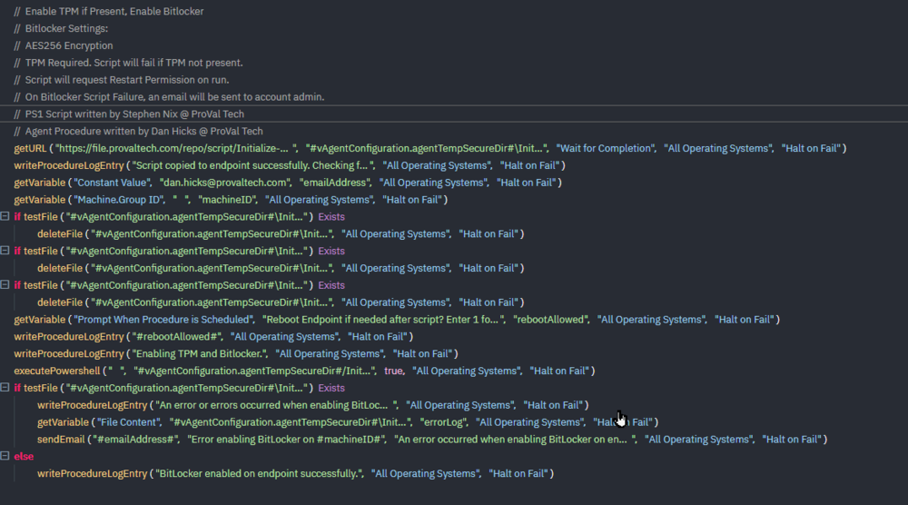

## Enable Bitlocker

This document enables Bitlocker and requires the following endpoint properties:

- Pro / Premium Windows OS
- Hardware TPM
- Group Policy must not force encryption other than AES 256

Clients will receive an email if the process fails on an endpoint. The email address must be manually configured in Line 11.

The script no longer requires a restart to complete successfully.

The script is located in ProVal VSA at:  
`Shared > PVAL Content Source > BitLocker > Enable Bitlocker`

