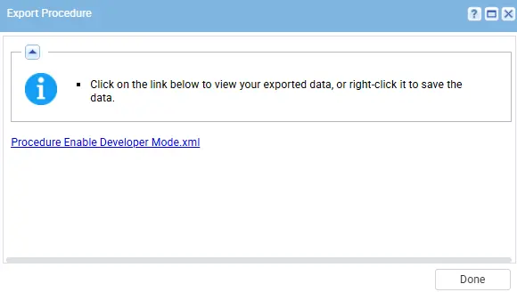
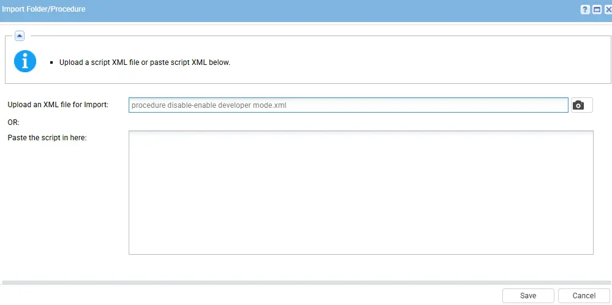
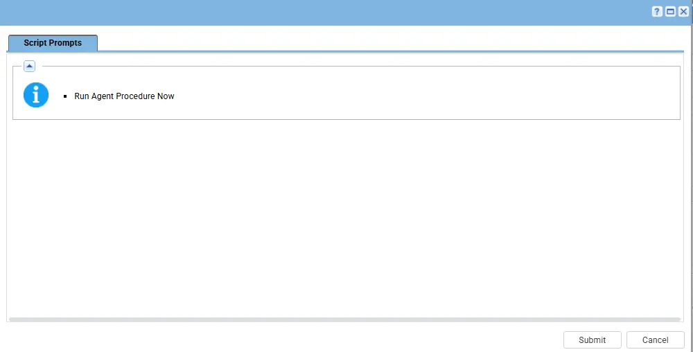

## Summary

This script is used to check the status of Developer mode and if its disable then it will enable on the Windows machine and will also validate after enable.

## Dependencies

- PowerShell 5.0+
- [Solution: Developer Mode Enable Solution](/docs/b4452b00-9dfd-4ad8-b4fd-3ba7769ff674)

## Implementation

1. Export the agent procedure from ProVal's VSA RMM instance.  
   **Name:** `Enable Developer Mode`   
     
   The export will download the necessary XML file.

2. Import this XML file into the partner's VSA RMM instance.

## Sample Run

Now, You can execute the script on the machine in which you want to enable the developer mode on the machine.

## Output

- Agent Procedure log

## Changelog

### 2026-05-01

  - Initial version of the document