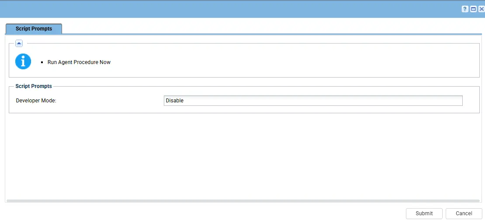

## Summary

This script enables or disables Developer Mode on a Windows machine based on the specified parameter.

## Dependencies

- PowerShell 5.0+
- [Solution: Enable/Disable Developer Mode](/docs/b4452b00-9dfd-4ad8-b4fd-3ba7769ff674)

## Variable

**`Developer Mode`**: As per the accepted value, it will enable or disable the Developer Mode on the machine.

Accepted Values: 
  - **Enable:** Enables the Developer Mode on the selected machine.
  - **Disable:** Disables the Developer Mode on the selected machine.

## Implementation

1. Export the agent procedure from ProVal's VSA RMM instance.  
   **Name:** `Enable/Disable Developer Mode`   
     
   The export will download the necessary XML file.

2. Import this XML file into the partner's VSA RMM instance.

## Sample Run

**Example 1:**  
Execute the script with `Developer Mode` = `Enable` to enable the Developer Mode on the machine.

**Example 2:**  
Execute the script with `Developer Mode` = `Disable` to Disable the Developer Mode on the machine.

## Output

- Agent Procedure log

## Changelog

### 2026-05-05

- Initial version of the document