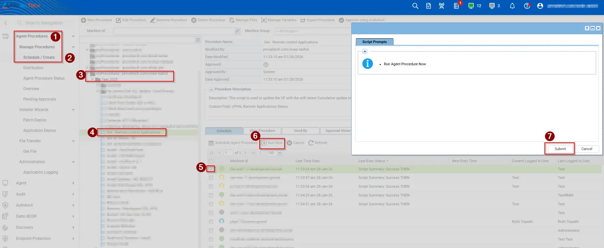

## Summary

This script inventories the endpoint for a curated list of remote access utilities by inspecting uninstall registry keys, running processes, installed services, and known executable paths. Optional exclusions can be defined using the Kaseya VSA agent procedure parameter ToolsToIgnore. All detected results are written to the script output and can be mapped to a Kaseya custom field for auditing and reporting purposes.

## Remote Applications Check

Supported tool display names (use exact spelling when excluding):

`AeroAdmin, Ammyy Admin, AnyDesk, BeyondTrust, Chrome Remote Desktop,Connectwise Control, DWService, GoToMyPC, LiteManager, LogMeIn, ManageEngine, Ninja RMM, NoMachine, Parsec, Remote Utilities, RemotePC, Splashtop, Supremo, TeamViewer, TightVNC, UltraVNC, VNC Connect (RealVNC), Zoho Assist, Atera, Automate, Datto RMM, Kaseya, N-Able N-Central, N-Able N-Sight, Syncro.`

## Sample Run

## Dependencies

[Custom Field - cPVAL Remote Applications Status](/docs/a89004d0-e23c-4f89-8937-dd62e2b64b7f)

## Variables

We have created two custom variables:

- `Name`: Used to specify the name of the application(s) that need to be excluded.
- `Excluded`: This value must be set to 0 or 1.

- `1 – Excludes the specified application(s); they will not be displayed in the custom field.`
- `0 – No exclusion is applied; all specified applications will be displayed in the custom field if present on the machine.`

**Example** use the below format to exclude any application.

- For multiple applications:

        'Datto RMM, Automate, Connectwise Control'
        
- For single application:

        'Datto RMM' 

## Parameters

| Parameter  | Required | Example                                                     | Type   | Description                                                                                                                                            |
| ---------- | -------- | ----------------------------------------------------------- | ------ | ------------------------------------------------------------------------------------------------------------------------------------------------------ |
| `Argument` | No       | *(leave blank)*                                             | String | Leave blank to include **all detected remote access tools**. No exclusions will be applied, and all installed tools will be shown in the custom field. |
| `Argument` | Yes      | `-ToolsToIgnore 'Datto RMM, Automate, ConnectWise Control'` | String | Specify the name(s) of remote access tools to exclude from results. Any tool listed here will **not** be shown in the custom field output.             |

## Output

- Script Logs.
- Custom Field.
