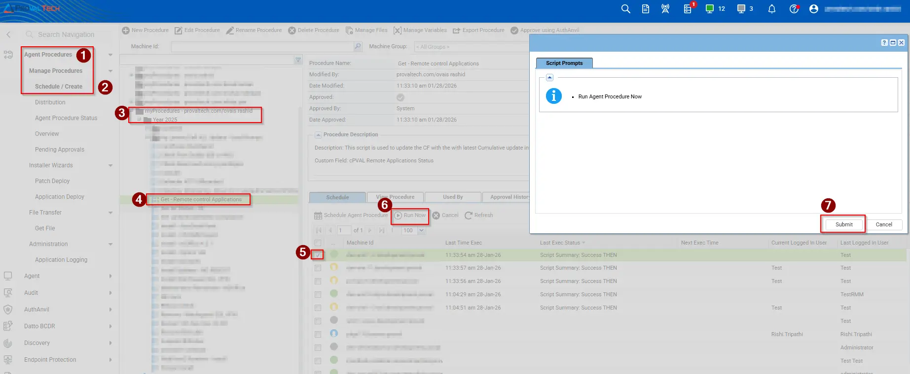
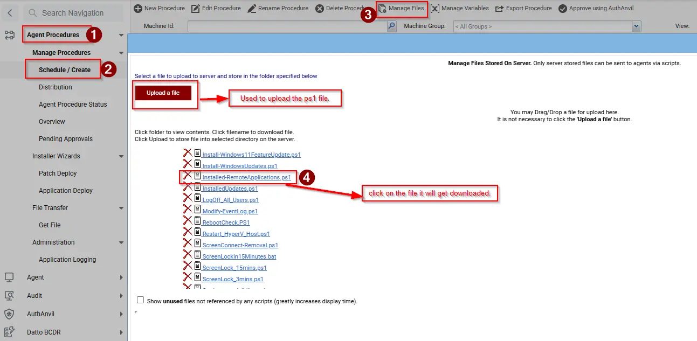

## Summary

This script inventories the endpoint for a curated list of remote access utilities by inspecting uninstall registry keys, running processes, installed services, and known executable paths. Optional exclusions can be defined using the Kaseya VSA agent procedure parameter **Name** and **Excluded** . All detected results are written to the script output and can be mapped to a Kaseya custom field for auditing and reporting purposes.

## Remote Applications Check

Supported tool display names (use exact spelling when excluding):

`AeroAdmin, Ammyy Admin, AnyDesk, BeyondTrust, Chrome Remote Desktop, ConnectWise Control, DWService, GoToMyPC, LiteManager, LogMeIn, ManageEngine, Ninja RMM, NoMachine, Parsec, Remote Utilities, RemotePC, Splashtop, Supremo, TeamViewer, TightVNC, UltraVNC, VNC Connect (RealVNC), Zoho Assist, Atera, Automate, Datto RMM, Kaseya, N-Able N-Central, N-Able N-Sight, Syncro.`

## Sample Run

## Dependencies

-  [Custom Field - cPVAL Remote Applications Status](/docs/a89004d0-e23c-4f89-8937-dd62e2b64b7f)
- `.\Installed-RemoteApplications.ps1`
- The `.ps1` file is located under **Managed Files**. The file must be downloaded and uploaded to the same folder.
- **Location:** `VSASharedFiles\PVAL\Installed-RemoteApplications.ps1`

## Script Variables

- In script **line number 12**, enter the application name(s) that need to be excluded.
- In script **line number 14**, change the value from `0` to `1` to exclude applications.

- `Excluded`: This value must be set to `0` or `1`.

    - `1`: Excludes the specified application(s); they will not be displayed in the custom field.
    - `0`: No exclusion is applied; all specified applications will be displayed in the custom field if present on the machine.

**Example:** Use the below format to exclude any application.

- For multiple applications:

        'Datto RMM, Automate, ConnectWise Control'
        
- For a single application:

        'Datto RMM'

## Output

- Script logs  
- Custom field
