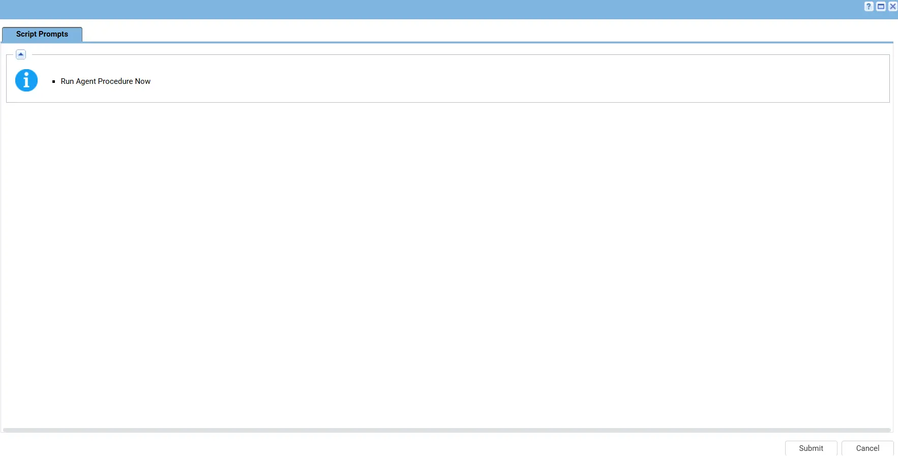

## Summary

Alerts if a device (workstation or server) hasn't been rebooted within a configurable number of days (and optionally minutes). Designed for RMM automation to proactively flag devices that have exceeded their expected reboot cycle.

## Dependencies

- [Get-LastRebootTime](/docs/ab26f055-f420-4e35-8241-8f868c940b6d)

## Sample Run

## Implementation

1. Export the agent procedure from ProVal's VSA RMM instance.   
   **Name:** `Get - Last Reboot Time`   

   The export will download the necessary XML file.   
   
2. Import this XML file into the partner's VSA RMM instance. 

3. Create Managed Variable
  - `<ThresholdDays>`
 
## Output

- Script Output

## Changelog

### 2026-07-23

- Initial version of the document.