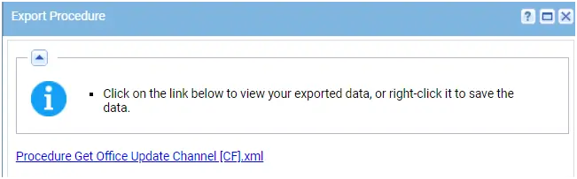
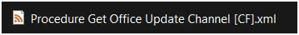
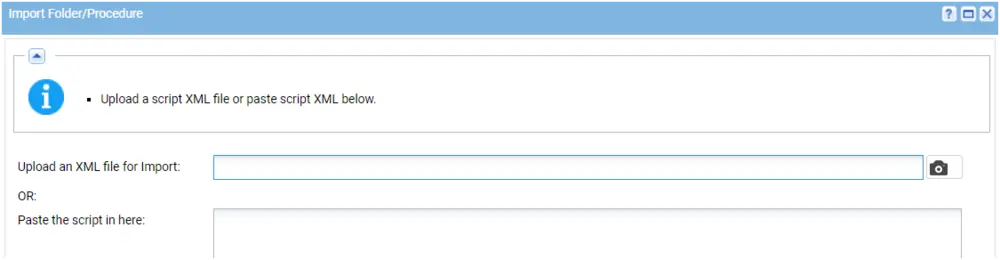
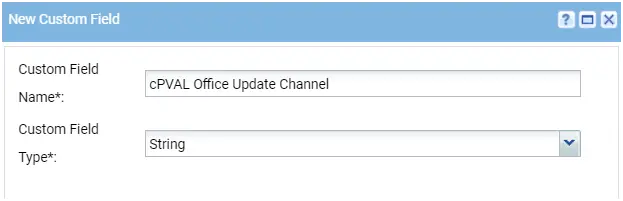
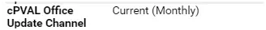

## Summary

This agent procedure is used to check the update channel for Microsoft Office and update to a CF.

The following channels are checked:

- Current (Monthly)
- Current Preview (Monthly Targeted/Insiders)
- Semi-Annual Enterprise (Broad)
- Semi-Annual Enterprise Preview (Targeted)
- Monthly Enterprise
- Beta
- LTSC
- LTSC Preview
- LTSC 2021 (Office 2021+)

## Dependencies

Custom Field: **cPVAL Office Update Channel**

## Implementation

1. Export the agent procedure from ProVal's VSA RMM instance.  
   Name: Get Office Update Channel (Windows) [CF]  
     
   The export will download the necessary XML file.  
     
   
2. Import this XML file into the partner's VSA RMM instance.  
     

3. Once imported, create a custom field in the partner environment.  
   Name: cPVAL Office Update Channel  
   Custom Field Type: String  
     

## Output

A Last Exec Status of success is expected.  
  
Agent Procedure Log  
  

Custom Field  
  