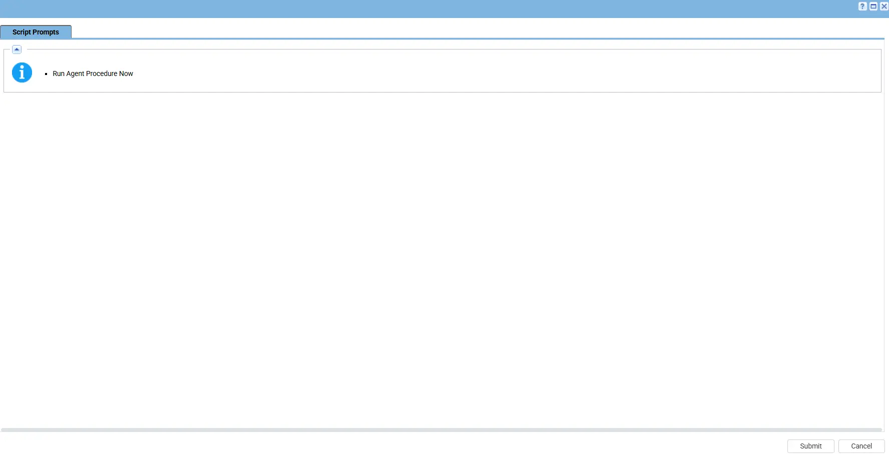
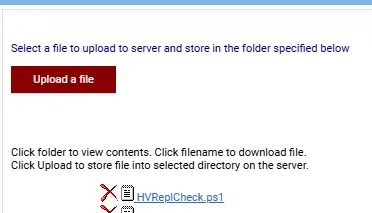

## Summary

- Monitors Hyper-V Replica health status, detects replication issues, and records monitoring activity in local logs. 

- Generates Windows Event Log alerts for Warning/Critical replication states and integrates with Kaseya VSA for automated monitoring and alerting. 

- Runs automatically through Windows Task Scheduler under the SYSTEM account every 15 minutes to provide continuous Hyper-V replication monitoring.

## Sample Run

 

## Implementation

1. Export the agent procedure from ProVal's VSA RMM instance.   
   **Name:** Hyper V Replication Audit  

   The export will download the necessary XML file.   
   
2. Import this XML file into the partner's VSA RMM instance.   

3. Export the `HVReplCheck.ps1` from the ProVal's Internal VSA. This is also placed under the below path:  
`Manage Files` > `Shared Files` > `PVAL` > `HVReplCheck.ps1`  

 

4. Map the `HVReplCheck.ps1` into the `12th` step of the script in the client's environment.

## Output

- Script Logs
- `C:\ProgramData\_Automation\Script\HVReplication\HVReplCheck.log`

## Changelog

### 2026-07-10

- This is initial version.
