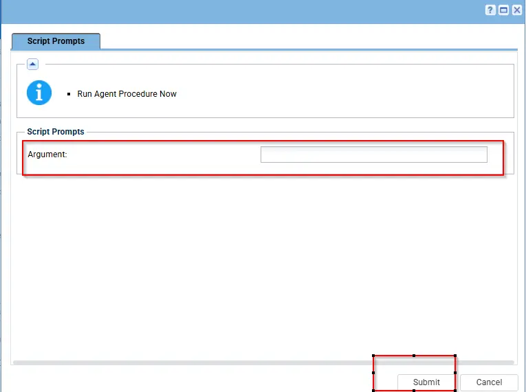
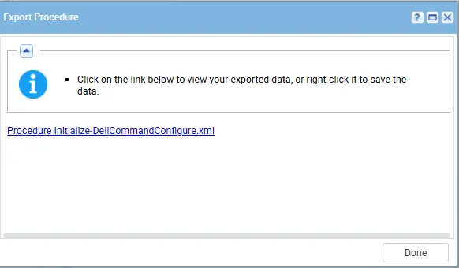
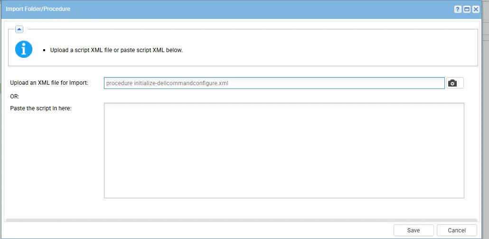
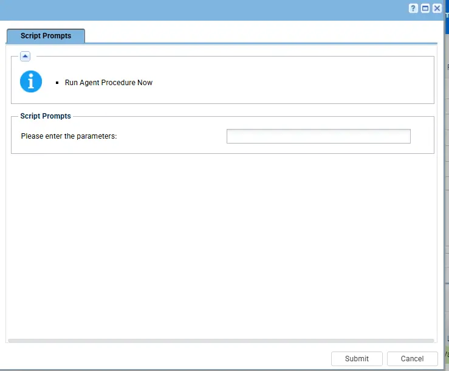
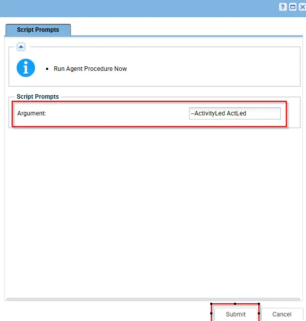

## Summary

Automates installation, updating, and execution of Dell Command | Configure (DCC) on Dell workstations. Ensures the latest version is present and provides command-line automation for BIOS configuration operations with comprehensive error handling and logging.

For complete documentation on supported arguments, refer to: See [Dell Documentation](https://www.dell.com/support/manuals/en-in/command-configure-v4.2/dcc_cli_4.2/bios-options?guid=guid-44c059be-b76d-4b2f-b8ef-655f736c40ce&lang=en-us) for supported parameters.  

## Sample Run

**Note:** `If an argument contains double quotes ("), they must be escaped by using them twice (""silent""). Otherwise, the command will not execute correctly.`

## Dependencies

- [Agnostic - Initialize-DellCommandUpdate](/docs/aa963f3d-f149-4bfa-8fdc-30f12c21ce7f)

## Parameters

| Parameter  | Required | Type   | Details                                                                                                                                                                  | Description                                                                      |
| ---------- | -------- | ------ | ------------------------------------------------------------------------------------------------------------------------------------------------------------------------ | -------------------------------------------------------------------------------- |
| `Argument` | False    | String | DCU-CLI arguments to execute. See [Dell Documentation](https://www.dell.com/support/manuals/en-in/command-configure-v4.2/dcc_cli_4.2/bios-options?guid=guid-44c059be-b76d-4b2f-b8ef-655f736c40ce&lang=en-us) for supported parameters. | Follow the documentation for more details about the parameters |

## Implementation

1. Export the agent procedure from ProVal's VSA RMM instance.    
  
The export will download the necessary XML file.

2. Import this XML file into the partner's VSA RMM instance.  

## Examples

1. Execute the script with argument `--AcPwrRcvry on`. This enables the 'Power On after Power Outage' setting

2. Execute the script without any argument to show help menu  

3. Execute the script with argument `--ActivityLed ActLed`. This configures the Network Activity LED to be managed by an Advanced Configuration and Power Interface (ACPI)–compliant operating system and driver.    

## Output

- Script Logs
  - `C:\ProgramData\_automation\AgentProcedure\DellCommandConfigure\Initialize-DellCommandConfigure-log.txt`
  - `C:\ProgramData\_automation\AgentProcedure\DellCommandConfigure\Initialize-DellCommandConfigure-error.txt`

## Changelog

### 2026-04-20

- Initial version of the document