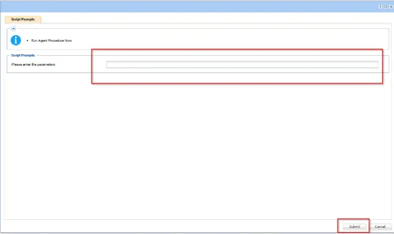
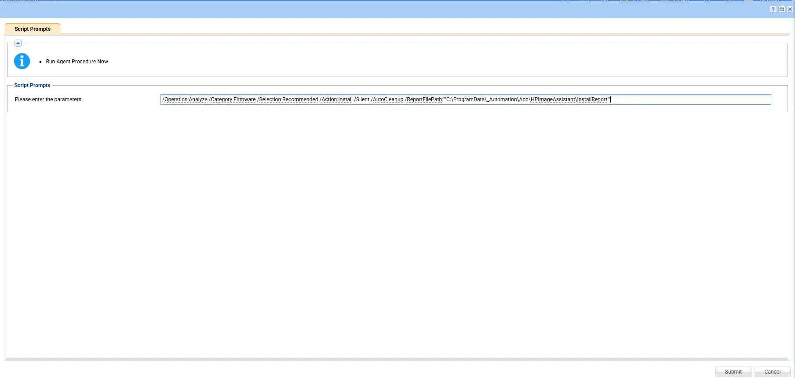
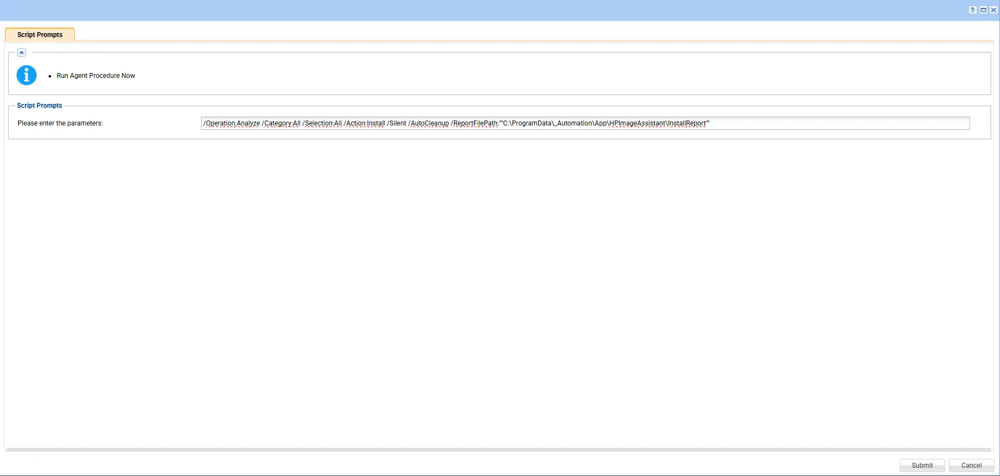

## Summary

This procedure deploys all updates including BIOS, firmware, and drivers to the endpoint HP workstations using HP Image Assistant (HPIA). It addresses the tedious, error-prone manual process of validating, acquiring, and installing driver, firmware, BIOS, and software updates on HP business PCs by fully automating:

- Environment and hardware validation
- Downloading and managing HP’s update tools
- Running update scans and applying updates
- Providing structured, human-readable reports

This tool is ideal for standardizing HP client environments, keeping endpoints secure, compliant, and up to date with minimal manual intervention.

For complete documentation on supported arguments, refer to: [HP Image Assistant User Guide](https://ftp.hp.com/pub/caps-softpaq/cmit/imagepal/userguide/936944-005.pdf)

**Note:** 
- `The script prompts for variables during runtime, where we can pass arguments to install all, or only firmware, only HP updates, only drivers, or any specific driver as needed.`
- `If an argument contains double quotes ("), they must be escaped by using them twice (""silent""). Otherwise, the command will not execute correctly.`

## Requirements

- Windows PowerShell 5.1 or higher
- Windows 10 or Windows 11 (x64)

## Sample Run

## Dependencies

   [Initialize-HPImageAssistant](/docs/92b749f0-2e30-4d4d-8916-fb5f30d85bff)

## Parameters

| Parameter  | Required | Example                                                                                                                                                                | Type   | Details                                                                                                                                                                  | Description                                                                      |
| ---------- | -------- | ---------------------------------------------------------------------------------------------------------------------------------------------------------------------- | ------ | ------------------------------------------------------------------------------------------------------------------------------------------------------------------------ | -------------------------------------------------------------------------------- |
| `Argument` | False    | `/Operation:Analyze /Category:All /Selection:All /Action:Install /Silent /AutoCleanup /ReportFilePath:"C:\ProgramData\_Automation\App\HPImageAssistant\InstallReport"` | String | HPIA arguments to execute. See the [HP Image Assistant User Guide](https://ftp.hp.com/pub/caps-softpaq/cmit/imagepal/userguide/936944-005.pdf) for supported parameters. | Executes HP Image Assistant to analyze the system and install applicable updates |
  
### Examples

1. **Default scan operation**: If executing the script without any arguments, it will only scan.

   

2. **Apply driver updates silently**: To perform an update action (for example, silent install of    recommended driver updates):

   `/Operation:Analyze /Category:Drivers /Selection:Recommended /Action:Install /Silent /AutoCleanup /ReportFilePath:""C:\ProgramData\_Automation\App\HPImageAssistant\InstallReport""`

   

3. **Apply Firmware updates silently**: To perform an update action (for example, silent install of recommended firmware updates):

   `/Operation:Analyze /Category:Firmware /Selection:Recommended /Action:Install /Silent /AutoCleanup /ReportFilePath:""C:\ProgramData\_Automation\App\HPImageAssistant\InstallReport""`

   

4. **Apply All updates silently** :To perform an update action (for example, silent install of all available updates):

    `/Operation:Analyze /Category:All /Selection:All /Action:Install /Silent /AutoCleanup /ReportFilePath:""C:\ProgramData\_Automation\App\HPImageAssistant\InstallReport""`

    

## Output

- Script Logs
   - `C:\ProgramData\_automation\AgentProcedure\DellCommandUpdate\Initialize-HPImageAssistant-log.txt`
   - `C:\ProgramData\_automation\AgentProcedure\DellCommandUpdate\Initialize-HPImageAssistant-error.txt`
