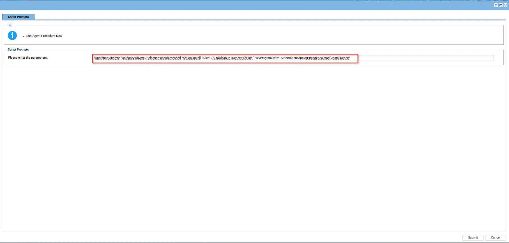

## Summary

`Initialize-HPImageAssistant.ps1` is a PowerShell automation script designed for IT administrators to efficiently manage updates and firmware on HP workstations using HP Image Assistant (HPIA). It addresses the tedious, error-prone manual process of validating, acquiring, and installing driver, firmware, BIOS, and software updates on HP business PCs by fully automating:

- Environment and hardware validation
- Downloading and managing HP’s update tools
- Running update scans and applying updates
- Providing structured, human-readable reports

This tool is ideal for standardizing HP client environments, keeping endpoints secure, compliant, and up to date with minimal manual intervention.

For complete documentation on supported arguments, refer to: [HP Image Assistant User Guide](https://ftp.hp.com/pub/caps-softpaq/cmit/imagepal/userguide/936944-005.pdf)

## Note

`The script prompts for variables during runtime, and we can also pass arguments to install only firmware, only Dell updates, only drivers, or any specific driver as needed.`

## Requirements

**Software:**

- Windows PowerShell 5.1 or higher
- Windows 10 or Windows 11 (x64)
- Internet access (for platform validation, downloading updates and HP Image Assistant)
- Administrative privileges (run as Administrator)

**Hardware:**

- HP workstation or desktop (validated via manufacturer and product ID)

## Sample Run

## Parameters
s
| Parameter         | Required  | Default              | Type      | Description                                                                 |
|-------------------|-----------|----------------------|-----------|-----------------------------------------------------------------------------|
| `Argument`        | True  | `/Operation:Analyze /Category:All /Selection:All /Action:Install /Silent /AutoCleanup /ReportFilePath:` `"C:\ProgramData\_Automation\App\HPImageAssistant\InstallReport"`    | String    | HPIA arguments to execute. See [HP Image Assistant User Guide](https://ftp.hp.com/pub/caps-softpaq/cmit/imagepal/userguide/936944-005.pdf) for supported parameters. |

## Dependencies

PowerShell 5.0+

## Output

Script Logs