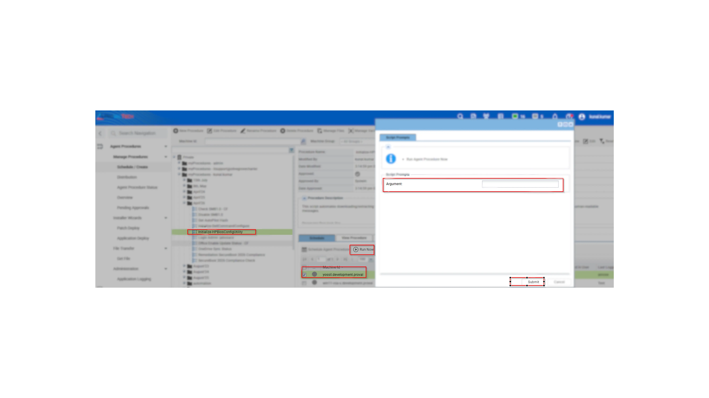
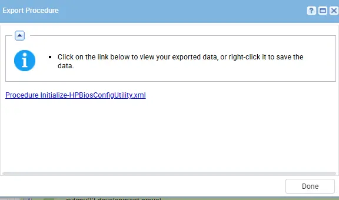
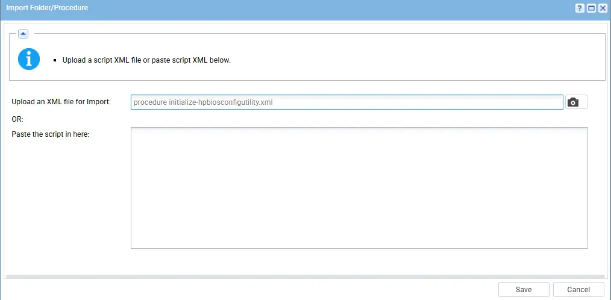
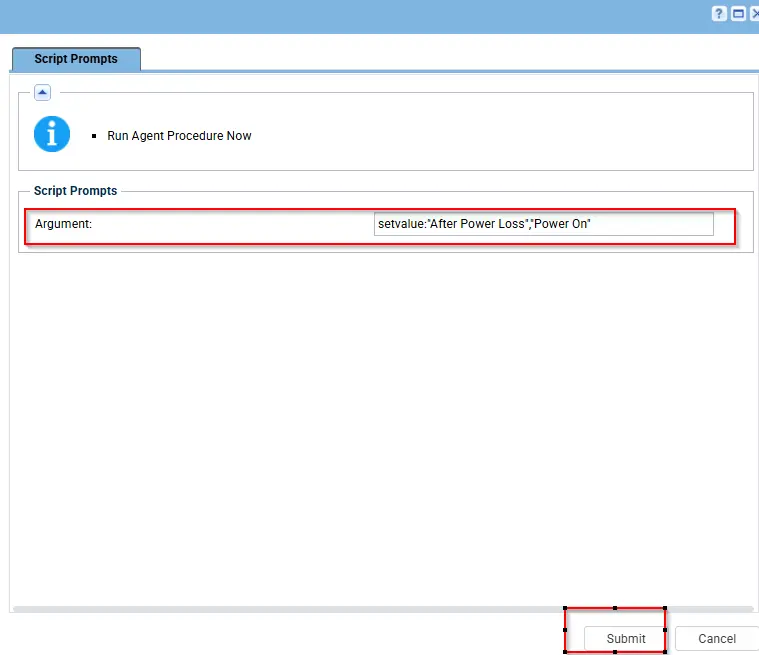
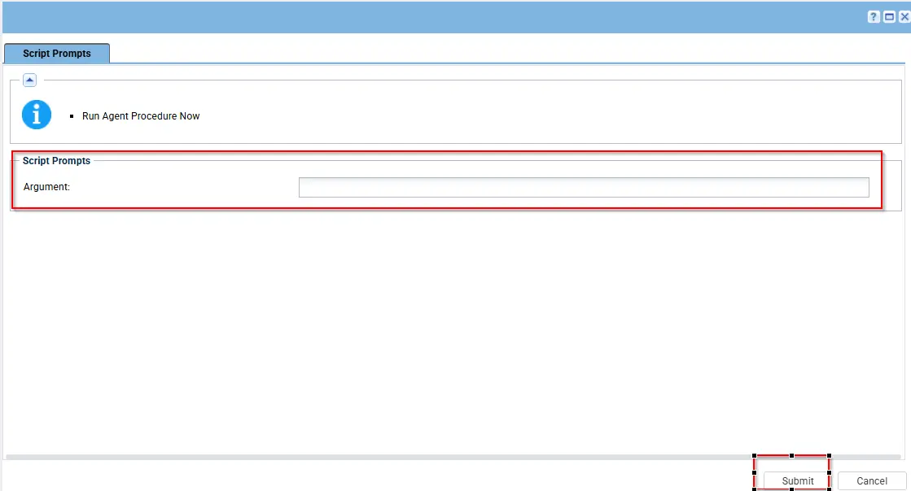

## Summary

This script automates downloading/extracting the BCU package, verifying the BCU executable, running BCU to read or apply BIOS settings, and interpreting BCU exit codes into human-readable messages.

For complete documentation on supported arguments, refer to: See [HP Documentation](https://ftp.hp.com/pub/caps-softpaq/cmit/whitepapers/BIOS_Configuration_Utility_User_Guide.pdf) for supported parameters.

## Sample Run

## Dependencies

[Initialize-HPBiosConfigUtility](/docs/b5d53223-2755-48da-b4f5-a1cd5fa9f58f)

## Variables

## Variables/Parameters

| Parameter  | Required | Example                                                                                          | Type   | Details                                                                                                                                                                                                                                           | Description                                                |
| ---------- | -------- | ------------------------------------------------------------------------------------------------ | ------ | ------------------------------------------------------------------------------------------------------------------------------------------------------------------------------------------------------------------------------------------------- | ---------------------------------------------------------- |
| `Argument` | False    | `-Argument '/SetConfig:"After Power Loss","Power On"'`                                                                                      | String | arguments to execute. See [HP Documentation](https://ftp.hp.com/pub/caps-softpaq/cmit/whitepapers/BIOS_Configuration_Utility_User_Guide.pdf) for supported parameters. | critical workstations that must stay online 24/7 without human intervention and will back online automatically when power back.                |
| `Argument` | False    | `'/SetConfig:"After Power Loss","Previous State"'` | String | arguments to execute. See [HP Documentation](https://ftp.hp.com/pub/caps-softpaq/cmit/whitepapers/BIOS_Configuration_Utility_User_Guide.pdf) for supported parameters. | General office workstations where you want to respect whether the user actually wanted the machine running. |
| `Argument` | False    | `'/SetConfig:"After Power Loss","Power Off"'` | String | arguments to execute. See [HP Documentation](https://ftp.hp.com/pub/caps-softpaq/cmit/whitepapers/BIOS_Configuration_Utility_User_Guide.pdf) for supported parameters. | High-density environments where you want to prevent a massive "power surge" caused by hundreds of machines turning on at the exact same second when the grid comes back online. |

## Implementation

1. Export the agent procedure from ProVal's VSA RMM instance.

The export will download the necessary XML file.

2. Import this XML file into the partner's VSA RMM instance.

## Examples

1. Execute it on the machine where its required with the parameter(--AcPwrRcvry on).It will enable the Power on setting automatically after outage only on the Dell Machines.

2. Execute it Without parameters, defaults to showing help:

## Output

- Script Logs

-`C:\ProgramData\_automation\AgentProcedure\HPBiosConfigUtility\Initialize-HPBiosConfigUtility.txt`

-`C:\ProgramData\_automation\AgentProcedure\HPBiosConfigUtility\Initialize-HPBiosConfigUtility.txt`

## Changelog

## 2026-04-16

- Initial version of the document