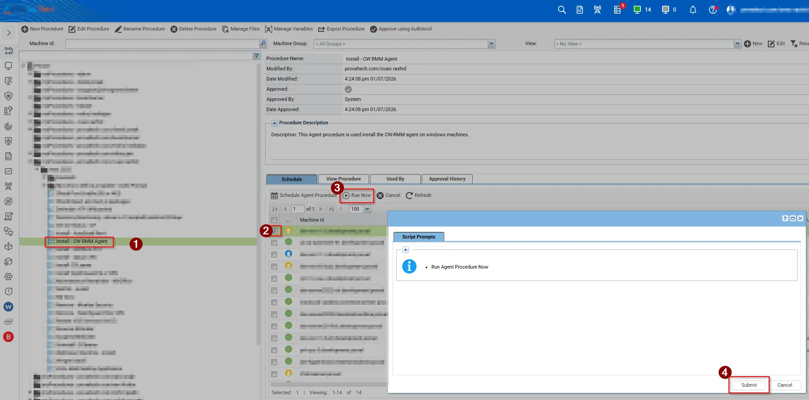
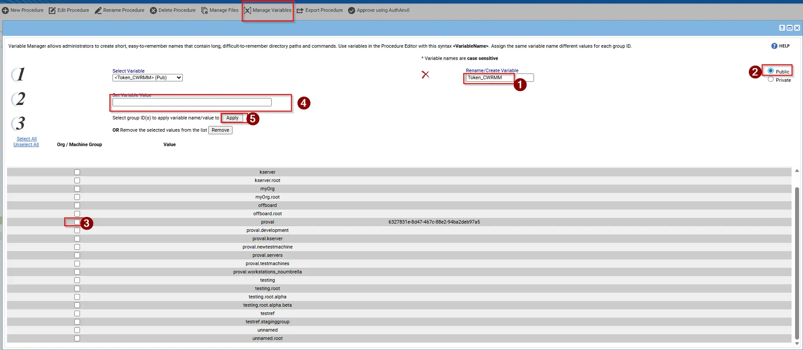

## Summary

This script is designed for VSA to deploy the ConnectWise Asio Platform agent to Windows endpoints in a controlled and automated manner. The script requires token during the installation. The token needs to upload under the managed Variables.

## Sample Run

## Parameters

Need to craete this variable under the managed files.

- **`<Token_CWRMM>`**

| Parameter         | Required | Type   | Description                                       |
|-------------------|----------|--------|---------------------------------------------------|
| `Token_CWRMM`     | True     | String | Tokem of the agent installation.                  |

  

## Output

- Script logs.
- `%ProgramData%_automation\AgentProcedure\CWRMM\AsioAgentInstaller.log`

| Time                 | Procedure                                            | Description                                                                                                                                                                                     | Admin  |
| -------------------- | ---------------------------------------------------- | ----------------------------------------------------------------------------------------------------------------------------------------------------------------------------------------------- | ------ |
| 1:40:46 PM 13-Jan-26 | Install - CW RMM Agent                               | Success THEN                                                                                                                                                                                    | ProNoc |
| 1:40:46 PM 13-Jan-26 | Install - CW RMM Agent-0005                          | Success THEN                                                                                                                                                                                    | ProNoc |
| 1:40:46 PM 13-Jan-26 | Install - CW RMM Agent-0005                          | CW Agent installed successfully.                                                                                                                                                                | ProNoc |
| 1:40:46 PM 13-Jan-26 | Install - CW RMM Agent                               | `msiexec /i "%ProgramData%\_automation\AgentProcedure\CWRMM\AsioAgentInstaller.msi" TOKEN=******** /qn /norestart /L*V "%ProgramData%\_automation\AgentProcedure\CWRMM\AsioAgentInstaller.log"` | ProNoc |
| 1:40:45 PM 13-Jan-26 | Install - CW RMM Agent-0001                          | Success ELSE                                                                                                                                                                                    | ProNoc |
| 1:40:45 PM 13-Jan-26 | Install - CW RMM Agent-0002                          | Success ELSE                                                                                                                                                                                    | ProNoc |
| 1:40:45 PM 13-Jan-26 | Install - CW RMM Agent-0003                          | Success THEN                                                                                                                                                                                    | ProNoc |
| 1:40:45 PM 13-Jan-26 | Install - CW RMM Agent-0003                          | Default platform installer downloaded                                                                                                                                                           | ProNoc |
| 1:40:44 PM 13-Jan-26 | Install - CW RMM Agent                               | Detected system locale: `en-US`                                                                                                                                                                 | ProNoc |
| 1:40:44 PM 13-Jan-26 | Execute Shell Command – Get Results to Variable      | Success THEN                                                                                                                                                                                    | ProNoc |
| 1:40:44 PM 13-Jan-26 | Execute Shell Command – Get Results to Variable-0001 | Success THEN                                                                                                                                                                                    | ProNoc |
| 1:40:44 PM 13-Jan-26 | Execute Shell Command – Get Results to Variable-0010 | Success THEN                                                                                                                                                                                    | ProNoc |
| 1:40:42 PM 13-Jan-26 | Execute Shell Command – Get Results to Variable-0002 | Success THEN                                                                                                                                                                                    | ProNoc |
| 1:40:42 PM 13-Jan-26 | Execute Shell Command – Get Results to Variable-0003 | Success THEN                                                                                                                                                                                    | ProNoc |
| 1:40:42 PM 13-Jan-26 | Execute Shell Command – Get Results to Variable-0004 | Success THEN                                                                                                                                                                                    | ProNoc |
| 1:40:42 PM 13-Jan-26 | Execute Shell Command – Get Results to Variable-0005 | Success ELSE                                                                                                                                                                                    | ProNoc |
| 1:40:42 PM 13-Jan-26 | Execute Shell Command – Get Results to Variable-0005 | Executing command in 64-bit shell as system: `powershell.exe "Get-WinSystemLocale -ErrorAction SilentlyContinue \| Select-Object -ExpandProperty Name"`                                         | ProNoc |
| 1:40:40 PM 13-Jan-26 | Execute PowerShell Command                           | Success THEN                                                                                                                                                                                    | ProNoc |
| 1:40:40 PM 13-Jan-26 | Execute PowerShell Command-0001                      | Success THEN                                                                                                                                                                                    | ProNoc |
| 1:40:40 PM 13-Jan-26 | Execute PowerShell Command-0002                      | Success THEN                                                                                                                                                                                    | ProNoc |
| 1:40:40 PM 13-Jan-26 | Execute PowerShell Command-0011                      | Success THEN                                                                                                                                                                                    | ProNoc |
| 1:40:40 PM 13-Jan-26 | Execute PowerShell Command-0012                      | Success ELSE                                                                                                                                                                                    | ProNoc |
| 1:40:40 PM 13-Jan-26 | Execute PowerShell Command-0011                      | PowerShell command completed successfully                                                                                                                                                       | ProNoc |
| 1:40:38 PM 13-Jan-26 | Execute PowerShell Command-0011                      | Executing PowerShell command: `New-Item -Type Directory -Path %ProgramData%\_automation\AgentProcedure -Name CWRMM -ErrorAction SilentlyContinue`                                               | ProNoc |
| 1:40:38 PM 13-Jan-26 | Execute PowerShell Command-0009                      | Success THEN                                                                                                                                                                                    | ProNoc |
| 1:40:38 PM 13-Jan-26 | Execute PowerShell Command-0010                      | Success ELSE                                                                                                                                                                                    | ProNoc |
| 1:40:38 PM 13-Jan-26 | Execute PowerShell Command-0010                      | Not sending output to variable                                                                                                                                                                  | ProNoc |
| 1:40:38 PM 13-Jan-26 | Execute PowerShell Command-0007                      | Success THEN                                                                                                                                                                                    | ProNoc |
| 1:40:38 PM 13-Jan-26 | Execute PowerShell Command-0008                      | Success THEN                                                                                                                                                                                    | ProNoc |
| 1:40:38 PM 13-Jan-26 | Execute PowerShell Command-0008                      | Custom command detected for directory creation                                                                                                                                                  | ProNoc |
| 1:40:38 PM 13-Jan-26 | Execute PowerShell Command-0003                      | Success THEN                                                                                                                                                                                    | ProNoc |
| 1:40:38 PM 13-Jan-26 | Execute PowerShell Command-0004                      | Success ELSE                                                                                                                                                                                    | ProNoc |
| 1:40:35 PM 13-Jan-26 | Execute PowerShell Command-0002                      | PowerShell is present                                                                                                                                                                           | ProNoc |
| 1:40:34 PM 13-Jan-26 | Install - CW RMM Agent                               | Checking and installing the CW RMM Agent                                                                                                                                                        | ProNoc |
| 1:40:27 PM 13-Jan-26 | Run Now – Install - CW RMM Agent                     | Procedure scheduled to run at Jan 13, 2026 1:40 PM                                                                                                                                              | ProNoc |