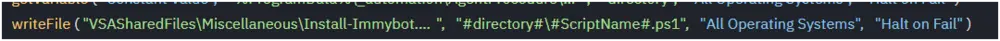
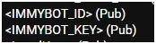
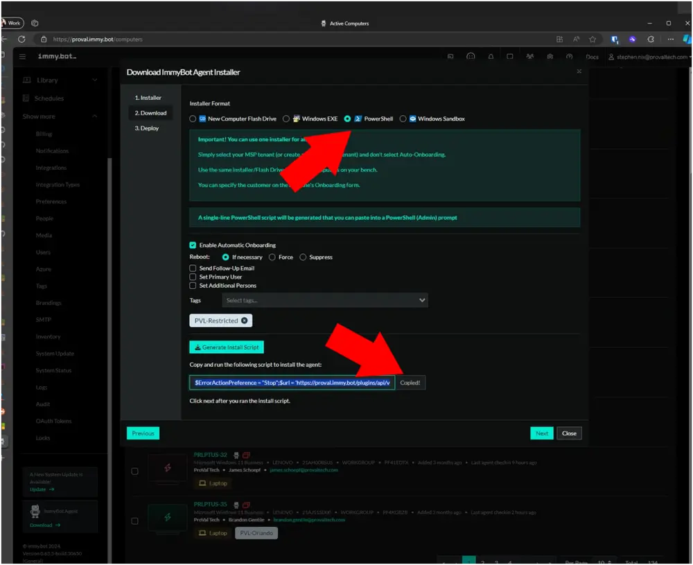
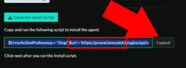

# Overview
This document provides instructions for installing ImmyBot on the endpoint using preconfigured variables.

# Dependencies
- Managed Variable (IMMYBOT_KEY)
- Managed Variable (IMMYBOT_ID)
- Managed File (Install-ImmyBot.ps1)

# VSA Implementation
1. Export the procedure from the ProVal VSA.
2. Import the procedure into the partner VSA.
3. Import the managed file (Install-ImmyBot.ps1)
   - This can be exported from our VSA:  
     `VSASharedFiles//Miscellaneous//Install-ImmyBot.ps1`
4. Modify the line 16 `writeFile` to point to the uploaded file, and ensure the destination shows `#directory#//#ScriptName#.ps1`



5. Create managed variables for IMMYBOT_ID and IMMYBOT_KEY  
   

These values can be gathered from the ImmyBot portal. The PowerShell output contains a KEY and an ID.

  
6. Specify the subdomain in the agent procedure. The subdomain can be gathered from the same command copied earlier.  

  

In this example, the subdomain of [https://proval.immy.bot](https://proval.immy.bot) would be **proval**.  

  

**Ensure you use the URL copied from the partner's ImmyBot instance**  

  

# Payload Usage
```powershell
PS C:/> Install-ImmyBot.ps1 -Subdomain 'yourSubdomain' -ID 'yourID' -KEY 'yourKEY' 
# Installs ImmyBot using the specified parameters.

PS C:/> Install-ImmyBot.ps1 -Subdomain 'yourSubdomain' -ID 'yourID' -KEY 'yourKEY' -Upgrade
# Installs ImmyBot using the specified parameters and will upgrade an existing agent to the latest version.

PS C:/> Install-ImmyBot.ps1 -Subdomain 'yourSubdomain' -ID 'yourID' -KEY 'yourKEY' -Upgrade -Force
# Installs ImmyBot using the specified parameters, will upgrade an existing agent to the latest version, and will replace existing installation even if up to date.
```

# Parameters
| Parameter    | Alias | Required | Default | Type   | Description                                                                                       |
|--------------|-------|----------|---------|--------|---------------------------------------------------------------------------------------------------|
| `-Subdomain` |       | True     |         | String | The subdomain of the partner's ImmyBot instance. This is their ImmyBot subdomain URL.          |
| `-ID`       |       | True     |         | String | ID for the installation of the ImmyBot agent                                                    |
| `-KEY`      |       | True     |         | String | KEY for the installation of the ImmyBot agent                                                   |
| `-Upgrade`   |       | False    |         | Switch | Will replace existing installations with the latest version of ImmyBot if an existing installation is detected. |
| `-Force`     |       | False    |         | Switch | Will replace existing installations with the latest version of ImmyBot even if the existing installation is using the current version. |

**Output**  
Location of output for log, result, and error files.
```
Agent Procedure Log Entry
%ProgramData%_automation/AgentProcedure/ImmyBotInstall/Install-ImmyBot-log.txt
%ProgramData%_automation/AgentProcedure/ImmyBotInstall/Install-ImmyBot-error.txt
```