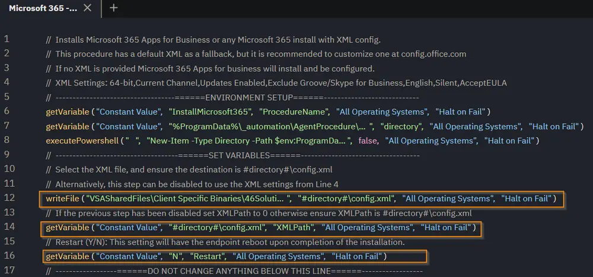

# Overview
This document enables the installation of Microsoft 365 Apps for Business or any Microsoft 365 product with XML configuration support. It is recommended to create an XML configuration at config.office.com.

# Requirements
- PowerShell 5+
- Windows 10+ / Server 2016+
- Must be run as an Administrator

# Process
1. Checks for elevated session privileges. If not elevated, it warns and exits.
2. Sets up the environment.
3. Checks if a custom XML configuration path is provided. If not, it creates a default configuration for Microsoft 365 Apps for Business installation.
4. Downloads and extracts the Office Deployment Tool (ODT) into a dedicated ODT folder within the script's directory.
5. Uses the ODT with the provided or default XML configuration to start the installation of Microsoft 365 Apps.
6. Cleans up the ODT folder after the installation is complete. Optionally, it restarts the computer if requested.

# VSA Implementation
In the VSA, there are a couple of variables for this script.

Within the SET VARIABLES section (Lines 9-17), there are three areas that can be customized.

You can specify the XML file on line 12 if using managed files. Ensure the destination is `#directory#//config.xml` or that the step is disabled if not specifying an XML file. Not specifying an XML will cause the script to use the XML settings shown in Line 4.

The XMLPath needs to be specified. If you've disabled step 12, change this from `#directory#//config.xml` to `0`.

The final variable is whether or not to restart the machine after installation. This can be set via Y/N.



# Payload Usage
```
PS C:/> Install-Microsoft365.ps1 
# Installs Microsoft 365 Apps for Business with default configuration.

PS C:/> Install-Microsoft365.ps1 -XMLPath "C:/Path/To/config.xml"
# Installs Microsoft 365 using the specified local XML configuration file.

PS C:/> Install-Microsoft365.ps1 -XMLPath "https://contoso.com/config.xml" -Restart 
# Installs Microsoft 365 using the specified XML configuration file with restart option.
```

# Parameters
| Parameter     | Alias | Required | Default  | Type   | Description                        |
|---------------|-------|----------|----------|--------|------------------------------------|
| `-XMLPath`    |       | False    |          | Switch | The URL/path to the XML config file |
| `-Restart`    |       |          | $False   | Switch | Restart after the installation       |

**Output**  
Location of output for log, result, and error files.
```
./Install-Microsoft365-log.txt
./Install-Microsoft365-error.txt
```