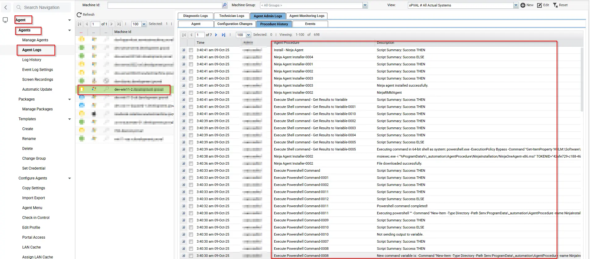

## Summary

This script deploys the NinjaRMMAgent to Windows and Mac OS.
It requires an Authorization token which needs to be stored under the managed variable.

## Sample Run

To run the script first fill the managed variable with the appropiate token which needs to get from the ninja Portal. The managed variable name is "Ninja_TokenID". To run the script use the below method.

## Dependencies

Managed Variable: Ninja_TokenID
Download URL for both Mac and windows.

## Variables
 
| Name               | Description                                                                          |
| ------------------ | ------------------------------------------------------------------------------------ |
| Dir for MAC        | /Library/Kaseya/_automation/AgentProcedure/NinjaInstallation                         |
| Dir for windows    | %ProgramData%_automation\AgentProcedure\NinjaInstallation                            |
| Ninja_TokenID      | This is used to store the Token which is required during the install of Ninja Agent. |
| #global:cmdresults# | Stores the command result to check the progress or error                             |

## Managed Files

None

## Output

| Time                  | Procedure                                         | Status                                                                                                                              | User                      |
|-----------------------|---------------------------------------------------|-------------------------------------------------------------------------------------------------------------------------------------|---------------------------|
| 3:40:41 am 9-Oct-25   | Install - Ninja Agent                             | Success THEN                                                                                                                        | ProNoc                    |
| 3:40:41 am 9-Oct-25   | Ninja Agent Installer-0004                        | Success ELSE                                                                                                                        | ProNoc                    |
| 3:40:41 am 9-Oct-25   | Ninja Agent Installer-0001                        | Success THEN                                                                                                                        | ProNoc                    |
| 3:40:41 am 9-Oct-25   | Ninja Agent Installer-0002                        | Success THEN                                                                                                                        | ProNoc                    |
| 3:40:41 am 9-Oct-25   | Ninja Agent Installer-0003                        | Success THEN                                                                                                                        | ProNoc                    |
| 3:40:41 am 9-Oct-25   | Ninja Agent Installer-0003                        | Ninja agent installed successfully.                                                                                                  | ProNoc                    |
| 3:40:41 am 9-Oct-25   | Ninja Agent Installer-0002                        | NinjaRMMAgent                                                                                                                        | ProNoc                    |
| 3:40:41 am 9-Oct-25   | Execute Shell command - Get Results to Variable   | Success THEN                                                                                                                        | ProNoc                    |
| 3:40:41 am 9-Oct-25   | Execute Shell command - Get Results to Variable-0001 | Success THEN                                                                                                                        | ProNoc                    |
| 3:40:41 am 9-Oct-25   | Execute Shell command - Get Results to Variable-0010 | Success THEN                                                                                                                        | ProNoc                    |
| 3:40:39 am 9-Oct-25   | Execute Shell command - Get Results to Variable-0002 | Success THEN                                                                                                                        | ProNoc                    |
| 3:40:39 am 9-Oct-25   | Execute Shell command - Get Results to Variable-0003 | Success THEN                                                                                                                        | ProNoc                    |
| 3:40:39 am 9-Oct-25   | Execute Shell command - Get Results to Variable-0004 | Success THEN                                                                                                                        | ProNoc                    |
| 3:40:39 am 9-Oct-25   | Execute Shell command - Get Results to Variable-0005 | Success ELSE                                                                                                                        | ProNoc                    |
| 3:40:39 am 9-Oct-25   | Execute Shell command - Get Results to Variable-0005 | `powershell.exe -ExecutionPolicy Bypass -Command "Get-ItemProperty 'HKLM:\Software\Microsoft\Windows\CurrentVersion\Uninstall*','HKLM:\Software\WOW6432Node\Microsoft\Windows\CurrentVersion\Uninstall*' -ErrorAction SilentlyContinue | Where-Object { $_.DisplayName -eq 'NinjaRMMAgent' } | Select-Object -ExpandProperty DisplayName -ErrorAction SilentlyContinue" > "c:\kworking\commandresults-1636964856.txt" 2>&1 | ProNoc |
| 3:40:38 am 9-Oct-25   | Ninja Agent Installer-0002                        | msiexec.exe -i "%ProgramData%_automation\AgentProcedure\NinjaInstallation/NinjaOneAgent-x86.msi" TOKENID="N122315212122"`          | ProNoc                    |
| 3:40:36 am 9-Oct-25   | Ninja Agent Installer-0002                        | File downloaded successfully.                                                                                                        | ProNoc                    |
| 3:40:33 am 9-Oct-25   | Execute Powershell Command                        | Success THEN                                                                                                                        | ProNoc                    |
| 3:40:33 am 9-Oct-25   | Execute Powershell Command-0001                   | Success THEN                                                                                                                        | ProNoc                    |
| 3:40:33 am 9-Oct-25   | Execute Powershell Command-0002                   | Success THEN                                                                                                                        | ProNoc                    |
| 3:40:33 am 9-Oct-25   | Execute Powershell Command-0011                   | Success THEN                                                                                                                        | ProNoc                    |
| 3:40:33 am 9-Oct-25   | Execute Powershell Command-0012                   | Success ELSE                                                                                                                        | ProNoc                    |
| 3:40:32 am 9-Oct-25   | Execute Powershell Command-0011                   | Powershell command completed!                                                                                                       | ProNoc                    |
| 3:40:30 am 9-Oct-25   | Execute Powershell Command-0011                   | `New-Item -Type Directory -Path $env:ProgramData_automation\AgentProcedure -Name NinjaInstallation`                                  | ProNoc                    |
| 3:40:30 am 9-Oct-25   | Execute Powershell Command-0009                   | Success THEN                                                                                                                        | ProNoc                    |
| 3:40:30 am 9-Oct-25   | Execute Powershell Command-0010                   | Success ELSE                                                                                                                        | ProNoc                    |
| 3:40:30 am 9-Oct-25   | Execute Powershell Command-0010                   | Not sending output to variable.                                                                                                      | ProNoc                    |
| 3:40:30 am 9-Oct-25   | Execute Powershell Command-0007                   | Success THEN                                                                                                                        | ProNoc                    |
| 3:40:30 am 9-Oct-25   | Execute Powershell Command-0008                   | Success THEN                                                                                                                        | ProNoc                    |
| 3:40:30 am 9-Oct-25   | Execute Powershell Command-0008                   | New command variable: `New-Item -Type Directory -Path $env:ProgramData_automation\AgentProcedure -Name NinjaInstallation`          | ProNoc                    |
| 3:40:30 am 9-Oct-25   | Execute Powershell Command-0008                   | Custom commands detected as `New-Item -Type Directory -Path $env:ProgramData_automation\AgentProcedure -Name NinjaInstallation`   | ProNoc                    |
| 3:40:30 am 9-Oct-25   | Execute Powershell Command-0003                   | Success THEN                                                                                                                        | ProNoc                    |
| 3:40:30 am 9-Oct-25   | Execute Powershell Command-0004                   | Success ELSE                                                                                                                        | ProNoc                    |
| 3:40:27 am 9-Oct-25   | Execute Powershell Command-0002                   | Powershell is present.                                                                                                              | ProNoc                    |
| 3:40:26 am 9-Oct-25   | Install - Ninja Agent                             | OS is 1                                                                                                                             | ProNoc                    |
| 3:40:26 am 9-Oct-25   | Install - Ninja Agent                             | Informational: Get Variable task in THEN step 4 was ignored because the client machine is running Win11, which does not meet the Mac OS X OS type criteria. (Line 13)                       | ProNoc                    |
| 3:40:26 am 9-Oct-25   | Install - Ninja Agent                             | Informational: Get Variable task in THEN step 2 was ignored because the client machine is running Win11, which does not meet the Mac OS X OS type criteria. (Line 10)                       | ProNoc                    |
| 3:40:19 am 9-Oct-25   | Run Now - Install - Ninja Agent                   | Admin ProNoc scheduled procedure Run Now - Install - Ninja Agent to run at Oct 9 2025 3:40AM                                           | ProNoc                    |

## Output

- Script log