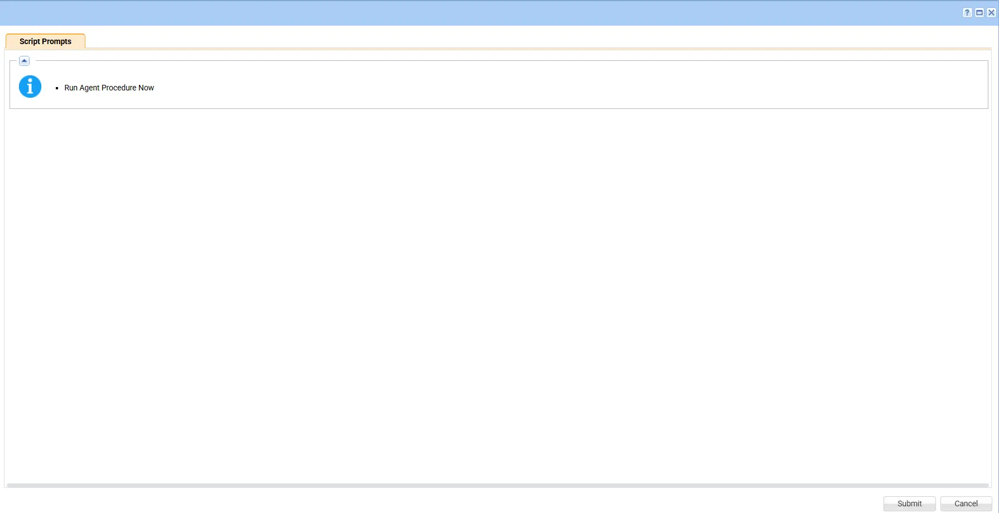

## Summary

This script checks the endpoint for an existing ScalePad Agent installation and determines whether the agent is already installed. If the ScalePad Agent is not detected, the script uses the configured ScalePad Enrollment Token to install and enroll the agent with the appropriate ScalePad organization. If the agent is already installed, the script exits without making any changes to the existing installation.

## Sample Run

## Dependencies

- [Managed Variables - ScalePad_Enrollment_Token](/docs/c5aeff56-6fcd-49a0-b3a6-a12dc7cf51cf)

## Implementation

1. Export the agent procedure from ProVal's VSA RMM instance.   
   **Name:** `Install ScalePad Agent` 

   The export will download the necessary XML file.   
   
2. Import this XML file into the partner's VSA RMM instance.   

3. Export the `Install-LCMAgent-Universal.ps1` from the ProVal's Internal VSA. This is also placed under the below path:  
`Manage Files` > `Shared Files` > `PVAL` > `Install-LCMAgent-Universal.ps1`  

  

4. Create the managed variable `ScalePad_Enrollment_Token`

    - [ScalePad_Enrollment_Token](/docs/c5aeff56-6fcd-49a0-b3a6-a12dc7cf51cf)

5. Map the `Install-LCMAgent-Universal.ps1` into the `18th` step of the script in the client's environment.
   
## Output

- Script logs

## Changelog

### 2026-08-18

- Initial version of the document