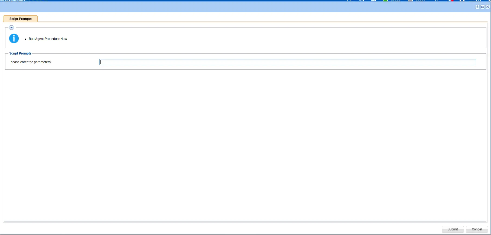
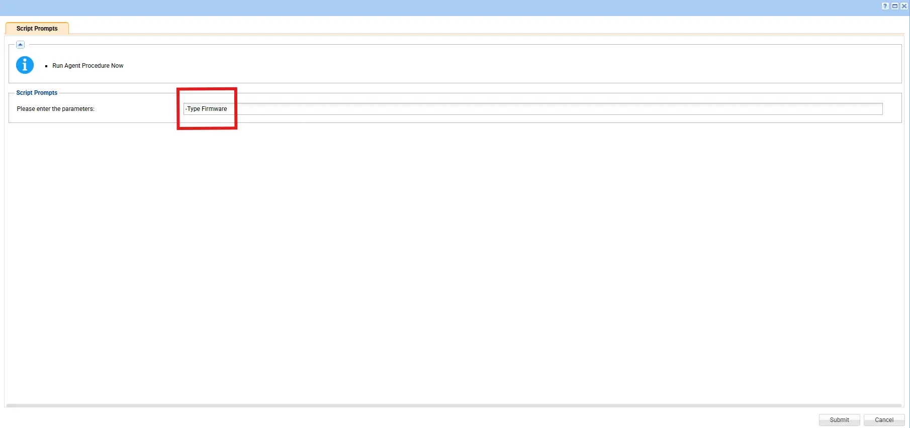
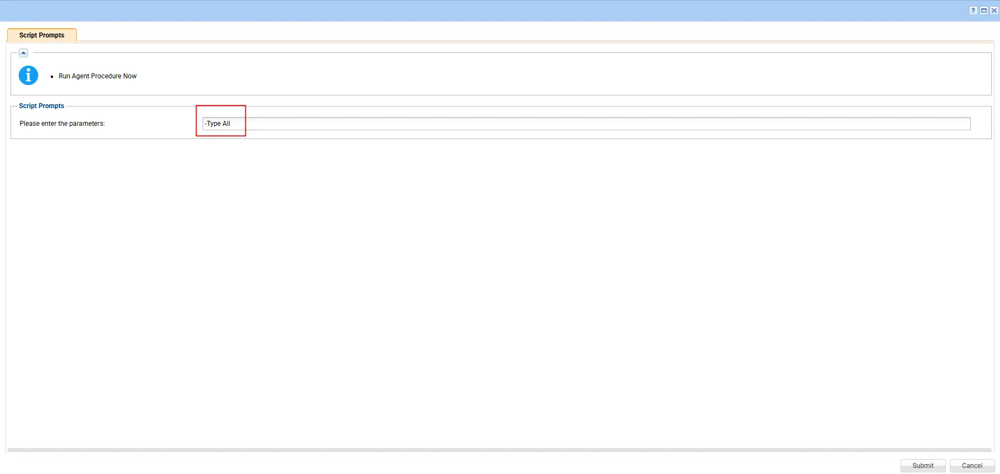
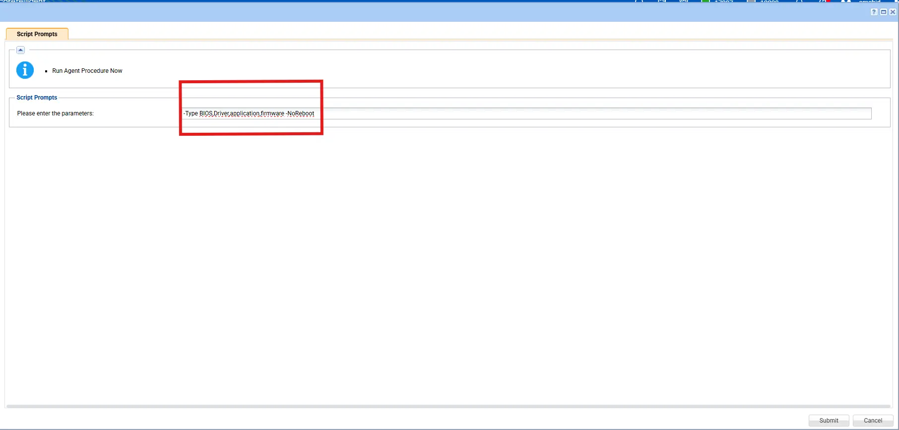
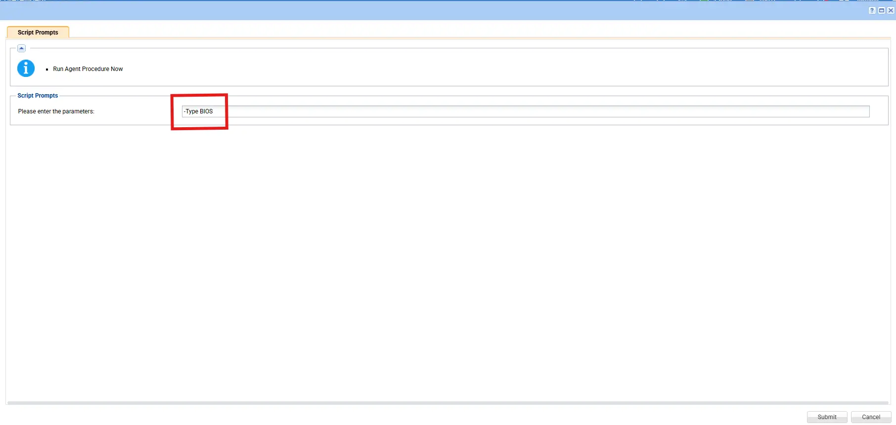
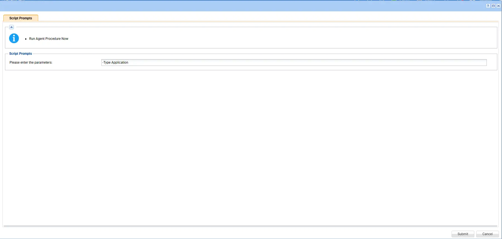
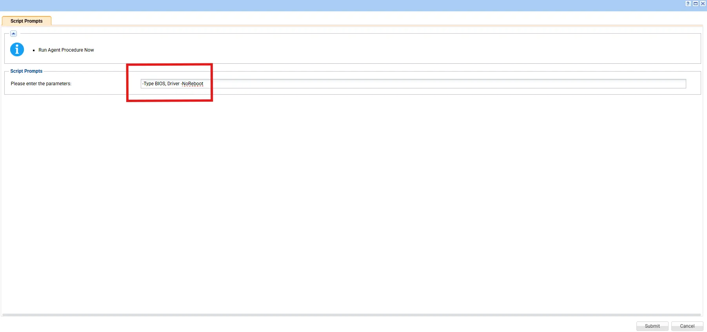
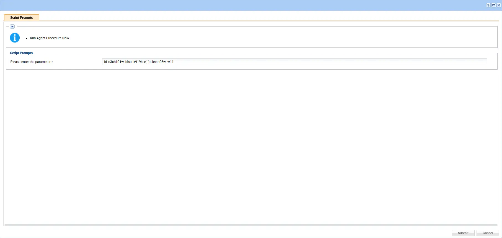

## Summary

This script uses the PowerShell module `LSUClient` to install available BIOS updates for Lenovo machines. The `-All` parameter can be used to install all available vendor updates, including BIOS, firmware, Applications and drivers.

**NOTE:** `The script prompts for variables during runtime, where we can pass arguments to either all, or install only firmware, only Lenovo updates, only drivers, or any specific driver as needed.`

## Note: `If an argument contains double quotes ("), they must be escaped by using them twice (""silent""). Otherwise, the command will not execute correctly.`

## Dependencies

[Install-LenovoUpdates](/docs/3640e534-d089-4304-89ba-68d3bc113978)

## Sample Run

## Parameters

Valid parameters: The valid values are `'All', 'Application', 'BIOS', 'Driver', 'Firmware'`. We can use them as per below examples.

| Parameter         | Required  | Excample            | Type      | Description                                                                 |
|-------------------|-----------|----------------------|-----------|----------------------------------------------------------------------------|
| `Argument`        | false |  ---    |    | Leave scan and and it will give the available updates details. |
| `Argument`        | True  | `-Type All`    | String    | Installs `ALL` updates. |

### Examples

1. **Default scan operation**: If executing the script without any arguments it will only scan.

   

2. **Apply driver updates silently**: To perform an update action (for example, silent install of    recommended driver updates):

   `-Type Drivers`

   

3. **Apply Firmware updates silently**:To perform an update action (for example, silent install of recommended firmware updates):

   `-Type Firmware`

   

4. **Apply All updates silently** :To perform an update action (for example, silent install of all available updates):

    `-Type All`

    

5. **Apply BIOS,Driver,application,firmware updates silently** :To perform an update action (for example, silent install of BIOS,Driver,application,firmware -NoRebootavailable updates):

    `-Type BIOS,Driver,application,firmware -NoReboot`

    

6. **Apply BIOS updates silently** :To perform an update action (for example, silent install BIOS available updates):

    `-Type BIOS`

    

7. **Apply Application updates silently** :To perform an update action (for example, silent install of Application available updates):

    `-Type Application`

    

8. **Apply BIOS, Driver updates silently** :To perform an update action (for example, silent install BIOS, Driver  available updates):

    `-Type BIOS, Driver -NoReboot`

    

9. **Apply specific updates silently** :To perform an update action (for example, silent install BIOS, Driver  available updates):

    `-Type 'n3ch101w_bisbnk919kse', 'pcieeth06w_w11'`

    

## Output

- Script Logs

- `C:\ProgramData\_automation\AgentProcedure\DellCommandUpdate\Install-LenovoUpdates-log.txt`

- `C:\ProgramData\_automation\AgentProcedure\DellCommandUpdate\Install-LenovoUpdates-error.txt`
