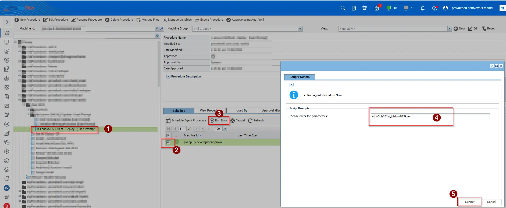
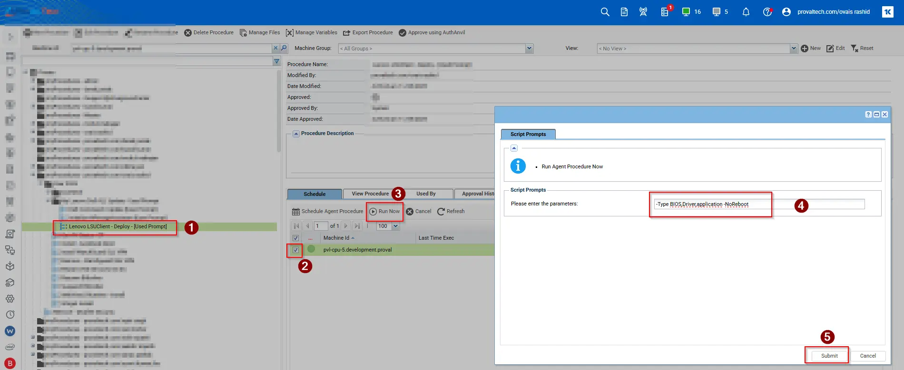

## Summary

This script uses the PowerShell module `LSUClient` to install available BIOS updates for Lenovo machines. The `-All` parameter can be used to install all available vendor updates, including BIOS, firmware, Applications and drivers.

## Note

`The script prompts for variables during runtime, and we can also pass arguments to install only firmware, only Dell updates, only drivers, or any specific driver as needed.`

## Dependencies

PowerShell 5.0

## Sample Run

## Parameters

Valid parameters: The valid values are `'All', 'Application', 'BIOS', 'Driver', 'Firmware'`. We can use them as per below examples.

| Parameter         | Required  | Default              | Type      | Description                                                                 |
|-------------------|-----------|----------------------|-----------|-----------------------------------------------------------------------------|
| `Argument`        | True  | `-Type All`    | String    | Used these parameters can install `ALL` updates. |
| `Argument`        | True  | `-Type Drivers`    | String    | HUsed these parameters can install `Drivers` updates. |
| `Argument`        | True  | `-Type BIOS`    | String    | Used these parameters can install `BIOS` updates.|
| `Argument`        | True  | `-Type Firmware`    | String    | Used these parameters can install `firmware` updates. |
| `Argument`        | True  | `-Type Application`    | String    | Used these parameters can install `Applciation`. |
| `Argument`        | True  | `-Type BIOS,Driver -NoReboot`    | String    | Used these parameters can install `BIOS,Driver` updates. |
| `Argument`        | True  | `-Id 'n3ch101w_bisbnk919kse', 'pcieeth06w_w11'`    | String    | Used these parameters can install particular updates |
| `Argument`        | True  | `-Type BIOS,Driver,application,firmware -NoReboot`    | String    | Used these parameters can install `BIOS,Driver,application,firmware` updates |

## Output

Script Logs