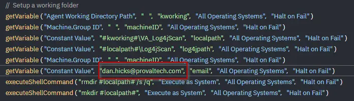

## Export the Log4J Scan & Mitigation Procedure

Export the Log4J Scan & Mitigation procedure from **Shared > PVAL Content Source**.  
Import it into the client environment.  

For each client, edit the procedure and change the **Email** global variable to the client's primary contact.  

  

Save the procedure.  
Log the deployment in the tracker located here: [Deployment Tracker](https://provaltech.sharepoint.com/:x:/s/ltadmin71/EQ8RZqNdHAtHsw641Bdh550BiC1_gQYbVSwLLfEEgSekEg?e=yRivZG)