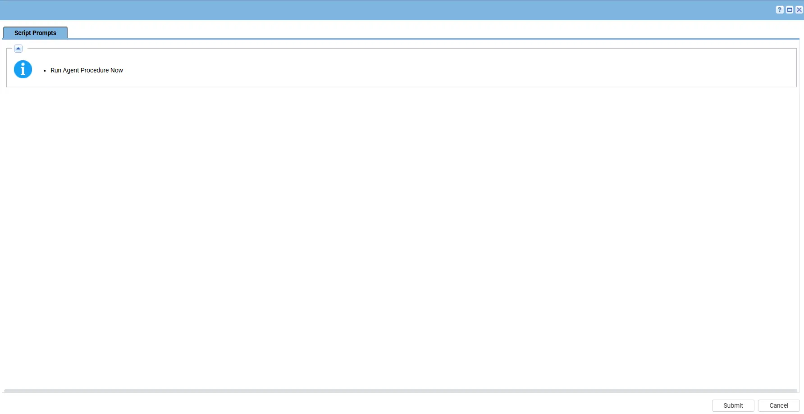
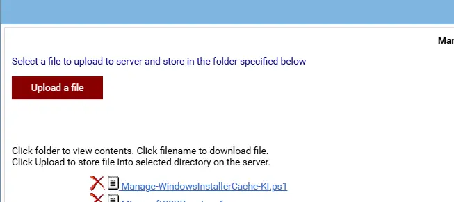

## Summary

The script performs a quarantine operation with force parameter to identify and isolate orphaned Windows Installer cache files, generates a manifest of the quarantined items, and then executes a deletion operation using the generated manifest. This staged approach provides a controlled and auditable remediation process while minimizing risk.

The implementation is designed for automated deployment, supports secure content delivery through code-signature validation, and helps reclaim disk space by safely removing orphaned Windows Installer cache files.

## Sample Run

## Dependencies

- [Agnostic - Manage-WindowsInstallerCache](/docs/fb30b46a-ae2e-498f-b049-48f687fea928)

## Implementation

1. Export the agent procedure from ProVal's VSA RMM instance.   
   **Name:** Manage - Windows Installer Cache   

   The export will download the necessary XML file.   
   
2. Import this XML file into the partner's VSA RMM instance.   

3. Export the `Manage-WindowsInstallerCache-KI.ps1` from the ProVal's Internal VSA. This is also placed under the below path:  
`Manage Files` > `Shared Files` > `PVAL` > `Manage-WindowsInstallerCache-KI.ps1`  

  

4. Map the `Manage-WindowsInstallerCache-KI.ps1` into the `25th` step of the script in the client's environment.
   
## Output

- Script Logs
- C:\programdata\_automation\script\Manage-WindowsInstallerCache-log.txt
- C:\programdata\_automation\script\Manage-WindowsInstallerCache-error.txt

## Changelog

### 2026-07-01

- Updated powershell script to use the Force parameter as well.
- Updated the Signature.

### 2026-06-15

- Initial version of the document