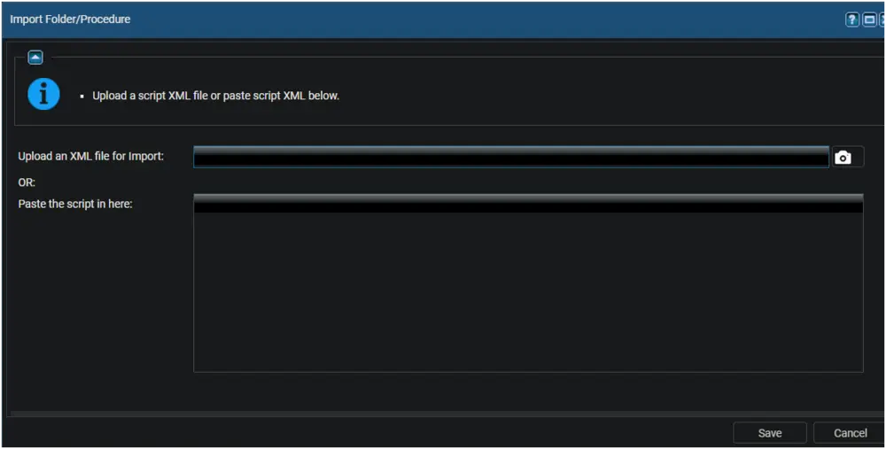
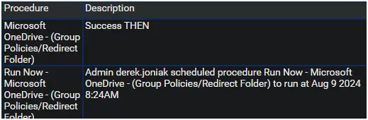
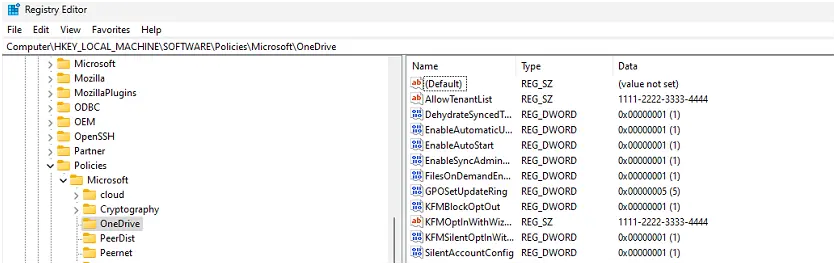

## Summary

This document implements group policies to redirect Windows known folders (Desktop, Documents, Pictures, Screenshots, and Camera Roll) to Microsoft OneDrive and outlines other desired modifications.

## Dependencies

- [Managed Variable - M365TenantId](/docs/b3141fc4-14f1-41a7-ba67-61b3a4e29fd5)

## Associated Content

- [SWM - Software Management - Solution - Microsoft OneDrive - (Group Policies/Redirect Folder)](/docs/42fcda71-e3ed-40e2-92e0-c0eb80e42e2d)

## Implementation

Export the procedure from ProVal's VSA instance.  
**Name:** Microsoft OneDrive - (Group Policies/Redirect Folder)  

  

The export will download the necessary XML file.  

  

Import this procedure into the partner's VSA instance.  

  

Ensure the [Managed Variable - M365TenantId](/docs/b3141fc4-14f1-41a7-ba67-61b3a4e29fd5) is created prior to usage if folder redirection is desired.

## Usage

ProVal Plug & Play: The agent procedure requires no configuration, but the options can be customized if desired by the partner.  

Ensure the managed variable exists prior to usage.  

  

| Name                              | Possible Values | Procedure Default | Description                                                                                     |
|-----------------------------------|------------------|-------------------|-------------------------------------------------------------------------------------------------|
| SilentAccountConfig               | (0/1)            | 1                 | Silently sign in users to the OneDrive sync app with their Windows credentials                 |
| FilesOnDemandEnabled              | (0/1)            | 1                 | File contents don't download until a file is opened.                                          |
| GPOSetUpdateRing                  | (4/5/0)          | 5                 | Sets the update ring for OneDrive. 4 for Insider, 5 for Production, or 0 for Deferred         |
| DehydrateSyncedTeamSites          | (0/1)            | 1                 | Convert Microsoft Teams site files to online-only files                                        |
| EnableAutomaticUploadBandwidthManagement | (0/1)       | 1                 | This setting lets OneDrive upload data in the background only when unused bandwidth is available. |
| EnableSyncAdminReports            | (0/1)            | 1                 | Lets OneDrive report sync device and health data and include it in administrative sync reports. |
| EnableAutoStart                   | (0/1)            | 1                 | Always start OneDrive automatically when signing in to Windows                                 |
| AllowTenantList                   | \<M365TenantId>   | \<M365TenantId>    | This setting prevents users from easily uploading files to other organizations by specifying allowed tenant IDs |
| KFMBlockOptOut                    | (0/1)            | 1                 | This setting forces users to keep their Documents, Pictures, and Desktop folders directed to OneDrive. |
| KFMOptInWithWizard                | \<M365TenantId>   | \<M365TenantId>    | This setting shows a window that prompts users to move their Documents, Pictures, and Desktop folders to OneDrive. |
| KFMSilentOptIn                    | \<M365TenantId>   | \<M365TenantId>    | This setting redirects and moves your users' Documents, Pictures, and/or Desktop folders to OneDrive without any user interaction. |
| KFMSilentOptInWithNotification     | (0/1)            | 1                 | Shows a notification after a successful redirection.                                          |

## Output

A status of Success is expected.  

  

  

  