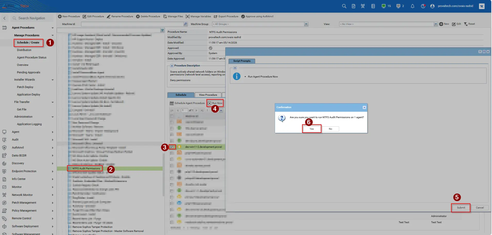
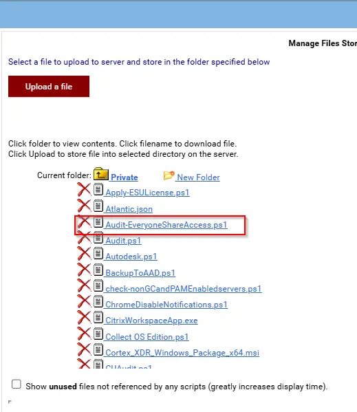

## Summary

Scans actively shared network folders on Windows endpoints and identifies folders where the NTFS access control list (ACL) contains an ALLOW entry for the "Everyone" group. This module distinguishes between NTFS permissions (folder-level security) and share permissions (network-level access), reporting only on NTFS allow entries. 

## Sample Run

## Dependencies

## Implementation

1. Export the agent procedure from ProVal's VSA RMM instance.   
   **Name:** NTFS Audit Permissions 

   The export will download the necessary XML file.   
   
2. Import this XML file into the partner's VSA RMM instance.   

3. Export the 'Audit-EveryoneShareAccess.ps1' from the ProVal's Internal VSA. This is also placed under the below path:  
`Manage Files` > `Shared Files` > `PVAL` > `Audit-EveryoneShareAccess.ps1`  

 

4. Map the `Audit-EveryoneShareAccess.ps1` into the `12th` step of the script in the client's environment.

5. Save the agent procedure.

## Output

- Script log.
- Outbound Email

## Changelog

### 2026-05-14

- Initial version of the document