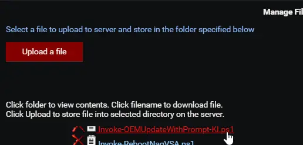
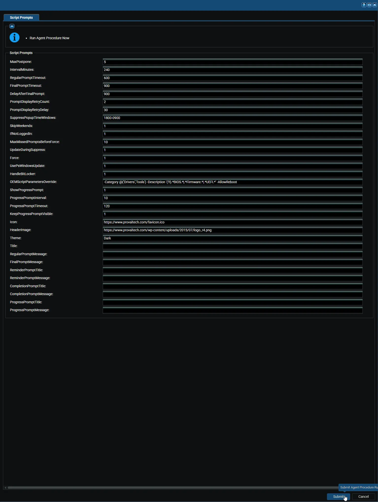
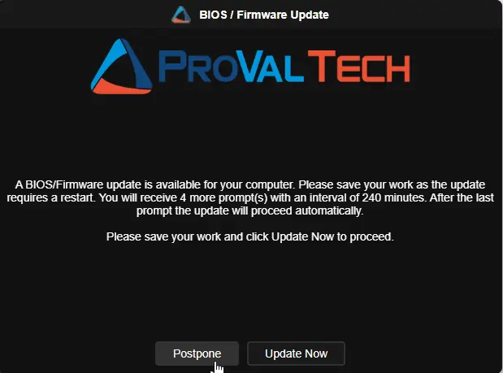
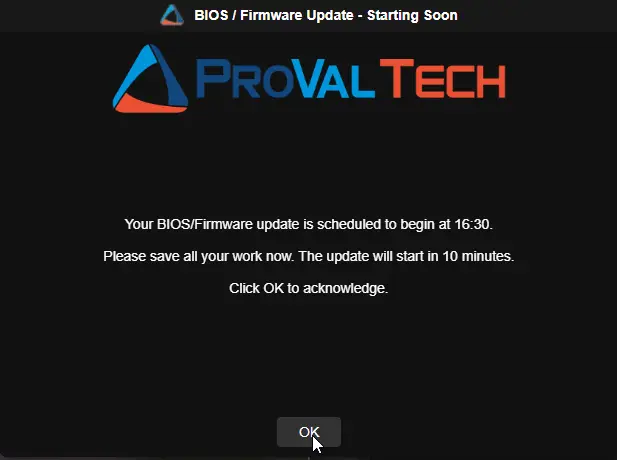
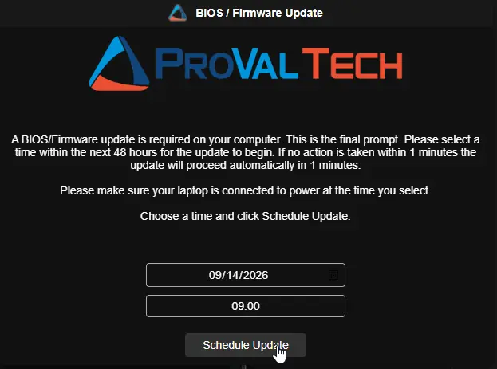
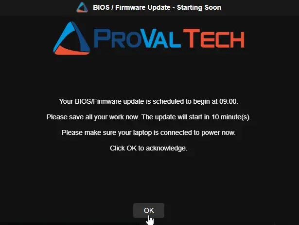
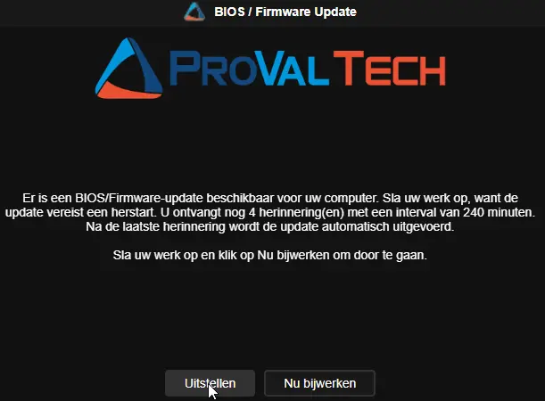

## Overview

This automated procedure ensures that BIOS and firmware updates are applied to managed workstations in a controlled, user-aware manner. Firmware and BIOS updates require a restart, and applying them unannounced causes data loss, frustration, and support tickets. This procedure prompts the logged-in user first, allows them to postpone the update around their schedule, and then enforces the update once the postponements are exhausted.

It is designed for a single deployment from Kaseya VSA. After the initial run, the underlying script manages its own prompt cycle through one-time scheduled tasks on the endpoint — every postpone, skip, or missed prompt reschedules the next attempt automatically until the update has been applied.

## How It Works

1. **Configuration Generation:** When the procedure runs, its parameter steps write the settings provided at run time into a configuration file (JSON format) at `C:\ProgramData\_Automation\Script\Invoke-OEMUpdateWithPrompt\Invoke-OEMUpdateWithPrompt-Param.Json`. Only settings that were provided and valid are written; a blank, unset, or invalid value is simply omitted.

2. **Script Execution:** The procedure launches a secure, pre-approved PowerShell wrapper. The wrapper is Authenticode-signed and validates its own signature against ProVal's approved certificate thumbprints, then downloads the latest signed `Invoke-OEMUpdateWithPrompt.ps1` from the ProVal content repository and validates that script's signature before executing it.

3. **Smart Defaults:** The wrapper reads the configuration file and passes through only the settings it finds — it holds no default values of its own. Any setting that was not provided falls back to the built-in, best-practice default inside the underlying script, so the process never fails because a value was left blank. A missing or unreadable configuration file simply runs the script entirely on its built-in defaults.

4. **User Interaction:** The script displays a user-friendly prompt on the user's desktop. The end-user can update immediately or postpone. On the final prompt, the user picks a time within the next 48 hours using a date/time picker.

5. **Update Execution:** Once the update starts, the script detects the device manufacturer and runs the matching vendor tooling — Dell Command Update, HP Image Assistant, or Lenovo System Update — or the PSWindowsUpdate module when `UsePsWindowsUpdate` is enabled. Optionally, BitLocker protection is suspended for one reboot cycle beforehand. After the vendor update completes, a reboot pending check runs: if a restart is required the machine restarts automatically; if not, a completion acknowledgement prompt is shown.

6. **Autonomous Management:** Once the initial prompt is shown, the script manages its own schedule in the background. It re-prompts at the defined intervals, retries prompts that fail to display, can keep the user informed with an optional in-progress notification while the update installs, and — if the user ignores the final prompt — forces the update after the configured grace period. All scheduled tasks and stored state are cleaned up before any upgrade begins.

## Key Benefits & Behaviors

* **Non-Disruptive:** Prompts can be suppressed during specified off-hours (e.g., overnight) and on weekends. An optional in-progress notification keeps the user informed while the update installs.

* **Intelligent Skipping:** The script automatically delays prompting when no user is logged in or the screen is locked. Before any unattended or forced update, it checks for active installations (Windows Update servicing, MSI installers, winget, and similar) and holds off until they finish.

* **Resilient:** A prompt that fails to display — the scheduled task never reached the prompt application, or its output was unreadable — is retried automatically and never counts against the user's postponements. A prompt the user simply ignored is treated as a real answer (missed), not a failure.

* **Self-Cleaning:** Before any upgrade path executes, all scheduled tasks and stored prompt state are removed, so a completed cycle never leaves artifacts behind.

* **BitLocker-Aware:** On encrypted devices, BitLocker protection can be suspended for a single reboot cycle around the update and resumed automatically when no reboot is required — preventing recovery key prompts after firmware updates.

* **Power-Aware:** On laptops, notebooks, and tablets, the built-in prompts include a line asking the user to connect to power before the update runs, since a firmware update interrupted by a flat battery can leave a device unbootable. Desktops do not see the line.

### Default Prompt Flow (6 prompts, 4 hours apart)

| Prompt | Type | User Options | What Happens If Ignored |
|--------|------|--------------|------------------------|
| 1st – 5th | Regular | `Postpone` or `Update Now` | Treated as missed; script reschedules for the next interval |
| 6th | Final (scheduling) | Date/time picker + `Schedule Update` | Update is forced after the timeout plus the grace period |

`MaxPostpone` controls the number of **regular, postponable** prompts; the final scheduling prompt is always additional. With the default of `5`: 5 regular prompts + 1 final = 6 total. (Note the difference from the Reboot Nag procedure, where the equivalent variable controls the total prompt count.)

### After the final prompt

- If the user picks a time **10 or more minutes** in the future → the update is scheduled, and a reminder appears 10 minutes before it begins.
- If the user picks a time **less than 10 minutes** away → the reminder is shown immediately and the update starts at the exact moment the user selected.
- If the selection is **invalid or in the past** → the update runs immediately.
- If the prompt **times out** → the script waits `DelayAfterFinalPrompt` seconds as a grace period, then forces the update. The grace period does not apply when the user does pick a time; the selection is honored to the minute.

### Automatic Behaviors

| Scenario | What Happens |
|----------|--------------|
| **Machine is locked** | Prompt is skipped; script reschedules for the next interval. If `MaxMissedPromptsBeforeForce` is set, skipped prompts increment a time-gated counter until the update is forced without the GUI. |
| **No user logged in** | Prompt is skipped and rescheduled — unless `IfNotLoggedIn` is enabled, in which case the update runs immediately. |
| **No user + install in progress** | Even with unattended updates enabled, the script defers if it detects an active installation (TiWorker, wusa, SetupHost, MoUsoCoreWorker, Windows10Upgrader, winget, or a held MSI mutex) and reschedules. |
| **Weekend / suppress window active** | Prompt is skipped; script reschedules. If `UpdateDuringSuppress` is enabled, unattended or forced updates bypass this restriction and proceed. Interactive prompts are never shown during suppression. |
| **No internet** | Script reschedules itself rather than failing. |
| **Procedure run again while cycle is active** | Exits without changes unless `Force` is set. |
| **Dutch-language user** | Prompts automatically appear in Dutch for `nl-NL` and `nl-BE` display languages. |
| **Update completes, reboot pending** | The machine is forcefully restarted to complete the installation. |
| **Update completes, no reboot pending** | A completion acknowledgement prompt is shown — only when a user is logged in and the machine is unlocked; otherwise the script exits silently. |
| **Prompt fails to display** | Retried up to `PromptDisplayRetryCount` extra times. A failed attempt never consumes a postponement; if every attempt fails, the script reschedules itself for the next interval with all prompt state preserved. |

## Dependencies

- [Invoke-OEMUpdateWithPrompt](/docs/52c50165-38d5-4793-b751-97260ab31f72)
- [OmniPrompt](/docs/8ead1ffd-dade-4e17-9958-3313da9a7aa8)
- [SilentLauncher](/docs/b0b9f423-eee3-4148-b8a0-e99400c45698)
- [Initialize-DellCommandUpdate](/docs/aa963f3d-f149-4bfa-8fdc-30f12c21ce7f)
- [Initialize-HPImageAssistant](/docs/92b749f0-2e30-4d4d-8916-fb5f30d85bff)
- [Install-LenovoUpdates](/docs/3640e534-d089-4304-89ba-68d3bc113978)
- [Install-WindowsUpdates](/docs/3ccc8542-1961-4d3f-a54b-4a1bb9a78edd)

## Implementation

1. Export the agent procedure from ProVal's VSA RMM instance.  
   **Name:** `OEM Update with Prompt`  

   The export will download the necessary XML file.  

2. Import this XML file into the partner's VSA RMM instance.  

3. Export the `Invoke-OEMUpdateWithPrompt-KI.ps1` from the ProVal's Internal VSA. This is also placed under the below path:  
`Manage Files` > `Shared Files` > `PVAL` > `Invoke-OEMUpdateWithPrompt-KI.ps1`  

  

4. Map the `Invoke-OEMUpdateWithPrompt-KI.ps1` into the script step (`136`) that executes the PowerShell wrapper in the client's environment.

## Sample Run

### What This Run Does

The screenshot shows the procedure launched with the default configuration — every scheduling variable at its built-in value (`MaxPostpone = 5`, `IntervalMinutes = 240`, `RegularPromptTimeout = 600`, `FinalPromptTimeout = 900`, `DelayAfterFinalPrompt = 600`) and every optional variable left blank. Submitting the procedure in this state runs the complete default prompt cycle.

**On the endpoint, immediately after Submit:**

1. The procedure writes only the supplied values into the JSON configuration file and launches the signed wrapper. The wrapper validates its own signature, downloads the latest signed `Invoke-OEMUpdateWithPrompt.ps1` from the content repository, validates that signature too, and executes it with the configuration.
2. The script bootstraps its dependencies (Strapper, SilentLauncher, OmniPrompt), persists itself for future rescheduled runs, prepares its working directories, and — when a user is logged in and the machine is unlocked — displays the first prompt within seconds.
3. From that moment the procedure's work is done: the script manages the rest of the cycle by itself through one-time scheduled tasks, so the procedure never needs to be run again on this machine.

**What the user sees:**

- A dark-themed prompt window titled **`BIOS / Firmware Update`** with the message *"A BIOS/Firmware update is available for your computer. Please save your work as the update requires a restart. You will receive 5 more prompt(s) with an interval of 240 minutes. After the last prompt the update will proceed automatically."* and two buttons: **Postpone** and **Update Now**. Dutch wording and buttons (*Uitstellen / Nu bijwerken*) appear automatically for `nl-NL` / `nl-BE` users, and laptops additionally see the connect-to-power line.
- **Update Now** — the vendor update installs immediately; the machine restarts when a reboot is pending, otherwise a completion acknowledgement prompt appears.
- **Postpone**, or ignoring the prompt for 10 minutes — the prompt closes and reappears 4 hours later, announcing one fewer reminder each time.
- After five postponed prompts, the **final prompt** appears with a 48-hour date/time picker and a single **Schedule Update** button. A selection 10 or more minutes out schedules the update and shows a "Starting Soon" reminder 10 minutes beforehand; a selection under 10 minutes shows the reminder immediately and the update starts at the exact moment chosen; if the prompt times out after 15 minutes, the update is forced following a 10-minute grace period.

**Default behavior boundaries** — because every optional variable is blank:

- Prompts appear any day, at any hour: no suppression window and no weekend skipping.
- Locked or logged-off machines simply reschedule every 4 hours; nothing is forced and nothing runs unattended (`IfNotLoggedIn` and `MaxMissedPromptsBeforeForce` are off).
- The vendor tooling follows manufacturer detection — Dell Command Update, HP Image Assistant, or Lenovo System Update; PSWindowsUpdate is not used.
- BitLocker is not suspended around the update, and no in-progress notification is shown while it installs.

**What "left blank" means:** the wrapper holds no default values of its own. A blank or unset variable is simply not written to the configuration file and not passed to the script, so the underlying script applies its own built-in default — which is exactly what the values shown in the screenshot reflect. Blank title and message variables resolve to the built-in English or Dutch wording, auto-detected from the logged-on user's display language, and blank `Icon` / `HeaderImage` variables leave the prompt window with its standard appearance. Entering a value in any field overrides only that setting; everything else keeps behaving exactly as described above.

### Sample Prompts (English)

**Desktops:**  
  
  
  

**Laptops (with the connect-to-power line):**  
  
  
  

**Completion acknowledgement prompt (no reboot pending):**  
  

**Update in progress notification:**  
  

### Sample Prompts (Dutch)

  
  
  

**Completion acknowledgement prompt (no reboot pending):**  
  

**Update in progress notification:**  
  

## Variables

All 32 parameters of the underlying script are available as procedure variables. When the procedure runs, the provided values are written to the JSON configuration file and read by the wrapper: switches are written as JSON `true`, integers as numbers, and text as JSON-escaped strings (so quotes, backslashes, and `\n` survive intact).

The wrapper itself sets no default values: a variable that is blank, unset, or holds an invalid value (for example, a non-numeric timeout or a malformed suppress window) is not written to the configuration file and is not passed to the script, so the built-in default shown below applies. A value of `0` is valid and meaningful for `PromptDisplayRetryCount`, `ProgressPromptInterval`, and `MaxMissedPromptsBeforeForce` — it is passed as zero, which is different from leaving the variable blank.

### Prompt Scheduling

| Variable | Type | Default | Description |
|----------|------|---------|-------------|
| `MaxPostpone` | String | `5` | Number of regular, postponable prompts before the final scheduling prompt. Total prompts = value + 1. Default gives 5 regular + 1 final. |
| `IntervalMinutes` | String | `240` | Minutes between successive prompt attempts. |
| `RegularPromptTimeout` | String | `600` | Timeout in seconds for regular prompts. When it expires, the prompt is treated as missed. |
| `FinalPromptTimeout` | String | `900` | Timeout in seconds for the final scheduling prompt. When it expires, the update is forced after the grace period. |
| `DelayAfterFinalPrompt` | String | `600` | Grace period in seconds after the final prompt times out before the update is forced. Does not apply when the user picks a time. |

### Prompt Display Retry

| Variable | Type | Default | Description |
|----------|------|---------|-------------|
| `PromptDisplayRetryCount` | String | `1` | Extra attempts to display a prompt when it fails to appear or returns unreadable output. `0` gives each prompt a single attempt. A failed attempt never consumes a postponement. |
| `PromptDisplayRetryDelay` | String | `30` | Seconds to wait between display attempts, giving a transient condition (such as a session still initializing) a chance to clear. |

### Suppression & Behavior Switches

| Variable | Type | Default | Description |
|----------|------|---------|-------------|
| `SuppressPopupTimeWindows` | String | *(not set)* | Time window during which prompts are suppressed, in `HHmm-HHmm` 24-hour format. Example: `1800-0900` suppresses from 6 PM to 9 AM. Spans midnight. |
| `SkipWeekends` | String | `False` | Enable to skip prompts on Saturdays and Sundays. `Accepted values: 1, Yes, True` |
| `IfNotLoggedIn` | String | `False` | Enable to run the update immediately when no user is logged in. Guarded by the install-in-progress check — if an update or installer is running, the update is deferred to the next interval. `Accepted values: 1, Yes, True` |
| `MaxMissedPromptsBeforeForce` | String | `0` | Number of consecutive skipped prompt attempts (due to locked screen or no user logged in) before the GUI is bypassed and the update is forced. Set to `0` to disable forcing. The counter resets as soon as a user is active at an unlocked machine. |
| `UpdateDuringSuppress` | String | `False` | Enable to allow an unattended or forced update to proceed inside a suppress time window or on a weekend. Interactive prompts are never shown during suppression. `Accepted values: 1, Yes, True` |
| `Force` | String | `False` | Enable to clear stored state and scheduled tasks, restarting the prompt cycle from the beginning. `Accepted values: 1, Yes, True` |

### Vendor Update Behavior

| Variable | Type | Default | Description |
|----------|------|---------|-------------|
| `UsePsWindowsUpdate` | String | `False` | Enable to use the PSWindowsUpdate module instead of vendor-specific tooling. Useful for unsupported manufacturers. `Accepted values: 1, Yes, True` |
| `HandleBitLocker` | String | `False` | Enable to suspend BitLocker protection on the OS drive for one reboot cycle before the update runs. Resumed automatically if no reboot is required; auto-resumes after the reboot otherwise. `Accepted values: 1, Yes, True` |
| `OEMScriptParametersOverride` | String | *(not set)* | Custom parameter string passed to the vendor update script, replacing the default parameter set for the detected manufacturer. Example for Dell DCU: `/applyUpdates -updateType=bios -silent`; for PSWindowsUpdate: `-Category 'Drivers','Tools' -AllowReboot`. Include every parameter the vendor script requires. |

### In-Progress Notification

| Variable | Type | Default | Description |
|----------|------|---------|-------------|
| `ShowProgressPrompt` | String | `False` | Enable to show a notice on the user's desktop while the update installs, repeated every `ProgressPromptInterval` minutes for `ProgressPromptTimeout` seconds. Covers every path that starts the update, including unattended and forced updates. `Accepted values: 1, Yes, True` |
| `ProgressPromptInterval` | String | `10` | Minutes between in-progress notices. `0` disables the repeating notices. Ignored when `KeepProgressPromptVisible` is enabled. |
| `ProgressPromptTimeout` | String | `300` | Seconds each in-progress notice stays on screen before closing on its own. Ignored when `KeepProgressPromptVisible` is enabled. |
| `KeepProgressPromptVisible` | String | `False` | Enable to keep the notice on the desktop for the whole update, showing it again whenever the user dismisses it. Takes precedence over the interval settings and implies `ShowProgressPrompt`. `Accepted values: 1, Yes, True` |

### Branding

| Variable | Type | Default | Description |
|----------|------|---------|-------------|
| `Icon` | String | *(not set)* | URL, local path, or UNC share path for the prompt window icon. Passed to the script unchanged; a verified copy is staged locally and every prompt runs with that local path, so the logged-in user never needs access to the original source. |
| `HeaderImage` | String | *(not set)* | URL, local path, or UNC share path for the prompt header image. Staged locally in the same way as `Icon`. |
| `Theme` | Selection | `Dark` | Prompt window theme. Valid values: `Dark`, `Light`. |

### Custom Messages

All message variables support substitution variables (see table below) and `\n` for line breaks.

| Variable | Type | Default | Description |
|----------|------|---------|-------------|
| `Title` | String | *(language-appropriate default)* | Custom title for the regular and final prompts (built-in wording is defined in the underlying script). |
| `RegularPromptMessage` | String | *(language-appropriate default)* | Message body for regular prompts. |
| `FinalPromptMessage` | String | *(language-appropriate default)* | Message body for the final scheduling prompt. |
| `ReminderPromptTitle` | String | *(language-appropriate default)* | Title for the reminder shown 10 minutes before a scheduled update. |
| `ReminderPromptMessage` | String | *(language-appropriate default)* | Message body for the reminder prompt. |
| `CompletionPromptTitle` | String | *(language-appropriate default)* | Title for the completion confirmation shown when no reboot was required. |
| `CompletionPromptMessage` | String | *(language-appropriate default)* | Message body for the completion confirmation. |
| `ProgressPromptTitle` | String | *(language-appropriate default)* | Title for the in-progress notice shown while the update installs. |
| `ProgressPromptMessage` | String | *(language-appropriate default)* | Message body for the in-progress notice. |

:::note  
Avoid apostrophes (single quotes) in custom message text. The procedure writes variable values into single-quoted PowerShell commands when generating the configuration file, and an apostrophe breaks that command. Reword instead — for example, *todays updates* instead of *today's updates*.  
:::

---

## Substitution Variables

Use these in any custom message. They are replaced with live values when the prompt is displayed.

:::important  
Unlike the Reboot Nag procedure, substitution variables here are **plain words without percent signs** — write `PromptsLeft`, not `%PromptsLeft%`. A percent sign cannot be used as a delimiter because the finished message passes through a `.cmd` file, where it would be treated as a batch variable expansion.  
:::

| Variable | Description | Example Value |
|----------|-------------|---------------|
| `PromptsToSend` | Total number of prompts the user will receive, counting the final one | `6` |
| `PromptsSent` | Number of prompts already shown, counting the one on screen | `2` |
| `PromptsLeft` | Prompts still to come after this one, counting the final one | `4` |
| `PromptIntervalMinutes` | Interval between prompts in minutes | `240` |
| `PromptIntervalHours` | Same interval in hours | `4` |
| `RegularTimeoutSeconds` | Regular prompt timeout in seconds | `600` |
| `RegularTimeoutMinutes` | Same timeout in minutes | `10` |
| `FinalTimeoutSeconds` | Final prompt timeout in seconds | `900` |
| `FinalTimeoutMinutes` | Same timeout in minutes | `15` |
| `DelayAfterFinalSeconds` | Delay after the final prompt times out, in seconds | `600` |
| `DelayAfterFinalMinutes` | Same delay in minutes | `10` |
| `ScheduledUpdateTime` | User-selected update time | `14:30` |
| `MinutesUntilUpdate` | Minutes until the scheduled update | `10` |
| `ProgressIntervalMinutes` | Minutes between in-progress notices | `10` |
| `ProgressTimeoutSeconds` | In-progress notice timeout in seconds | `300` |
| `ProgressTimeoutMinutes` | Same timeout in minutes | `5` |
| `UpdateElapsedMinutes` | Minutes the update has been running (in-progress notice only) | `25` |
| `ComputerName` | Machine name | `PC-OFFICE-01` |
| `UserName` | Logged-in username | `jsmith` |

:::note  

- Matching is case-insensitive and bounded to whole words, so `ComputerName` is replaced but `ComputerNameHere` is left alone. A word that is not a published variable is left exactly as written.
- Variables that don't apply in a given context (e.g., `ScheduledUpdateTime` during a regular prompt, or `UpdateElapsedMinutes` outside the in-progress notice) are replaced with an empty string.
- Use `\n` in any message to insert a line break in the prompt.
- Unit conversion is automatic — `IntervalMinutes` is in minutes so `PromptIntervalHours` divides by 60; timeout/delay values are in seconds so the `Minutes` variants divide by 60.  

:::

---

## Default Messages

When no custom message is set, the script uses language-aware defaults. Language is auto-detected from the logged-on (or last logged-on) user's UI language or the system locale.

### Default English Messages

| Field | Default Text |
|-------|-------------|
| **Window Title** | `BIOS / Firmware Update` |
| **Regular Prompt** | `A BIOS/Firmware update is available for your computer. Please save your work as the update requires a restart. You will receive PromptsLeft more prompt(s) with an interval of PromptIntervalMinutes minutes. After the last prompt the update will proceed automatically.\n\nPlease save your work and click Update Now to proceed.` |
| **Final Prompt** | `A BIOS/Firmware update is required on your computer. This is the final prompt. Please select a time within the next 48 hours for the update to begin. If no action is taken within FinalTimeoutMinutes minutes the update will proceed automatically in DelayAfterFinalMinutes minutes.\n\nChoose a time and click Schedule Update.` |
| **Reminder Title** | `BIOS / Firmware Update - Starting Soon` |
| **Reminder Message** | `Your BIOS/Firmware update is scheduled to begin at ScheduledUpdateTime.\n\nPlease save all your work now. The update will start in MinutesUntilUpdate minute(s).\n\nClick OK to acknowledge.` |
| **Completion Title** | `BIOS / Firmware Update - Complete` |
| **Completion Message** | `The BIOS/Firmware update has completed successfully. A reboot was not required to install todays updates.\n\nYour computer is ready to use.\n\nClick OK to acknowledge.` |
| **In-Progress Title** | `BIOS / Firmware Update - In Progress` |
| **In-Progress Message** | `A BIOS/Firmware update is currently being installed on your computer. The installation is still running in the background.\n\nYour computer may restart automatically once the update has finished, so please save your work and leave the computer switched on.\n\nNo action is needed from you.` |

### Default Dutch Messages

Applied automatically when the user's UI language matches `nl-NL` or `nl-BE`.

| Field | Default Text |
|-------|-------------|
| **Window Title** | `BIOS / Firmware Update` |
| **Regular Prompt** | `Er is een BIOS/Firmware-update beschikbaar voor uw computer. Sla uw werk op, want de update vereist een herstart. U ontvangt nog PromptsLeft herinnering(en) met een interval van PromptIntervalMinutes minuten. Na de laatste herinnering wordt de update automatisch uitgevoerd.\n\nSla uw werk op en klik op Nu bijwerken om door te gaan.` |
| **Final Prompt** | `Er is een BIOS/Firmware-update vereist op uw computer. Dit is de laatste herinnering. Selecteer een tijdstip binnen de komende 48 uur voor de update. Als er geen actie wordt ondernomen binnen FinalTimeoutMinutes minuten, wordt de update automatisch uitgevoerd na DelayAfterFinalMinutes minuten.\n\nKies een tijdstip en klik op Update plannen.` |
| **Reminder Title** | `BIOS / Firmware Update - Start binnenkort` |
| **Reminder Message** | `Uw BIOS/Firmware-update staat gepland om te beginnen om ScheduledUpdateTime.\n\nSla al uw werk nu op. De update begint over MinutesUntilUpdate minuten.\n\nKlik op OK om te bevestigen.` |
| **Completion Title** | `BIOS / Firmware Update - Voltooid` |
| **Completion Message** | `De BIOS/Firmware-update is succesvol voltooid. Er was geen herstart nodig om de updates van vandaag te installeren.\n\nUw computer is klaar voor gebruik.\n\nKlik op OK om te bevestigen.` |
| **In-Progress Title** | `BIOS / Firmware Update - Bezig` |
| **In-Progress Message** | `Er wordt momenteel een BIOS/Firmware-update op uw computer uitgevoerd. De installatie is nog bezig op de achtergrond.\n\nUw computer kan automatisch opnieuw opstarten zodra de update is voltooid. Sla uw werk op en laat de computer ingeschakeld.\n\nU hoeft verder niets te doen.` |

### Extra Line on Laptops

On laptops, notebooks, and tablets, an extra line is added before the closing sentence of the regular, final, reminder, and in-progress messages. Desktops do not see it. Custom messages are used exactly as written and do not receive the line — include the wording yourself when overriding a message on a fleet that contains portable devices.

| Prompt | English | Dutch |
|--------|---------|-------|
| Regular prompt | `Please connect your laptop to power before the update begins. Do not run the update on battery.` | `Sluit uw laptop aan op de netstroom voordat de update begint. Voer de update niet uit op accustroom.` |
| Final prompt | `Please make sure your laptop is connected to power at the time you select.` | `Zorg ervoor dat uw laptop op het gekozen tijdstip op de netstroom is aangesloten.` |
| Reminder prompt | `Please make sure your laptop is connected to power now.` | `Zorg ervoor dat uw laptop nu op de netstroom is aangesloten.` |
| In-progress notice | `Please keep your laptop connected to power until the update has finished.` | `Laat uw laptop aangesloten op de netstroom totdat de update is voltooid.` |

---

## Real-Life Scenarios

### Scenario 1: Default Configuration

**Settings:** All defaults (5 regular prompts + 1 final, 4 hours apart).

**What the user experiences:**

- **9:00 AM** — Prompt 1 appears: "A BIOS/Firmware update is available... You will receive 5 more prompt(s) with an interval of 240 minutes." User clicks Postpone.
- **1:00 PM** — Prompt 2 appears. User clicks Postpone.
- **5:00 PM** — Prompt 3 appears. User clicks **Update Now**. The vendor update installs and the machine restarts. Cycle ends.

If the user had postponed all 5 regular prompts:

- The sixth and final prompt appears at the next interval with the date/time picker.
- User selects tomorrow at 8:00 AM → the update is scheduled.
- **7:50 AM next day** — Reminder appears: "Your BIOS/Firmware update is scheduled to begin at 08:00... The update will start in 10 minutes."
- **8:00 AM** — The vendor update runs and the machine restarts.

### Scenario 2: Quick Cycle for Critical Firmware

**Settings:**

- `MaxPostpone` = `1`
- `IntervalMinutes` = `60`
- `FinalPromptTimeout` = `600`
- `DelayAfterFinalPrompt` = `300`

**What the user experiences:**

- **10:00 AM** — Prompt 1 (regular) appears, announcing one more prompt to come. User postpones.
- **11:00 AM** — Prompt 2 (final) appears with the date/time picker. If ignored for 10 minutes, the update starts at 11:15 AM (10-minute timeout + 5-minute grace period) and the machine restarts.

### Scenario 3: Overnight Suppression with Weekend Skip

**Settings:**

- `SuppressPopupTimeWindows` = `1800-0800`
- `SkipWeekends` = `True`

**What the user experiences:**

- Prompts only appear between 8:00 AM and 6:00 PM, Monday through Friday.
- If a prompt is due at 7:00 PM Friday, it is skipped and retried at each interval. The user won't see it until Monday morning after 8:00 AM.
- The missed-prompt counter does not advance during suppression — only locked/logged-off states count as missed.

### Scenario 4: Unattended Machines (Kiosks, Shared PCs)

**Settings:**

- `IfNotLoggedIn` = `True`
- `IntervalMinutes` = `120`

**What happens:**

- If no user is logged in when the script runs, the update executes immediately without any prompt.
- **Exception:** If Windows Update servicing, an MSI installer, winget, or similar is actively running, the update is deferred by 2 hours and checked again.
- If a user IS logged in, the normal prompt flow is used.

### Scenario 5: User Accepts the Update

**Settings:** Any configuration, with `HandleBitLocker` = `True` and `ShowProgressPrompt` = `True`.

**What happens:**

- **2:00 PM** — User clicks **Update Now** on prompt 2. All scheduled tasks and stored state are cleaned up.
- BitLocker protection on the OS drive is suspended for one reboot cycle.
- The vendor update (for example, Dell Command Update applying BIOS and firmware packages) runs as a monitored process; an in-progress notice appears on the desktop while it installs.
- The reboot pending check detects a pending restart → the machine forcefully restarts and BitLocker auto-resumes after that single reboot.
- If no reboot had been required → a completion acknowledgement prompt is shown and BitLocker is resumed immediately.

### Scenario 6: Custom Messages with Substitution Variables

**Settings:**

- `RegularPromptMessage` = `Hi UserName, the firmware on ComputerName needs updating.\n\nYou have PromptsLeft reminder(s) left.\nNext reminder in PromptIntervalHours hour(s).`

**What the user sees (second of six prompts, 4-hour interval):**

> Hi jsmith, the firmware on PC-OFFICE-01 needs updating.
>
> You have 4 reminder(s) left.
> Next reminder in 4 hours.

### Scenario 7: Scheduling the Update on the Final Prompt

**Settings:** Any configuration.

**Case A — user picks a time 10 or more minutes away:**

- Final prompt appears at 1:30 PM. User selects 4:30 PM and clicks **Schedule Update**.
- The script registers a task for 4:20 PM and exits.
- **4:20 PM** — Reminder appears: "Your BIOS/Firmware update is scheduled to begin at 16:30. The update will start in 10 minutes."
- **4:30 PM** — The vendor update runs and the machine restarts.

**Case B — user picks a time less than 10 minutes away:**

- Final prompt appears at 2:00 PM. User selects 2:05 PM.
- The reminder is shown immediately with a 5-minute timeout, announcing that the update begins at 14:05.
- **2:05 PM** — The update starts at the exact moment the user selected.

### Scenario 8: Forced Update After Missed Prompts

**Settings:**

- `MaxMissedPromptsBeforeForce` = `3`
- `UpdateDuringSuppress` = `True`

**What happens:**

- The user leaves their machine locked or logged off for multiple prompt cycles.
- The script skips the prompt 3 consecutive times (time-gated, so one long locked window cannot count twice), incrementing the missed prompt counter.
- On the 3rd missed attempt, the threshold is met. Because `UpdateDuringSuppress` is enabled, the script bypasses any active weekend or after-hours suppress windows and forces the update immediately (provided no installations are running).
- If the user unlocks the machine on any pass before the threshold is met, the counter resets and the normal prompt cycle resumes.

### Scenario 9: Keeping the User Informed During the Update

**Settings:**

- `ShowProgressPrompt` = `True`
- `ProgressPromptInterval` = `10`
- `ProgressPromptTimeout` = `300`

**What happens:**

- **2:00 PM** — The user clicks **Update Now**. The vendor update starts.
- **2:10 PM** — Update still running → notice shown, closes by itself at 2:15 PM.
- **2:20 PM** — Update still running → notice shown, closes by itself at 2:25 PM.
- **2:26 PM** — The update finishes and the machine restarts (or the completion prompt appears when no reboot is required). The notice task is removed either way.

With `KeepProgressPromptVisible` = `True` instead, the notice appears as soon as the update starts and stays on the desktop for the whole update; clicking its OK button only hides it until the next check brings it back.

## Output

- Script log — the wrapper validates the run by reading the script's log file and echoing its content to the agent procedure log; any error log content fails the procedure.

## Changelog

### 2026-09-22

- Initial version of the document.
