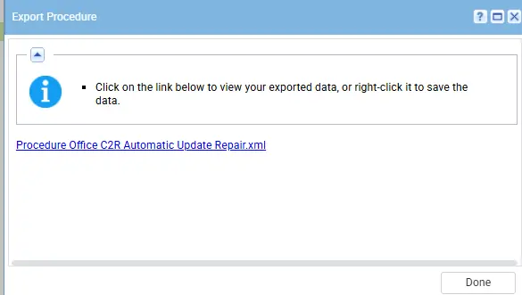
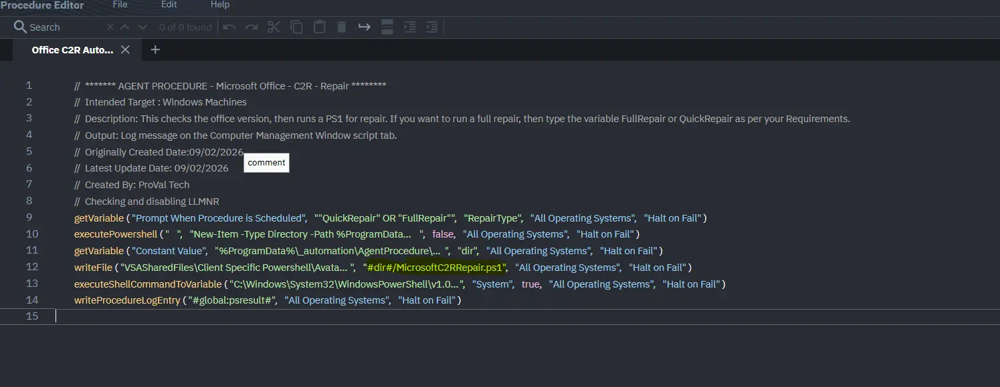
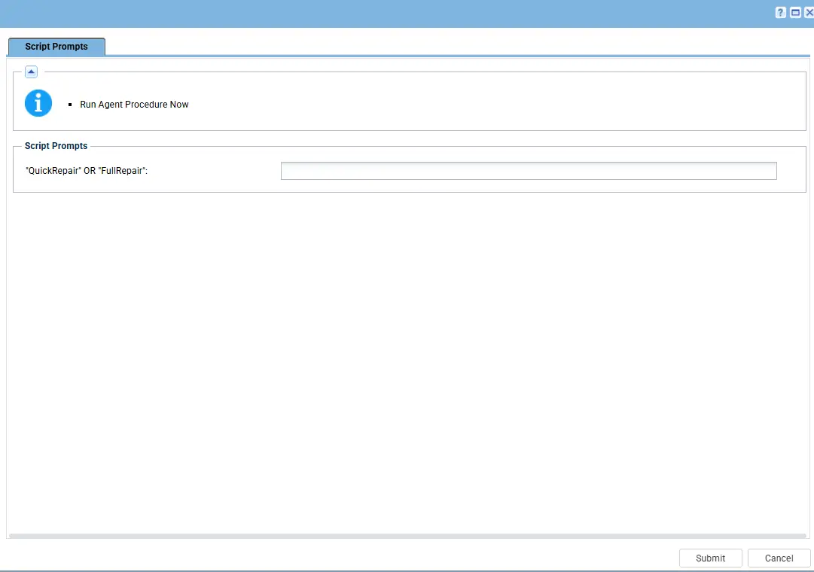

## Summary

This document outlines the process to repair the Office Click2Run Automatic Update on an endpoint using the PS1, it ask for the repair type from the script executor like QuickRepair OR FullRepair. It includes example logs and details on the execution of the repair procedure.

## Dependencies

PowerShell 5.0+
PS1

## Process

This document outlines the process to repair the Office Click2Run Automatic Update on an endpoint and when anyone will execute the script on the endpoints then it will ask about the type of repair(Quick or Fullrepair).
Please note it will close all the office package open on the endppoints.

## Implementation

1. Export the agent procedure from ProVal's VSA RMM instance.  
   **Name:** Office C2R Update Channel Status 
     
   The export will download the necessary XML file.  
     
   
2. Import this XML file into the partner's VSA RMM instance.  
     

3. Export the PS1 from the Proval Internal VSA
   

4. Mapped it into the script in the client environment
    

5. Execute the agent procedure in the partne's VSA RMM and put the Repair type that you want to do:
   

## Output

Agent Procedure History Log