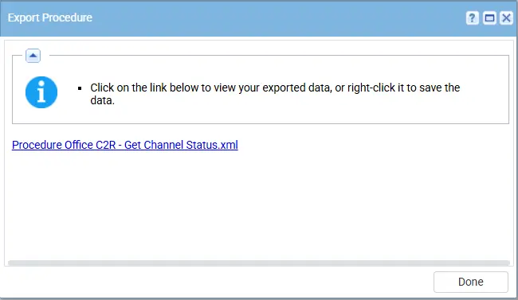
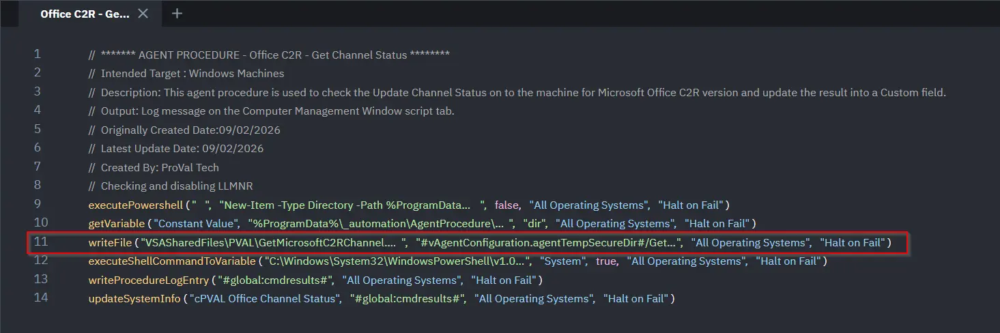

## Summary

This agent procedure is used to check the Update Channel Status on to the machine for Microsoft Office C2R version and update the result into a Custom field.

## Dependencies

- PowerShell 5.0+
- `GetMicrosoftC2RChannel.ps1`
- [Custom Field - cPVAL Office Channel Status](/docs/880a8d01-fc10-4ea9-94d8-7b2bb87c01a5)
- [Solution - Microsoft365 Click-to-Run Solution](/docs/f8deaddc-02c1-492d-b9dc-381a653de0e5) 

## Implementation

1. Export the agent procedure from ProVal's VSA RMM instance.    
   **Name:** `Office C2R - Get Channel Status`  
      
   The export will download the necessary XML file.    
    
   
2. Import this XML file into the partner's VSA RMM instance.       

3. Export the `GetMicrosoftC2RChannel.ps1` from the ProVal's Internal VSA. This is also placed under the below path:  
`Manage Files` > `Shared Files` > `PVAL` > `GetMicrosoftC2RChannel.ps1`  

     

4. Map the `GetMicrosoftC2RChannel.ps1` into the 11th step of the script in the client's environment  
     

## Output

- Agent Procedure log

 ## Changelog

 ### 2026-03-11

 - Initial version of the document